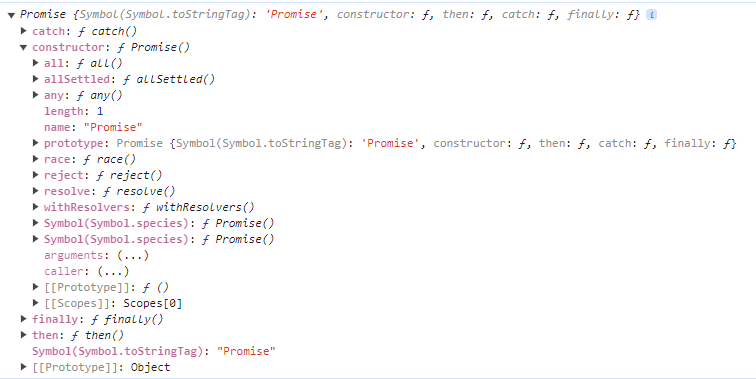
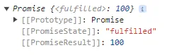
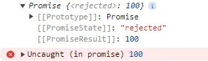
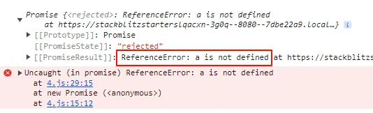
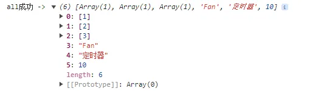
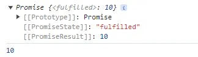

# 异步编程

ES6 中新增一个内置的类：Promise 承诺/约定模式，基于这种模式可以有效的处理异步编程问题。

[代码在线地址](https://stackblitz.com/edit/stackblitz-starters-lqacxn)

## 为什么需要异步编程

首先我们通过一个需求来引入我们的问题：先从服务器端基于`"api/1"` 这个接口获取数据：紧接着把获取的某些数据作为参数，再基于`"api/2"`获取其它的数据；最后在第二次数据获取成功后，再基于`"api/3"`获取新的数据...   也就是第一个请求成功才可以获取第二个，第二个成功才可以获取第三个，->“AJAX的串行”

为了方便，我这里使用 jquery 进行发送 ajax 请求

在 `1.js` 中，尝试发送请求实现，实现串行打印 `1 -> 2 -> 3 -> ok`结果你会发现，这并不符合我们的需求，我们需要的是最后打印 ok，而下面的代码，首先就会答应 ok

```js
$.ajax({
  url: '/promise/api/1.json',
  dataType: 'json',
  success(res) {
    app.textContent += `第一次请求结果：${res}。`;
    console.log(res);
  },
});

$.ajax({
  url: '/promise/api/2.json',
  dataType: 'json',
  success(res) {
    app.textContent += `第二次请求结果：${res}。`;
    console.log(res);
  },
});

$.ajax({
  url: '/promise/api/3.json',
  dataType: 'json',
  success(res) {
    app.textContent += `第三次请求结果：${res}。`;
    console.log(res);
  },
});

app.textContent += 'ok 我要最后请求！！！';
console.log('ok 我要最后请求！！！');
```


这时候我们可以使用**回调函数**的方式来解决异步问题，在 `2.js` 中书写回调函数的方式

```js
$.ajax({
  url: '/promise/api/1.json',
  dataType: 'json',
  success(res) {
    app.textContent += `第一次请求结果：${res}。`;
    console.log(res);
    $.ajax({
      url: '/promise/api/2.json',
      dataType: 'json',
      success(res) {
        app.textContent += `第二次请求结果：${res}。`;
        console.log(res);
        $.ajax({
          url: '/promise/api/3.json',
          dataType: 'json',
          success(res) {
            app.textContent += `第三次请求结果：${res}。`;
            console.log(res);
            app.textContent += 'ok 我要最后请求！！！';
            console.log('ok 我要最后请求！！！');
          },
        });
      },
    });
  },
});
```


显然，这是得到了我们想要的效果，但是，这种传统的实现异步操作的方式，并且是串行的模式下，基本上都是回调函数嵌套回调函数，实现起来非常的恶心，会产生**“回调地狱”**的问题

此时，我们需要一种优秀的代码管理模式，能够有效的管理异步编程中的代码，通过这种代码管理的思想，让代码开发起来更便捷、维护起来更方便、可读性更强...

这时就引出了 `Promise`， `Promise` 设计模式就是用来管理异步编程的。

```js
const api1 = () => {
  return new Promise((resolve) => {
    $.ajax({
      url: '/promise/api/1.json',
      dataType: 'json',
      success(res) {
        resolve(res);
      },
    });
  });
};

const api2 = () => {
  return new Promise((resolve) => {
    $.ajax({
      url: '/promise/api/2.json',
      dataType: 'json',
      success(res) {
        resolve(res);
      },
    });
  });
};

const api3 = () => {
  return new Promise((resolve) => {
    $.ajax({
      url: '/promise/api/3.json',
      dataType: 'json',
      success(res) {
        resolve(res);
      },
    });
  });
};

// .then 的方式
api1()
  .then((res) => {
    app.textContent += `第一次请求结果：${res}。`;
    console.log(res);
    return api2();
  })
  .then((res) => {
    app.textContent += `第二次请求结果：${res}。`;
    console.log(res);
    return api3();
  })
  .then((res) => {
    app.textContent += `第三次请求结果：${res}。`;
    console.log(res);
    app.textContent += 'ok 我要最后请求！！！';
    console.log('ok 我要最后请求！！！');
  });
```

`promise` 是链式调用，如果太多的话，也会导致看起来很费力，我们可以使用 `Promise` 的语法糖 `async/await` 来解决链式调用的问题

```js
// async 的方式
(async function () {
  const res1 = await api1();
  app.textContent += `第一次请求结果：${res1}。`;
  console.log(res1);
  const res2 = await api2();
  app.textContent += `第二次请求结果：${res2}。`;
  console.log(res2);
  const res3 = await api3();
  app.textContent += `第三次请求结果：${res3}。`;
  console.log(res3);
  app.textContent += 'ok 我要最后请求！！！';
  console.log('ok 我要最后请求！！！');
})();
```

在 js 中，除了 ajax 请求是异步的编程，还有一些操作也是异步编程

- 事件绑定
- 定时器
- promise/async/await
- requestAnimationFrame
- ....

## Promise

使用 `promise` 的时候我们可以 `new` 它。在 `4.js` 中书写代码。

### executor 函数

在我们 `new Promise` 的时候，需要传递一个函数(excutor) 进去才可以，否则会报错

```js
const p1 = new Promise()
/**
 * 它会报错 `Uncaught TypeError: Promise resolver undefined is not a function`
 * 要求 new 的时候，必须传一个函数进来才可以 [executor]
 */
```

new Promise 的时候：

- 会立即执行传递的 excutor 函数

- - 在 excutor 函数中一般用来管控一个异步的操作（不写异步的也可以）
  - 而且传递给 executor 两个参数：resolve，reject，并且这两个参数都是函数

```js
// new Promise的时候会立即执行传递的 executor 函数
const p1 = new Promise(function (resolve, reject) {
  console.log(1);
});
console.log(2);
// 先打印 1，再打印 2
```

- 创造 Promise 类的一个实例

- - **[[PromiseState]]** Promise状态：`pending` 准备状态、`fulfilled/resolved` 成功(已兑现)、`rejected` 失败(已拒绝)
  - **[[PromiseResult]]** Promise值：默认为 undefined，一般存储成功的结果或者失败的原因
  - `p1.__proto__` -> `Promise.prototype`：then/catch/finally 三个方法

打印`p1.__proto__`：



接下来就是学习 `resolve`函数和 `reject`函数了，new 一个 p2 Promise实例，resolve一个结果。

执行 resolve 控制实例的状态变为成功，传递的值100是成功的结果

```js
const p2 = new Promise(function (resolve, reject) {
  // [[PromiseState]]: "fulfilled"
  // [[PromiseResult]]: 100
  resolve(100);
});
console.log(p2);
```



执行 `reject` 控制实例的状态变为失败，传递的值还是100，但是它是错误状态的，需要捕获，否则会提示未捕获错误

```js
const p2 = new Promise(function (resolve, reject) {
  // [[PromiseState]]: "rejected"
  // [[PromiseResult]]: 100
  reject(100);
});
console.log(p2);
```



如果 executor 中的代码执行报错，则实例的状态也会变为失败 `rejected` 态，并且值`[[PromiseResult]]`为`报错的原因`

```js
const p2 = new Promise(function (resolve, reject) {
  // [[PromiseState]]: "rejected"
  // [[PromiseResult]]: ReferenceError: a is not defined
  // 打印没有定义的变量 a
  console.log(a)
});
console.log(p2);
```



但是你一旦状态从 `pending` 改变为 `fulfilled` 或者 `rejected` 后，就都无法再次改变其状态了

```js
const p2 = new Promise(function (resolve, reject) {
  // [[PromiseState]]: "fulfilled"
  // [[PromiseResult]]: 100
  resolve(100);
  reject(0)
});
console.log(p2);
```


### then 方法

Promise 是如何管控异步编程？我们先写一个异步的例子，并解读他：

```js
const p3 = new Promise(function (resolve, reject) {
  // setTimeout 是异步的，一秒后执行 resolve 函数
  setTimeout(() => {
    resolve('OK')
  }, 1000)
})
p3.then(result => {
  // 当 p3 实例的状态修改为 fulfilled 的时候，通知传递的第一个函数执行，result -> [[PromiseResult]]
  console.log('成功->', result)
}, reason => {
  // 当 p3 实例的状态修改为 rejected 的时候，通知传递的第二个函数执行，reason -> [[PromiseResult]]
  console.log('失败->', reason)
})
```

解读：

1. 代码执行顺序：

1. 1. new Promise
   2. 执行executor：设置一个异步定时器
   3. 执行p3.then注入两个方法（注入方法会保存起来）
   4. 等待1000ms
   5. 执行定时器的回调函数：执行resolve改变promise状态的值
   6. 通知之前基于then注入的两个方法中的第一个执行

1. `new Promise` 的时候会立即执行 `executor` 函数，在 `executor` 函数中管理一个异步编程的代码（此时的状态是 `pending`），当异步操作到达指定时间，开始执行的时候（可以理解为异步操作成功），此时我们通过执行 `resolve`，把 `promise` 状态修改为 `fulfilled` 态
2. 调用 `.then` 方法，如果实例的状态为 `fulfilled` 的时候，就会执行第一个函数，将结果 `[[PromiseResult]]` 传给 `result`，如果实例的状态为 `rejected` 的时候，就会执行第二个方法，将结果 `[[PromiseResult]]` 传给 `reason`

:::tip 总结

**（Promise是如何管控异步编程的）：**

- new Promise的时候创建 promise 实例，此时在 executor 函数中管理一套异步的代码
- 后期等异步操作成功或者失败的时候，执行 resolve/reject，以此来控制 promise 实例的状态和结果
- 根据状态和结果，就可以控制基于 `.then` 注入的两个方法中的哪一个去执行

:::

上面提到过，executor 函数中不仅能放异步代码，也可以放同步代码，我们可以观察一下同步和异步的代码来确定它是怎么实现异步的

```js
// 放同步代码
const p4 = new Promise((resolve) => {
  console.log(1);
  resolve('ok');
  console.log(2);
});
p4.then(
  (result) => {
    console.log('成功->', result);
  },
  (reason) => {
    console.log('失败->', reason);
  }
);
console.log(3); // 打印顺序为 1 2 3 成功-> ok
```

上述代码中：执行 resolve 函数会立即修改状态和值，并且通知基于 then 注入的方法执行

执行到这里时候会发现个问题：.then还没执行，方法还没有被注入，不知道该通知谁来执行

所以此时需要把 `通知方法执行的操作` 先保存起来（放入到等待任务队列中）-> `通知方法执行` 这个操作本身是异步的，需要等待方法注入完成后再通知其执行的

```js
// 放异步代码
const p5 = new Promise(function (resolve, reject) {
  setTimeout(() => {
    resolve('ok');
    console.log(1);
  }, 1000);
});
p5.then((result) => {
  console.log(2); // 打印顺序为 1 2
}); 
```

如果还不明白，可以看上述代码，无论是否基于 then 注入的方法，执行 resolve/reject 的时候 `修改状态和值` 是同步的（立即处理），但是 `通知对应注入方法执行` 的这个任务就是异步操作的（不会立即处理，只是把它排到等待任务队列中，当其他事情处理完，再次返回头，通知对应注入的方法执行）

#### 链式调用

执行 `.then` 方法会返回一个全新的 promise 实例，所以我们可以链式调用。代码放在 `5.js`

```js
const p1 = new Promise((resolve, reject) => {
  resolve('ok');
});

const p2 = p1.then(
  (result) => {
    console.log('成功 ->', result);
    return 10;
  },
  (reason) => {
    console.log('失败 ->', reason);
    return 20;
  }
);

p2.then(
  (result) => {
    console.log('成功 ->', result);
  },
  (reason) => {
    console.log('失败 ->', reason);
  }
);
// 成功 -> ok
// 成功 -> 10

// 我们把 p1 中的 resolve 改为 reject
const p1 = new Promise((resolve, reject) => {
  reject('no');
});

const p2 = p1.then(
  (result) => {
    console.log('成功 ->', result);
    return 10;
  },
  (reason) => {
    console.log('失败 ->', reason);
    return 20;
  }
);
// 不论哪个方法执行，只要执行不报错，新实例的状态就是fulfilled
// 所以p2.then 执行的是第一个方法
p2.then(
  (result) => {
    console.log('成功 ->', result);
  },
  (reason) => {
    console.log('失败 ->', reason);
  }
);
// 失败 -> no
// 成功 -> 20
```

.then 返回 promise 实例的案例

```js
const p3 = Promise.resolve('ok');
const p4 = p3.then(
  (result) => {
    console.log('成功 ->', result);
    return Promise.reject('no'); // 返回的promise实例的状态和结果就是最后p2的状态和结果
  },
  (reason) => {
    console.log('失败 ->', reason);
    return 20;
  }
);

p4.then(
  (result) => {
    console.log('成功 ->', result);
  },
  (reason) => {
    console.log('失败 ->', reason);
  }
);
// 成功 -> ok
// 失败 -> no
```

对 promise 实例状态和值进行分析

- 第一种情况：`new Promise` 出来的实例
  - resolve/reject 的执行控制其状态`[[PromiseState]]`以及`[[PromiseResult]]`
  - executor 函数执行失败控制其 `[[PromiseState]]=rejected` & `[[PromiseResult]]=报错信息`
- 第二种情况：`.then` 返回的新实例
  - then 注入的两个方法，不论哪个方法执行，只要执行不报错，新实例的状态就是`fulfilled`；只要执行报错，新实例的状态就是`rejected`；并且新实例的`[[PromiseResult]]`是方法返回的值
  - 但是如果方法执行返回的是一个新的`promise`实例，则此实例最后的成功或者失败，直接决定`.then`返回实例的成功和失败（得到的结果也都是一样的）

#### 不捕获错误

对于**失败**的promie实例，如果没有编写方法处理其结果，则会在控制台抛出异常信息（但是不会阻碍其余的代码执行）

```js
Promise.reject('no').then((result) => {
  console.log('成功 ->', result); // Uncaught (in promise) no
  return 10;
});
```

#### 顺延机制

在 `.then` 注入方法的时候，如果其中某个方法没有传递，则会顺延到下一个 `then` 中具备相同状态需要执行的函数上

```js
Promise.reject('no') // 状态为 rejected，应该执行第二个函数
  .then((result) => { // 第一个 then 中没第二个函数，则会顺延下去
    console.log('顺延机制成功 ->', result);
    return 10;
  }/*, reason => { // 我们不加第二个函数，它会默认给上这个函数
    return Promise.reject(reason)
  }*/)
  .then(null, (reason) => { // 第一个then 中有第二个函数则会执行
    console.log('顺延机制失败 ->', reason);
  }); // 顺延机制失败 -> no

Promise.resolve('ok') // 状态为 fulfilled，应该执行第一个函数
  .then(null/*result => { // 我们不加第一个函数，它会默认给上这个函数
    reutrn result
  }*/, (reason) => {
    console.log('顺延机制失败 ->', reason);
  })
  .then((result) => {
    console.log('顺延机制成功 ->', result);
  }); // 顺延机制成功 -> ok
```

### catch 方法

通过顺延机制，我们在真实的项目中，在多个 then 链下，其余的 then 方法基本都存放的是成功处理的事情，最后一个 then 存放失败的，这样不论是第一次或者其中某一次，导致 promise 实例状态都是失败的，都会顺延到最后一个失败的处理函数上进行处理

```js
Promise.resolve('ok')
  .then((result) => {
    console.log('成功 ->', result);
    return 10;
  })
  .then((result) => {
    console.log('成功 ->', result);
    return Promise.reject('no');
  })
  .then(null, (reason) => {
    console.log('失败 ->', reason);
  });
```

这时候会发现，需要捕获错误，最后一个 then 就不可少，但是这样写起来不美观，也不利于阅读，从而引出了 `catch`方法，上面代码等同于下面的代码：

```js
Promise.resolve('ok')
  .then((result) => {
    console.log('成功 ->', result);
    return 10;
  })
  .then((result) => {
    console.log('成功 ->', result);
    return Promise.reject('no');
  })
  .catch((reason) => {
    console.log('失败 ->', reason);
  });
```

:::tip 相当于

then(null, reason => {}) 用 catch(reason => {}) 来代替

:::

### finally 方法

该方法可以在 catch 后进行操作，它的作用是，不管 Promise 的状态是成功还是失败，都会执行。

在实际开发中，可以用来关闭 loading 动画效果，因为如果请求失败，loading 会一直转圈圈，可以在 finally 中进行关闭

```js
Promise.resolve('ok')
  .then((result) => {
    console.log('成功 ->', result);
    return 10;
  })
  .then((result) => {
    console.log('成功 ->', result);
    return Promise.reject('no');
  })
  .catch((reason) => {
    console.log('失败 ->', reason);
  })
  .finally(() => {
    console.log('我是finally，成功失败我都执行');
  });
```

### all & race 方法

在开发中可能会遇到同时处理多个`Promise`实例的情况

- Promise.all：等待所有的`promise`实例都成功，整体返回的状态才是成功，只要有一个失败，整体状态就是失败 -> 相当于 "AJAX 的并行"
- Promise.race：看多个实例谁先处理完，先处理完成的状态（不论是失败还是成功）就是最后整体的状态

`all` 方法在实际开发中能用到，`race` 方法相对来说用的比较少。直接上代码：

```js
const api1 = () => {
  return new Promise((resolve) => {
    $.ajax({
      url: '/promise/api/1.json',
      dataType: 'json',
      success(res) {
        resolve(res);
      },
    });
  });
};

const api2 = () => {
  return new Promise((resolve) => {
    $.ajax({
      url: '/promise/api/2.json',
      dataType: 'json',
      success(res) {
        resolve(res);
      },
    });
  });
};

const api3 = () => {
  return new Promise((resolve) => {
    $.ajax({
      url: '/promise/api/3.json',
      dataType: 'json',
      success(res) {
        resolve(res);
      },
    });
  });
};

const fn = () => {
  return new Promise((resolve) => {
    setTimeout(() => {
      resolve('定时器');
    }, 1000);
  });
};
const Fan = Promise.resolve('Fan');

// 同时请求
const pAll = Promise.all([api1(), api2(), api3(), Fan, fn(), 10]);
pAll
  .then((result) => {
    // 都成功，pAll就是就是成功的：result是按照之前设定的顺序依次存储每一个promise的结果
    console.log('all成功 ->', result);
  })
  .catch((reason) => {
    // 只要处理过程中有一个失败的，则立即结束处理，pAll也是失败的：谁失败的，记录谁的失败原因
    console.log('all失败 ->', reason);
  });
```



把 Fan 实例的成功态改为失败态，这时候执行的就是 `catch` 了

```js
const Fan = Promise.reject('Fan'); // all失败 -> Fan
```

简单过一下 race 方法，race中谁最先处理完，状态和值就是谁的（不论是成功还是失败态）

```js
const pRace = Promise.race([api1(), api2(), api3(), Fan, fn(), 20]);

pRace
  .then((result) => {
    console.log('race成功 ->', result); // race成功 -> Fan
  })
  .catch((reason) => {
    console.log('race失败 ->', reason);
  });
```

## async await

它是 ES7 新增的，它相当于 promise 的语法糖，是基于 promise 实现的。代码在 `6.js`

**async**：修饰函数，最后默认让函数返回一个 `promise` 实例（函数执行报错，实例状态是失败，结果是报错原因；否则实例状态是成功，结果是return后面的值）。它一般都是配合`await`的（函数中使用await，则必须基于async修饰才可以）

```js
async function fn() {
  return 10;
}
console.log(fn());
fn().then((result) => {
  console.log(result);
});
```



**await [promise实例]：** 如果设置的不是 promise实例

- 正常的值 await 10 -> await Promise.resolve(10)
- 函数执行 await xxx() -> 首先立即执行 xxx 函数，接收它的返回值 -> await 返回值

```js
function computed() {
  console.log(1);
  return new Promise((resolve) => {
    setTimeout(() => {
      resolve(2);
    }, 1000);
  });
}
console.log(3);
async function fan() {
  console.log(4);
  const result = await computed();
  console.log(result);
  console.log(5);
}
fan();
console.log(6); // 3 4 1 6 2 5
```

本身是异步微任务：把当前上下文中await下面要执行的代码整体存储到异步的微任务中，当await后面的promise实例状态为成功后，再去执行下面的代码（也就是那个异步的微任务）

### 错误捕获

对失败的`promise`实例没有做异常的处理，则控制台抛出异常信息（不会影响后续代码执行）

```js
async function error() {
  // Uncaught (in promise) 100
  const result = await Promise.reject(100);
  console.log(result);
}
error();
setTimeout(() => {
  console.log('还会继续执行！！！');
}, 1000);
```

如果想要像 `catch` 一样捕获错误，需要使用到 `try catch` 对异常进行捕获

```js
async function catchErr() {
  try {
    const result = await Promise.reject(100);
    console.log(result);
  } catch (error) {
    // ...
    console.log('catchError', error); // catchError 100
  }
}
catchErr();
```

