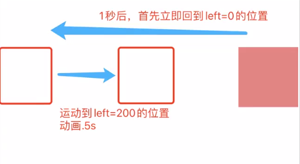

# 浏览器底层渲染

客户端从服务器获取到需要渲染页面的源代码后，会开辟一个 **GUI渲染线程**，自上而下解析代码，最后绘制出对应的页面

自上而下渲染解析代码的过程是“同步”的，但是有些操作也是异步的

## 资源加载

### css 资源加载

- 遇到的是 `<style>` "内嵌样式" 

- - "同步" 交给GUI渲染线程解析

- 遇到的是 `<link>` "外链样式" 

- - "异步" 开辟一个新的 "HTTP网络请求线程"。注意：同一个源下，根据不同的浏览器，最多只允许同时开辟4～7个HTTP线程 "HTTP的并发数"
  - 不等待资源信息请求回来，GUI渲染线程继续向下渲染
  - GUI渲染线程同步操作都处理完成后，再把基于HTTP网络线程请求回来的资源文件进行解析渲染

- 遇到 `@import` "导入式样式" 

- - "同步" 开辟一个新的 "HTTP网络请求线程" 去请求资源文件
  - 但是在资源文件没有请求回来之前，GUI渲染线程会被 "阻塞"，不允许起继续向下渲染

### script 资源加载

- 默认都是 "同步" 的：必须基于HTTP网络线程，把资源请求回来之后，并且交给 "JS渲染线程" 渲染解析完成后，GUI渲染线程才能继续向下渲染，所以 `<script>` 默认也是 "阻碍GUI渲染" 的
- async 属性：遇到 `<script async>` 首先也是开辟一个HTTP网络线程去请求加载资源文件，与此同时GUI渲染线程继续向下渲染，**把默认的同步改成"异步"**，但是一旦当资源请求回来后，会中断GUI的渲染，先把请求回来的JS进行渲染解析
- defer 属性：到 `<script defer>` 和 async 类似，都是新开辟HTTP网络线程去请求加载资源文件，与此同时GUI还会继续渲染(**"异步"**)，但是不一样的地方是，defer和link类似，是在GUI同步的代码渲染完成后，才会渲染解析请求回来的JS代码

### img和音视频加载

遇到这些资源，也会发送新的HTTP网络线程，请求加载对应的资源文件，不会阻碍GUI的渲染(**"异步"**)；当GUI渲染完成后，才会把请求回来资源信息进行渲染解析

:::tip Webkit 浏览器预测解析

chrome 的预加载扫描器 html-preload-scanner 通过扫描节点中的"src"，"link" 等属性，找到外部连接资源后进行预加载，避免资源加载的等待时间，同样实现了提前加载以及加载和执行分离

:::

## 页面渲染的步骤

1. DOM TREE（DOM树）：自上而下渲染完页面，整理好整个页面的DOM结构关系
2. CSSOM TREE（样式树）：当把所有的样式资源请求加载回来后，按照引入CSS的顺序，依次渲染样式代码，生成样式树
3. RENDER TREE（渲染树）：把生成的DOM树和CSSOM树合并在一起，生成渲染树（设置display:none的元素不进行处理）
4. Layout 布局/回流/重排：根据生成的渲染树，计算它们在设备视口（viewport）内的确切位置和大小
5. 分层处理：按照层级定位分层处理，每一个层级都有会详细规划出具体的绘制步骤
6. Painting：按照每一个层级计算处理的绘制步骤，开始绘制页面

## 前端性能优化（CRP：关键渲染路径）

- 生成DOM TREE

- - 减少DOM的层级嵌套
  - 不要使用“非标准”的标签
  - ......

- 生成CSSOM TREE

- - 尽可能不要使用 @import (阻塞GUI渲染)
  - 如果CSS代码比较少，尽可能使用“style内嵌样式”（尤其是移动端开发）
  - 如果使用link，尽可能把所有的样式资源合并为一个，且压缩（减少HTTP请求数量，因为HTTP的并发性也是有限制的，以及渲染CSS的时候，也不需要再计算依赖关系..）
  - CSS选择器链短一些（因为CSS选择器渲染是从右到左的）
  - 把link等导入CSS的操作放在HEAD中（目的是：一加载页面就开始请求资源，同时GUI去生成DOM树“CSS等资源预先加载”）
  - ......

- 对于其他资源的优化

- - 对于 `<script>`，尽可能放置在页面的底部（防止其阻塞GUI的渲染）；对于部分`<script>`需要使用`async`或者`defer`

- - - `async` 是不管JS的依赖关系的，哪一个资源先获取到，就先把这个资源代码渲染执行
    - `defer` 不会这样的：和link一样，是等待所有`<script defer>`都请求回来后，按照导入顺序/依赖关系依次渲染执行的

- - 对于 ``

- - - 懒加载：第一次加载页面的时候不要加载请求图片，哪怕它是异步的，但是也占据了HTTP并发的数量，导致其他资源延后加载
    - 图片的Base64：不用去请求加载图片，Base64码基本上代表的就是图片，而且页面渲染图片的时候速度也会很快（慎用，但是在webpage工程化中可以使用，因为它基于 file-loader 可以自动转换为Base64）

- - ......

- Layout/Painting：重要的优化手段（减少DOM的“回流/重排”和重绘）

- - 第一次加载页面必然会有一次回流和重绘
  - 触发回流操作后，也必然会触发重绘；如果只是单纯的重绘，则不会引发回流；性能优化点，重点都在回流上。

:::tip 操作DOM消耗性能？

操作DOM会进行**回流**

- 元素在视口中的大小或位置发生改变
- 元素的删除或者新增（以及基于display控制显示隐藏）
- 浏览器视口大小发生改变
- ......

这些操作都需要浏览器重新计算每一个元素在视口中的位置和大小（也就是重新Layout/Reflow)

:::

## 当代浏览器的渲染队列机制

### 回流和重绘 Reflow&Repaint

- 回流：元素的大小或者位置发生了改变（当页面布局和几何信息发生变化的时候），触发了重新布局，导致渲染树重新计算布局和渲染
- 重绘：元素样式的改变（但宽高、大小、位置等不变）

:::tip 注意：

**回流一定会触发重绘，但重绘不一定会回流**

:::

在当前上下文操作中，遇到一行修改样式的代码，并没有立即通知浏览器渲染，而是把其放置在渲染队列中，接下来看是否还有修改样式的代码，如果有继续放置在渲染队列中......一直到再也没有修改样式的代码或者“**遇到一行获取样式的操作**”，这样都会刷新浏览器的渲染队列机制（也就是把现在队列中修改样式的操作，统一告诉浏览器渲染，这样只会引发一次回流）

下面的代码会进行两次回流

```javascript
box.style.width = "100px"
box.style.height = "100px"
box.offsetHeight 
// box.style.xxx或者window.getComputedStyle(box).xxx 
// 再或者box.clientWidth|Height|Top|Left 
// 以及box.offsetWidth|Height|Top|Left或者box.ScrollWidth|Height|Top|Left...
// 这些获取样式的操作都会刷新渲染队列
box.style.position = "absolute"
box.style.top = "100px"
```

### 减少/避免回流的方式

总方式：不要自己直接去操作DOM，例如 vue/react

1. 样式的分离读写：把修改样式和获取样式代码分离开。

以上面代码为例，先把修改样式的代码放前面，再进行获取样式，可以减少一次回流

```javascript
box.style.width = "100px"
box.style.height = "100px"
box.style.position = "absolute"
box.style.top = "100px"
box.offsetHeight
```

2. 样式集中改变

使用其他方式统一设置样式，这样中间就不可以插入读取操作

```javascript
box.style.cssText = "width:100px; height: 100px;"
box.className = ".boxClass"
```

3. 缓存布局信息

```javascript
div.style.left = div.offsetLeft + 1 + 'px'
div.style.top = div.offsetTop + 1 + 'px'
// 改为
const curLeft = div.offsetLeft
const curTop = div.offsetTop
div.style.left = curLeft + 1 + 'px'
div.style.top = curTop + 1 + 'px'
```

4. 元素批量修改

例子：使用 for 循环给页面上添加元素

```javascript
const arr = ['张三', '李四', '王五']
// 几次循环就会进行几次回流
arr.forEach(item => {
  let span = document.createElement('span')
  span.innerText = item
  document.body.addpendChild(span)
})
```

- 模板字符串拼接：（缺点：可能因为把原始容器的内容变为字符串和新的字符串拼接，最后再整体渲染回去，导致原始容器中的元素绑定的一些事件失效......）

```javascript
let str = ``
arr.forEach(item => {
  str += `<span>${item}</span>`
})
document.body.innerHTML += str
```

- 文档碎片：createDocumentFragment

```javascript
let frag = document.createDocumentFragment()
arr.forEach(item => {
  let span = document.createElement('span')
  span.innerText = item
  frag.appendChild(span)
})
document.body.appendChild(frag)
// 用完记得销毁掉
frag = null
```

5. 把动画等频发样式修改的操作，运用到`position:fixed/absolute...`上

这样做能**脱离文档流**，单独占一层，利用这种分层的机制，如果改变一个层面上的位置大小等信息，浏览器的回流和重绘会加快很多

6. CSS3 硬件加速（GPU加速）

修改元素的 transform / opacity （filters）... 的这些样式，不会引发 DOM 的回流

**浏览器的硬件加速，弊端就是消耗浏览器的内存，**性能消耗严重，有时候会导致字体模糊等

有时候我们需要进行回流

案例：



我们习惯性会写成

```javascript
setTimeout(()=>
  //立即回到left：0的位置
  box.style.transitionDuration = '0s'
  box.style.left = 0
  // 回到开始位置后，再次运动到1eft：200位置（有动画）
  box.style.transitionDuration = '0.5s'
  box.style.left = '200px'
}, 1000)
```

效果不是我们想要的


我们可以在中间增加一次回流，来实现我们想要的效果

```javascript
setTimeout(()=>
  //立即回到left：0的位置
  box.style.transitionDuration = '0s'
  box.style.left = 0
  // 刷新渲染队列（获取属性会增加一次回流）
  box.offsetLeft
  // 回到开始位置后，再次运动到1eft：200位置（有动画）
  box.style.transitionDuration = '0.5s'
  box.style.left = '200px'
}, 1000)
```