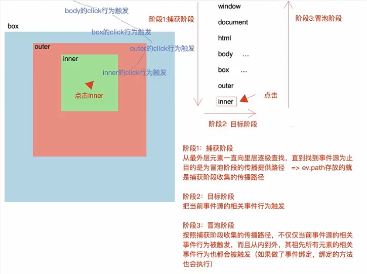
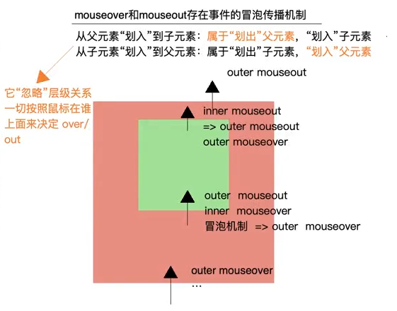
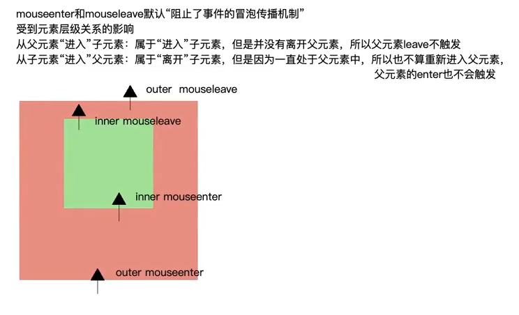

# 事件

> ```javascript
> document.body.onclick = function() {}
> ```
>
> 大部分人：给 body 绑定一个点击事件
>
> 标准：给 body 的点击事件行为绑定方法

## 事件

事件是浏览器赋予元素的默认行为，也可以理解为事件是天生具备的，不论我们是否为其绑定方法，当某些行为触发的时候，相关的事件都会被触发执行

### 浏览器赋予元素的事件行为

可以从 [mdn](https://developer.mozilla.org/zh-CN/docs/Web/Events) 上查看详细的事件，列举一些常用的事件

#### 资源事件

| 事件名称     | 触发                                                   |
| ------------ | ------------------------------------------------------ |
| error        | 资源加载失败                                           |
| abort        | 正在加载资源已经被中止时                               |
| load         | 资源加载成功（window.onload / img.onload）             |
| beforeunload | 资源卸载之前（window.onbeforeunload 页面关闭之前触发） |
| unload       | 资源卸载                                               |

#### 鼠标事件

| 事件名称    | 触发                                                         |
| ----------- | ------------------------------------------------------------ |
| click       | 事件（PC：频繁点击N次，触发N次点击事件）单击事件（移动端：300ms内没有发生第二次点击操作，算作单击事件行为，所以click在移动端有300ms延迟） |
| dblclick    | 双击事件                                                     |
| contextmenu | 鼠标右击                                                     |
| mousedown   | 鼠标按下                                                     |
| mouseup     | 鼠标抬起                                                     |
| mousemove   | 鼠标移动                                                     |
| mouseover   | 鼠标划入                                                     |
| mouseout    | 鼠标滑出                                                     |
| mouseenter  | 鼠标进入                                                     |
| mouseleave  | 鼠标离开                                                     |
| mousewheel  | 鼠标滚轮滚动                                                 |

#### 键盘事件

| 事件名称 | 触发                                      |
| -------- | ----------------------------------------- |
| keydown  | 键盘按下                                  |
| keyup    | 键盘抬起                                  |
| keypress | 长按（除了`Shift`/`Fn`/`CapsLock`键之外） |

#### 手指事件

| 事件名称   | 触发     |
| ---------- | -------- |
| touchstart | 手指按下 |
| touchmove  | 手指移动 |
| touchend   | 手指松开 |

上面的都是单手指事件（Touch Event），还有多手指事件（[Gesture Event](https://developer.mozilla.org/zh-CN/docs/Web/API/GestureEvent)），但是它兼容性不好

#### 表单事件

| 事件名称 | 触发                                                         |
| -------- | ------------------------------------------------------------ |
| focus    | 元素获得焦点（不会冒泡）                                     |
| blur     | 元素获得焦点（不会冒泡）                                     |
| submit   | 表单提交（前提：表单元素都包含在form中，并且点击的按钮是submit） |
| reset    | 表单重置（前提：表单元素都包含在form中，并且点击的按钮是reset） |
| select   | 下拉框内容选中                                               |
| change   | 内容改变                                                     |
| input    | 监控文本框中的内容随着输入的改变而触发                       |

#### 视图事件

| 事件名称         | 触发                         |
| ---------------- | ---------------------------- |
| resize           | 元素（浏览器）大小发生改变   |
| scroll           | 滚动条滚动                   |
| fullscreenchange | 切换全屏模式或切换回正常模式 |
| fullscreenerror  | 无法切换到全屏模式           |

#### css 过渡事件

| 事件名称         | 触发                 |
| ---------------- | -------------------- |
| transitionstart  | transition动画开始   |
| transitionend    | transition动画结束   |
| transitionrun    | transition动画运行中 |
| transitioncancel | transition动画取消   |

#### 拖拽事件

| 事件名称  | 触发                                                         |
| --------- | ------------------------------------------------------------ |
| drag      | 正在拖动元素或文本选区（在此过程中持续触发，每350ms触发一次） |
| dragend   | 拖放操作结束。（（松开鼠标按钮或按下Esc键）                  |
| dragenter | 被拖动的元素或文本选区移入有效释放目标区                     |
| dragstart | 用户开始拖动HTML元素或选中的文本                             |
| dragleave | 被拖动的元素或文本选区移出有效释放目标区                     |
| dragover  | 被拖动的元素或文本选区正在有效释放目标上被拖动力（在此过程中持续触发，每350ms触发一次） |
| drop      | 元素在有效释放目标区上释放                                   |

#### 剪切板事件

| 事件名称 | 触发                                     |
| -------- | ---------------------------------------- |
| cut      | 已经剪贴选中的文本内容并且复制到了剪贴板 |
| copy     | 已经把选中的文本内容复制到了剪贴板       |
| paste    | 从剪贴板复制的文本内容被粘贴             |

#### 网络事件

| 事件名称 | 触发                 |
| -------- | -------------------- |
| online   | 浏览器已获得网络访问 |
| offline  | 浏览器已失去网络访问 |

#### WebSocket 事件

| 事件名称 | 触发                                          |
| -------- | --------------------------------------------- |
| open     | WebSocket连接已建立                           |
| message  | 通过WebSocket接收到一条消息                   |
| error    | WebSocket连接异常被关闭（比如有些数据无法发送 |
| close    | WebSocket连接已关闭                           |

## 事件绑定

给元素默认的事件行为绑定方法，这样可以在行为触发的时候，执行这个方法

### DOM 0级事件绑定

语法：`[元素].on[事件]=[函数]`

```javascript
document.body.onclick = function() {}
```

移除绑定：赋值为 null 或者其他非函数值皆可

```js
document.body.onclick = null
```

原理：每一个DOM元素对象的私有属性上都有很多类似于“`onxxx`”的私有属性，我们给这些代表事件的私有属性赋值，就是 **DOM0级** 事件绑定

- 如果没有对应事件的私有属性值（例如：DOMContentLoaded）则无法基于这种办法实现事件绑定
- 只能给当前元素的某个事件行为绑定一个方法，绑定多个方法，最后一个操作会覆盖以往的
- 好处是执行效率快，而且开发者使用起来方便

### DOM 2级事件绑定

语法：`[元素].addEventListener([事件]，[方法]，[捕获/冒泡])`

```js
document.body.addEventListener('click', fn1, false)
```

移除：`[元素].removeEventListener([事件]，[方法]，[捕获/冒泡])` 但是需要参数和绑定的时候一样

```js
document.body.removeEventListener('click', fn1, false)
```

原理：每一个DOM元素都会基于`__proto__`，查找到 `EventTarget.prototype` 上的`addEventListener / removeEventListener` 等方法，基于这些方法实现事件的绑定和移除；**DOM2级事件**绑定采用事件池机制

- DOM2事件绑定，绑定的方法一般不是匿名函数，主要目的是方便移除事件绑定的时候使用
- 凡是浏览器提供的事件行为，都可以基于这种模式完成事件的绑定和移除（例如：`window.onDOMContentLoaded`是不行的，因为没有这个私有的事件属性，但是我么可以`window.addEventListener('DOMContentLoaded', func)`这样是可以的）
- 以给当前元素的某个事件类型绑定**多个**"不同"的方法（进入到事件池），这样当事件行为触发，会从事件池中依次（按照绑定的顺序）取出对应的方法然后执行

## 事件对象

存储当前事件操作及触发的相关信息的（浏览器本身记录的，记录的是当前这次操作的信息，和在哪个函数中无关）

### 鼠标事件对象 MouseEvent

- `clientX / clientY` 鼠标触发点距离当前窗口的 X / Y 轴坐标
- `pageX / pageY` 鼠标触发点距离body的 X / Y 轴坐标
- `type` 事件类型
- `target / srcElement` 获取当前事件源（当前操作的元素）
- `path` 传播路径
- `ev.preventDefault() / ev.returnValue = false` 阻止默认行为
- `ev.stopPropagation() / ev.cancelBubble = true` 阻止冒泡传播

### 键盘事件对象 KeyboardEvent

- `key / code` 存储按键名字
- `which / keyCode` 获取按键的键盘码

  - `方向键`“左37上38右39下40”
  - `Space` 32
  - `BackSpace` 8
  - `Del` 46 （MAC电脑中没有BackSpace，delete键是8）
  - `Enter` 13
  - `Shift` 16
  - `Ctrl` 17
  - `Alt` 18

- `altKey` 是否按下alt键（组合按键）
- `ctrLKey` 是否按下ctrl键（组合按键）
- `shiftKey` 是否按下shift键（组合按键）

### 手指事件对象 TouchEvent（移动端）

- `changedTouches / touches` 都是用来记录手指的信息的，平时常用的是`changedTouches`
  - 手指按下、移动、离开屏幕 `changedTouches`都存储了对应的手指信息，哪怕离开屏幕后，存储的也是最后一次手指在屏幕中的信息；而`touches`在手指离开屏幕后，就没有任何的信息了；=>获取的结果都是一个`TouchList`集合，记录每一根手指的信息
- `ev.changedTouches[0]` 第一根手指的信息
  - clientX / clientY
  - pageX / pageY

## 默认行为

浏览器会赋予元素很多默认的行为操作

- 鼠标右击菜单
- 点击 a 标签实现页面跳转
- 部分浏览器回记录输入记录，在下一次输入的时候有模糊匹配
- 键盘按下会输入内容

可以阻止鼠标右键的默认行为，写一个自定义右击菜单

```css
.contextmenu {
  position: fixed;
  left: 0;
  top: 0;
  width: 80px;
  border: 1px solid #ccc;
}

ul {
  list-style: none;
  text-align: center;
  margin: 5px 0;
  padding: 0;
}

li {
  font-size: 14px;
  padding: 5px 0;
  cursor: pointer;
}

li:hover {
  background-color: #ccc;
}
```

```js
// 自定义右击菜单
window.oncontextmenu = function (e) {
  // 阻止默认行为
  e.preventDefault();
  // 没有就创建一个
  let contextmenu = document.querySelector('.contextmenu');
  if (!contextmenu) {
    contextmenu = document.createElement('div');
    contextmenu.className = 'contextmenu';
    contextmenu.innerHTML = `<ul>
      <li>新标签打开</li>
      <li>复制</li>
      <li>粘贴</li>
      <li>重新加载</li>
    </ul>`;
    app.appendChild(contextmenu);
  }
  // 右击菜单的位置
  contextmenu.style.left = `${e.clientX + 10}px`;
  contextmenu.style.top = `${e.clientY + 10}px`;
};

// 点击其他内容（不包含contextmenu及里面的内容），我们让右键菜单消失
window.onclick = function (e) {
  let target = e.target,
    targetTag = target.tagName;
  // 点击contextmenu不做任何处理
  if (targetTag === 'LI') {
    target = target.parentNode;
    targetTag = target.tagName;
  }
  if (targetTag === 'UL' && target.parentNode.className === 'contextmenu') {
    return;
  }

  // 否则让右击菜单消失
  let contextmenu = document.querySelector('.contextmenu');
  if (contextmenu) {
    app.removeChild(contextmenu);
  }
};
```

### 阻止默认行为

阻止 a 标签默认行为

1. ```html
   <a href="javascript:;" id="link">
   ```

2. ```js
   link.onclick = function (e) {
       e.preventDefault()
       // 返回false也可以阻止默认行为
       // return false
   } 
   ```

## 事件的传播机制

触发点击事件会有三个阶段：

1. 阶段一：捕获阶段。从最外层元素一直向里层逐级查找，直到找到事件源为止目的是为冒泡阶段的传播提供路径=>ev.path存放的就是捕获阶段收集的传播路径
2. 阶段二：目标阶段。把当前事件源的相关事件行为触发
3. 阶段三：冒泡阶段。按照捕获阶段收集的传播路径，不仅仅当前事件源的相关事件行为被触发，而且从内到外，其祖先所有元素的相关事件行为也都会被触发（如果做了事件绑定，绑定的方法也会执行）



```js
inner.onclick = function(e) {
    console.log('inner:', e)
}
outer.onclick = function(e) {
    console.log('outer:', e)
}
box.addEventListener('click', function(e) {
    console.log('box:', e)
})
document.body.onclick = function(e) {
    console.log('body:', e)
}
```

上述代码的执行顺序为：`box -> inner -> outer -> body` box 设置了在捕获阶段执行。

- **DOM0事件**绑定中给元素事件行为绑定的方法，都是在目标阶段/冒泡阶段触发的

- **DOM2事件**绑定可以控制在绑定的方法在捕获阶段触发（虽然没有什么实际的意义）
  - 元素`.addEventListener(事件，方法，false/true)`
  - 最后一个参数默认是false：控制方法是在冒泡阶段触发执行的，如设置为true可以控制在捕获阶段触发执行

### 阻止事件冒泡

两种写法：

- e.stopPropagation()
- e.cancelBubble = true

兼容写法：

```js
e.stopPropagation ? e.stopPropagation() : e.cancelBubble = true
```

### 事件委托

因为点击事件行为存在冒泡传播机制，所以不论点击`INNER/OUTER/BOX`，最后都会传播到BODY上，触发BODY的CLICK事件行为，把为其绑定的方法执行

在方法执行接受到的事件对象中，有一个`target/srcElement`属性（事件源），可以知道当前操作的是谁，我们此时方法中完全可以根据事件源的不同，做不同的处理

上述机制就是“事件委托/事件代理”：利用事件的冒泡传播机制（核心/前提），我们可以把一个“容器A"中所有后代元素的某个“事件行为E"触发要做的操作，委托给A的事件行为E，这样后期只要触发A中任何元素的E行为，都会传播到A上，把给A绑定的方法执行；在方法执行的时候，基于事件源不同做不同的处理

好处：

- 性能高 60% 左右
- 可以操作动态绑定的元素
- 某些需求必须基于它完成

```js
document.body.onclick = function(e) {
    let target = e.target,
        targetClass = target.className
    if (targetClass === 'inner') {
        console.log('inner')
        return
    }
    if (targetClass === 'outer') {
        console.log('outer')
        return
    }
    if (targetClass === 'box') {
        console.log('outer')
        return
    }
}
```


### mouseover 和 mouseenter 的区别

`mouseover` 和 `mouseenter` 两个事件在JavaScript中都用于处理鼠标指针进入元素的行为，但它们之间存在着一些关键区别：

1. **事件冒泡**:
   - `mouseover` 事件会冒泡。这意味着如果鼠标指针移动到元素的子元素上，父元素也会触发 `mouseover` 事件。
   - `mouseenter` 事件不会冒泡。鼠标指针移动到元素的子元素上时，不会触发父元素的 `mouseenter` 事件。
2. **触发频率**:
   - 当鼠标指针移动到元素的子元素上时，`mouseover` 会被触发多次，因为它在进入父元素及其子元素时都会触发。
   - `mouseenter` 在鼠标指针首次进入元素时仅触发一次，即使是进入其子元素，也不会再次触发。

简单来说，如果你不需要考虑元素内部的子元素，或者你想避免事件冒泡，那么 `mouseenter` 是一个更好的选择。如果你需要在鼠标指针穿过元素及其子元素时都能够检测到，那么 `mouseover` 会是更合适的选择。





## 实现一个图片放大镜效果


在`vue3`中实现

```vue
<template>
    <div class="image">
      <!-- 图片放大镜效果 -->
      <div class="large" v-show="show">
        
      </div>
      <div class="middle" ref="target">
        
        <div class="layer" v-show="show" :style="layerPosition"></div>
      </div>
      <ul class="small">
        <li v-for="(item, i) in images" :key="item" :class="{ active: i === activeIndex }">
          
        </li>
      </ul>
    </div>
</template>

<script setup>
    import { ref, reactive, watch } from 'vue'
	import { useMouseInElement } from '@vueuse/core'
    // 图片列表
    const images = []
	// 当前预览图的索引
    const activeIndex = ref(0)

    // 1. 是否显示遮罩和大图
    const show = ref(false)
    // 2. 遮罩的坐标(样式)
    const layerPosition = reactive({
      left: 0,
      top: 0
    })
    // 3. 大图背景定位(样式)
    const largePosition = reactive({
      left: 0,
      top: 0
    })
    // 4. 使用useMouseInElement得到基于元素左上角的坐标和是否离开元素数据
    const target = ref(null)
    const { elementX, elementY, isOutside } = useMouseInElement(target)
    watch([elementX, elementY, isOutside], () => {
      // 5. 根据得到数据设置样式数据和是否显示数据
      show.value = !isOutside.value
      // 计算坐标
      const position = { x: 0, y: 0 }

      if (elementX.value < 100) position.x = 0
      else if (elementX.value > 300) position.x = 200
      else position.x = elementX.value - 100

      if (elementY.value < 100) position.y = 0
      else if (elementY.value > 300) position.y = 200
      else position.y = elementY.value - 100
      // 给样式赋值
      layerPosition.left = position.x + 'px'
      layerPosition.top = position.y + 'px'
      largePosition.left = -2 * position.x + 'px'
      largePosition.top = -2 * position.y + 'px'
    })
</script>

<style scoped lang="scss">
.image {
  width: 480px;
  height: 400px;
  position: relative;
  display: flex;
  z-index: 401;
  .large {
    position: absolute;
    top: 0;
    left: 412px;
    width: 400px;
    height: 400px;
    box-shadow: 0 0 10px rgba(0, 0, 0, 0.1);
    background-repeat: no-repeat;
    background-size: 800px 800px;
    background-color: #f8f8f8;
    overflow: hidden;
    img {
      max-width: 800px;
      max-height: 800px;
      position: absolute;
      left: 0;
      top: 0;
    }
  }
  .middle {
    width: 400px;
    height: 400px;
    background: #f5f5f5;
    position: relative;
    cursor: move;
    .layer {
      width: 200px;
      height: 200px;
      background: rgba(0,0,0,.2);
      left: 0;
      top: 0;
      position: absolute;
    }
  }
  .small {
    width: 80px;
    li {
      width: 68px;
      height: 68px;
      margin-left: 12px;
      margin-bottom: 15px;
      cursor: pointer;
      &:hover,&.active {
        border: 2px solid #27BA9B;
      }
    }
  }
}
</style>
```

