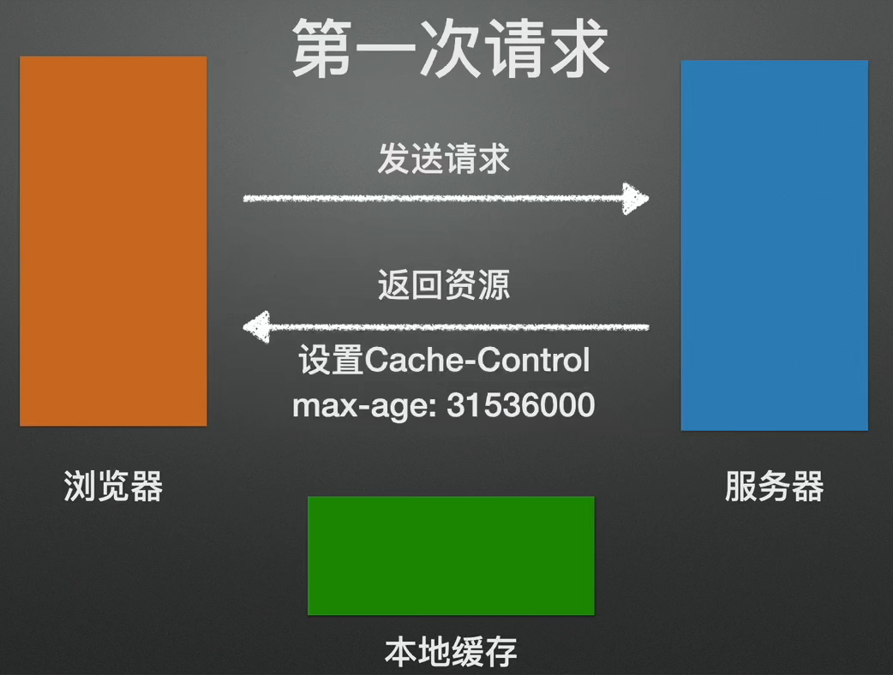
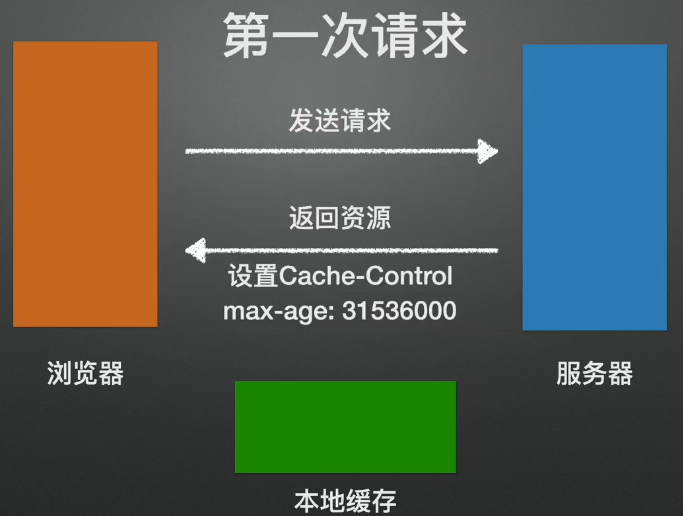
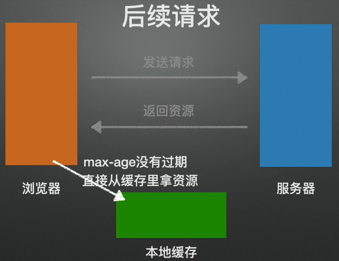
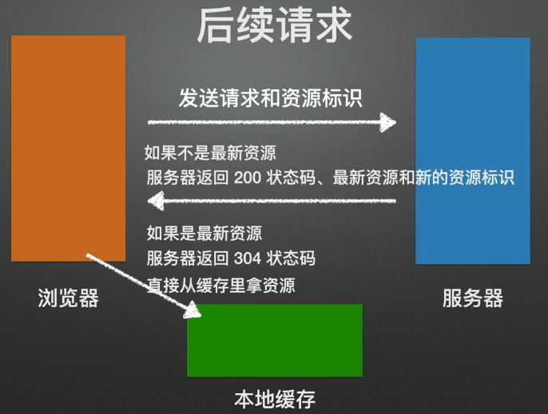

# HTTP 网络通信层

## 传输协议

用于传输客户端和服务器端通信的信息

- HTTP：超文本(除文本外的富媒体资源，例如：图片、视频等)传输协议
- HTTPS：HTTP+SSL(加密传输) ，支付类网站基本上都是基于HTTPS传输协议处理的
- FTP：文件传输协议（现在一般用于客户端和服务器端文件的直接传输）

## URL 解析

客户端 到 服务端

使用 `encodeURI` 进行编码，用 `decodeURI` 进行解码。常用于编码中文汉字（整个URL处理），客户端和服务端都支持

```javascript
const url = "http://www.fanjs.cn/index.html?from=星星屿&url=http://www.xxx.com?xxx=yyy"
console.log(url) // 'http://www.fanjs.cn/index.html?from=%E6%98%9F%E6%98%9F%E5%B1%BF&url=http://www.xxx.com?xxx=yyy'
encodeURI` 只对中文汉字进行编码，当我们需要对特殊符号进行编译，就可以使用 `encodeURIComponent`，相应的解码方式为 `decodeURIComponent
const url = `http://www.fanjs.cn/index.html?from=${encodeURIComponent('星星屿')}&url=${encodeURIComponent('http://www.xxx.com?xxx=yyy')}`
console.log(url) // http://www.fanjs.cn/index.html?from=%E6%98%9F%E6%98%9F%E5%B1%BF&url=http%3A%2F%2Fwww.xxx.com%3Fxxx%3Dyyy
```

还有一种方式也可以编译特殊字符和中文，它就是 `escape`，对应的解码方式是 `unescape`，但是不是所有的后台语言都支持这个方法，所以一般只用于客户端和客户端之间(例如：自己存储的cookie/localstorage)

```javascript
const url = `http://www.fanjs.cn/index.html?from=${escape('星星屿')}`
console.log(url) // http://www.fanjs.cn/index.html?from=%u661F%u661F%u5C7F
```

## 强缓存和协商缓存

客户端缓存处理（强缓存和协商缓存）：都是对**资源文件**的缓存处理，数据的缓存不是这样处理的 

### 强缓存

强缓存策略可以通过两种方式来设置，分别是请求头里的两个属性：

- **Expires**: Wed, 04 Oct 2023 05:12:36 GMT   (HTTP1.0)
- **Cache-Control**：max-age=14400  (HTTP1.1)

- - `max-age=`：设置缓存的最大有效期，单位为秒
  - `no-cache`：设置了该字段需要先和服务端确认返回的资源是否发生了变化，如果资源未发生变化，则直接使用缓存好的资源；

`Cache-Control` 中的 **no-cache 和 no-store** 对比

- `no-cache` 是指先要和服务器确认是否有资源更新，在进行判断。也就是说没有强缓存，但是会有协商缓存；
- `no-store` 是指不使用任何缓存，每次请求都直接从服务器获取资源。

它们是通过服务器设置的，并且基于响应头信息返回给客户端的（nginx这些发布工具直接搞定的）；客户端浏览器接收到响应后，会自己建立缓存机制（不需要前端自己写代码）

- 第一次请求，没有缓存，直接从服务器获取（缓存标识Expires/Cache-Control）如果是 HTTP1.0 就取 `Expires` 的值，HTTP1.1就取 `Cache-Control`，客户端拿到内容后，把信息和标识缓存到本地
- 二次请求，检测本地是否有缓存（检查是否过期），如果没过期，则直接基于缓存信息渲染；如果没有或者过期，重复上一步
- 是否走缓存，HTTP**状态码都是200**





**强缓存存在的问题：**

客户端缓存信息了，但是服务器的资源文件更新了（项目新版本上线部署），这样导致用户无法及时获取到服务器最新资源信息。

所以 `.html` 这种页面是不进行强缓存的，`xxx.css/js/png...` 可以强缓存：因为html没有强缓存，所以每一次html都是从服务器获取的，如果其它资源文件服务器有更新，我们只需要在html中导入资源的时候做处理即可

- 导入路径后面设置时间戳
- 资源文件的名字在内容发生更改后，名字会重新生成（HASH名字 ->webpack）

```html
<!DOCTYPE HTML>
<html>
  <head>
    <meta name="viewport" content="width=device-width initial-scale=1.0 maximum-scale=1.0 user-scalable=0">
    <meta http-equiv="Content-Type" content="text/html; charset=utf-8">
    <title>强缓存</title>
    <!-- import css -->
    <!-- 加时间戳 -->
    <link rel="stylesheet" href="css/reset.css?20240425">
    <!-- webpack 打包加 hash -->
    <link rel="stylesheet" href="css/index.asfg234sc.css">
  </head>
  <body>
  </body>
</html>
<!-- 
  第一次请求后，本地缓存的：reset.css?20240425/index.asfg234sc.css
  ...
  第n次请求，重新获取index.html，但是此时我们清楚的知道，index.css 服务器已经更新了，
  但是本地还有index.css的缓存呢？我们可以通过改变时间戳和hash值的方式进行处理
-->
```

### 协商缓存

协商缓存也可以通过两种方式来设置(客户端需要和服务器协商)：在强缓存失效的情况下，协商缓存的机制才会触发（**Etag 的优先级更高**）

- **Last-Modified/If-Modified-Since**:  Tue, 01 Jan 1980 00:00:00 GMT   (HTTP1.0)

- - 有个弊端。基于时间单位，最小反应时间是秒，假如1秒内客户端存储了信息，同时服务器更新了文件，这样就检测不出来了，基于标识就可以，所以出现了 `Etag`

- **Etag/If-None-Match**: "O0qEMh7+oA1ckgB5O2uwzyYyhiA="  (HTTP1.1)

> 使用协商缓存的时候，服务器需要考虑负载平衡的问题，因此多个服务器上资源的 Last-Modified 应该保持一致，因为每个服务器上 Etag 的值都不一样，因此在考虑负载平衡时，最好不要设置 Etag 属性。

**协商缓存的大致过程：**

**第一次请求**，没有任何缓存，直接从服务器获取资源和标识Last-Modified/ETag(状态码返回的是200)，页面渲染同时，存储到本地；

...

**第N次请求**，检测本地是否有存储的标识，如果没有认为没缓存，重复上一个步骤，如果有：

- 基于标识`If-Modified-Since/If-None-Match`，把之前存储的`Last-Modified/ETag`结果，传递给服务器
- 服务器收到结果做匹配

- - 服务器端一般这样处理的，在项目文件部署的时候，会生成`Last-Modified/ETag`对应的值，这个值代表当前项目文件在服务器上最后一次更新的时间或者对应的标识
  - 接收到客户端传递的结果，和之前存储的值进行比较

- - - 如果一致说明文件**没有更新**，给客户端直接**返回304**状态码即可
    - 如果不一致说明文件**有更新**，则把最新的文件信息及标识信息重新返回给客户端，**状态码是200**

- - 客户端收到响应后，判断状态码

- - - 304，把之前缓存的文件拿出来渲染
    - 200，按照最新的文件渲染，同时更新本地的缓存

**所以html页面完全可以设置协商缓存，而其余的资源文件一般是两种都设置！！**




## 数据缓存

把从服务器获取的数据缓存下来（不经常更新的数据），可以减少请求的次数

请求的方式有很多，比如：

- ajax：ajax/axios(promise)/JQ-ajax
- fetch
- ...

缓存的一些方案：

- A: 本地存储 cookie/localStorage/sessionStorage
- B: 本地数据库(浏览器数据库)存储 IndexedDB
- vuex/redux ...
- ...

如果需要存储的数据量特别大，则基于IndexedDB是一个不错的选择（localStorage一个源下只能存储5MB）

不论是A还是B方案，都是把信息存储到本地(物理磁盘)，哪怕页面关闭重新打开，缓存的信息也存在（排除：sessionStorage）；但是C方案不是，它是类似于定义了全局变量存储信息，页面关闭或者刷新存储的信息都会消失，这种情况在SPA单页面应用，组件之间来回切换的时候可以用...

本地存储的对比：

- localStorage VS sessionStorage：都是H5新的API（不兼容IE6~8），`localStorage`持久存储，而`sessionStorage`是会话存储，只要页面关闭，则存储的信息就没有了
- localStorag VS cookie：

- - 存储大小，同源下`localStorage`最多存储**5MB**，而`cookie`只能存储**4KB**左右
  - 稳定性：`cookie`有过期时间，而且清除浏览器或者电脑记录或者垃圾，都有可能会把他清除掉，并且浏览器的无痕浏览器模式是无法记录`cookie`的，`localStorage`是持久存储，基本上只要不是手动清除会一直存在！！
  - 和服务器关系：`localStorage`和服务器没有任何的关系（当然你可以自己手动把`localStorage`中存储的信息发送给服务器），但是`cookie`不行，只要本地有`cookie`，在向服务器发送请求的时候，浏览器都会把这些信息发送给服务器
  - `cookie`的好处是**兼容**，某些需要在每次请求的时候，把信息传递给服务器的，可以存储到`cookie`中