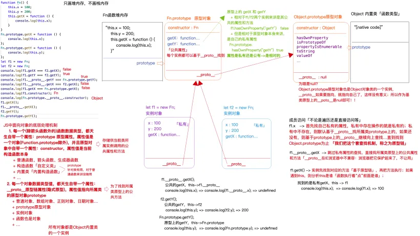

# 面向对象编程

面向对象编程：对象、类、实例。

- 对象：万物皆对象（泛指）
- 类：对“对象”的划分（按照其功能结构特点，划分出大类和小类）
- 实例：类中具体的事务

类可以分为内置类和自定义类：

**内置类**：

- 每一种数据类型都有一个自己所属的内置类：`Number`数字类（每一个数字/NaN/Infinity都是它的实例）、`String`、`BooLean`、`Symbol`、`BigInt`、`Array`、`RegExp`、`Date`、`Function`、`Object`...
- 每一种DOM元素也都有自己所属的类：

- - `window` -> `Window` ->`WindowProperties` ->`EventTarget` -> `Object`
  - `document` ->`HTMLDocument` -> `Document` -> `Node` -> `EventTarget` -> `Object`
  - `div` -> `HTMLDivElement` ->`HTMLElement` -> `Element` -> `Node` -> ...
  - `a` -> `HTMLAnchorElement` -> `HTMLElement`  -> ...

- `HTMLCollection`/`NodeList`/ `CSSStyleDeclaration`/`DOMTokenList` ...

自定义类：（分析一个例子：创建一个函数 fn）

- fn() 普通函数执行（堆栈机制）
- new fn() 构造函数执行（堆栈机制 + 面向对象机制）

## 普通函数和构造函数

new fn() 和 fn() 还是有区别的，构造函数被称为 **类**，返回值被称为 **实例。**

相似：

- 一样把函数执行（传递的参数也是一样的）
- 形成私有上下文（按照步骤逐一处理）
- 也存在私有变量

不同：

- new执行，浏览器会在当前上下文中，默认**创建一个对象（实例对象）**
- 在初始化this的时候，会让**this指向这个实例对象**

- - 代码中编写 this.xxx = yyy 的操作，都是给实例对象设置私有属性
  - 除这些操作，其余的操作和实例对象没有直接的关系

- 函数如果没有返回值，或者返回的是基本类型值，则**默认返回创建的实例对象**；如果自己返回的是引用类型值，以自己返回的为主

```javascript
function Fn() {
  /**
   * EC(FN)
   *	初始创建Fn这个类的实例对象 0x000
   *	初始THIS：this -> 0x000
   */
  let total = 0 // 上下文的私有变量和实例对象没有必然的联系
  this.x = 10 // this.xxx=yyy 都是给实例对象设置的私有属性和方法
  this.y = 20
  this.say = function () {
    console.log('say')
  }

  /* 
    如果不设置返回值，或者返回值是一个基本类型值，默认都会把实例对象0x000返回；
    如果手动返回的是一个引用数据类型值，则以自己返回的为主
  */
  // return {
  //   name: 'fan'
  // }
}

let f1 = new Fn() // 0x000
let f2 = new Fn // 0x001
```

### new Fn 和 new Fn()

new 执行的时候，如果类不需要传递实参，可以不加小括号

- 不加小括号，叫做**无参数列表 new**
- 设置小括号，叫做**带参数列表 new**

它们的运算符优先级是不一样的

- new Fn：19
- new Fn()：20

## 公有属性和私有属性

检测某个成员（属性/键）是否属于这个对象，或者是否属于这个对象的私有属性

- `in`：检测成员是否属于这个对象（特点：不论是私有属性，还是公有的属性，只要有则检测结果就是true）
- `getOwnProperty`：检测当前成员是否为对象的私有属性（特点：只有是私有属性，结果才是ture，哪怕有这个属性，但是属于公有的属性，结果也是false）

```javascript
console.log(f1)
console.log('say' in f1) // true
console.log(f1.getOwnProperty('say')) // true
// f1是一个对象，他可以访问hasOwnProperty方法并且执行，
// 说明：'hasOwnProperty'属性是它的一个成员
console.log('hasOwnProperty' in f1) // true
console.log(f1.hasOwnProperty('hasOwnProperty')) // false 
// 说明 'hasOwnProperty' 的私有属性，也就是它的公有属性（前提基于in检测出来的结果是true）
```

### 检测成员是否为公有属性

- 思路一：是它的属性，但是不是私有的，那么一定是公有的。（BUG：如果某个属性即是私有的，也是公有的，则检测出来的结果是不准确的）
- 思路二：检测原型上的属性，因为原型上的属性都是公有的。（使用 `Object.getPrototypeOf`：获取当前对象的原型）

```javascript
// obj: 要检测的对象
// attr: 要验证的成员
function hasPubProperty(obj, attr) {
  // 思路一
  // return (attr in obj) && !obj.hasOwnProperty(attr)

  let proto = Object.getPrototypeOf(obj)
  while (proto) {
    // 依次查找原型链，直到找到object.prototype为止
    if (proto.hasOwnProperty(attr)) {
      return true
    }
    proto = Object.getPrototypeOf(proto)
  }
  return false
}
```

## 对象遍历的问题及解决办法

### 对象的 symbol 属性

- `hasOwnProperty` 可以检测到 symbol 属性
- `in` 可以检测到 symbol 属性

```javascript
const sy = Symbol();
let obj = {
  name: 'fan',
  age: 18,
  [sy]: 100,
};
console.log(obj.hasOwnProperty(sy)); // hasOwnProperty 是可以检测 symbol 属性的
console.log(sy in obj); // in 是可以检测 symbol 属性的
```

对象的一些方法：

- `Object.keys`：获取一个对象非 Symbol 的私有属性（结果是一个数组，数组中包含获取的属性）
- `Object.getOwnPropertyNames`：类似于 `Object.keys`
- `Object.getOwnPropertySymbols`：只获取 Symbol 的私有属性（结果也是一个数组）

### 遍历对象的问题

for in 遍历的问题：

1. 无法遍历 Symbol 的私有属性
2. 可以遍历到自己扩展的公共属性。【内置的公共属性是不可枚举的（就是无法遍历到的）】
3. 有些遍历数字属性，而且是按照从小到大（不会严格按照属性书写的顺序）

很多对**对象**的操作是无法拿到 `Symbol` 属性的。

```javascript
const sy = Symbol();
let obj = {
  name: 'fan',
  age: 18,
  22: '22',
  1: '1',
  [sy]: 100,
};

Object.prototype.AAA = 200; // AAA 在原型链上，它是公有属性
console.log(obj.hasOwnProperty('AAA')); // false
console.log('AAA' in obj); // true

// for in 遍历的时候，无法遍历Symobol的私有属性，但是可以遍历到自己扩展的公共属性
// 内置的公共属性是不可枚举的（就是无法遍历到的）
for (let key in obj) {
  // 优先遍历数字属性，从小到大的顺序
  console.log('obj key: ' + key); // 1 22 'name' 'age' 'AAA'
}
```

### 解决办法

1. 解决：只想遍历私有的，包含 Symbol()

```javascript
let keys = [
  ...Object.getOwnPropertyNames(obj),
  ...Object.getOwnPropertySymbols(obj),
];

for (let key of keys) {
  console.log(`value: ${obj[key]}`); // 1 22 fan 18 100
}
```

1. 解决：能够避免遍历公共的属性

```javascript
for (let key in obj) {
  // 如果在原型链上就跳出本次循环
  if (!obj.hasOwnProperty(key)) break;
  console.log(key); // 1 22 'name' 'age'
}
```

## 原型和原型链

使用一个例子来学习原型和原型链

```javascript
function Fn() {
  this.x = 100;
  this.y = 200;
  this.getX = function () {
    console.log(this.x);
  };
}
Fn.prototype.getX = function () {
  console.log(this.x);
};
Fn.prototype.getY = function () {
  console.log(this.y);
};
let f1 = new Fn();
let f2 = new Fn();
console.log(f1.getX === f2.getX); // false
console.log(f1.getY === f2.getY); // true
console.log(f1.__proto__.getY === Fn.prototype.getY); // true
console.log(f1.__proto__.getX === f2.getX); // false
console.log(f1.getX === Fn.prototype.getX); // false
console.log(f1.constructor);
console.log(Fn.prototype.__proto__.constructor);
f1.getX(); // 100
f1.__proto__.getX(); // undefined
f2.getY(); // 200
Fn.prototype.getY(); // undefined
```

