# 数据库设计

## 数据库模型

数据库设计中最常采用的模型为**实体（Entity）关系（Relationship）模型**，简称**ER模型**。

核心思想是将现实世界中的复杂数据表示为一组实体，并描述这些实体之间的关系。

由实体、属性、关系三部分组成：

- ①抽取实体：**实体**通常对应现实世界中的一个**对象**，例如：学生、班级、教师、课程。

- ②分析属性：每个实体都包含一组**属性**，这些属性用于描述实体，例如学生包含姓名、年龄、性别等属性。
- ③分析实体和实体之间的关系：**关系**用于描述各实体之间的联系，例如学生和班级之间存在从属关系。

其中**关系**可分为**一对一**、**一对多**、**多对多**三种，例如学生和班级之间的关系为**一对多**、学生和课程之间的关系为**多对多**。

实体关系模型通常使用实体关系图（ER diagram）进行表示。下图是一个简易的选课系统的实体关系图，其中方框代表实体，方框之间的连线则代表实体间的关系，连线两端的不同符号用于表示一对一、一对多、多对多的关系。

符号说明如下：

|                     符号                      |   说明   |
| :-------------------------------------------: | :------: |
|    | 表示0个  |
|  | 表示1个  |
|  | 表示多个 |

上述符号通常是两个**成对**使用，其分别表示**最小值**和**最大值**。例如上述ER图中的**班级**和**学生**之间的连线，**班级**一侧的符号表示**一**（最小值和最大值都是一），**学生**一侧的符号表示**多**（最小值是一，最大值是多），其表达的含义就是班级和学生之间的关系为**一对多**，一个学生只对应一个班级，而一个班级会对应多个学生（且至少对应一个学生）。

## 数据库设计流程

传统的数据库设计流程分为三个阶段：

- 概念模型设计阶段
- 逻辑模型设计阶段
- 物理模型设计阶段

### 概念模型设计

概念模型是一个粗略的初步设计，其只关注实体和关系，不体现最终建表所需的各种细节信息（例如实体的属性）。下图便是一个典型的简易**选课系统**数据库的概念模型。

设计概念模型通常有四类方法：

- 自顶向下。即首先定义全局概念结构的框架，再逐步细化。

- **自底向上**(常用)。即首先定义各局部应用的概念结构，然后再将他们集成起来，得到全局概念结构。

- 逐步扩张。首先定义最重要的核心概念结构，然后向外扩张，以滚雪球的方式逐步生成其他的概念结构，直至总体概念结构。

- 混合策略。即自顶向下和自底向上相结合。

### 逻辑模型设计

相较于概念模型，逻辑模型会包含更多的细节信息，例如实体的属性、用于关联两个实体的字段等等。需要注意的是，逻辑模型并不关注具体的数据库实现（例如MySQL或者Oracle）。下图是上述选课系统数据库的逻辑模型。

ER图之间可能有冲突，冲突主要分为三类：

- 属性冲突
- 命名冲突
- 结构冲突

### 物理模型设计

相较于逻辑模型，物理模型会包含更多的与所选数据库相关的具体信息，例如存储引擎、字段类型、索引等信息。一般而言，物理模型会包含最终建表所需的所有信息，下图是上述选课系统数据库的物理模型。

:::tip 提示

所有表建议加上创建时间(create_time)、更新时间(update_time)、是否删除(is_deleted)三个字段

不建议真正删除，用状态标识就好了

:::

