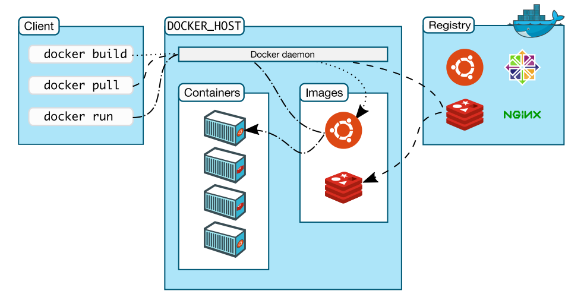
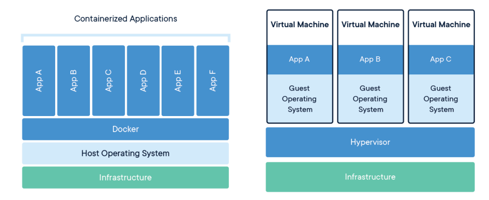

# 基本概念

## 1. Docker 架构

- Client： 客户端；操作docker服务器的客户端（命令行或者界面） 
- Docker_Host：Docker主机；安装Docker服务的主机 
- Docker_Daemon：后台进程；运行在Docker服务器的后台进程 
- Containers：容器；在Docker服务器中的容器（一个容器一般是一个应用实例，容器间互相隔离）
- Images：镜像、映像、程序包；Image是只读模板，其中包含创建Docker容器的说明。容器是由Image运 行而来，Image固定不变。 
- Registries：仓库；存储Docker Image的地方。官方远程仓库地址：[Explore Docker's Container Image Repository | Docker Hub](https://hub.docker.com/search)

| Docker            | 面向对象     |
| ----------------- | ------------ |
| 镜像（Image）     | 类           |
| 容器（Container） | 对象（实例） |

**容器和虚拟机**

## 2. Docker 隔离原理

- `namespace` 6项隔离 （资源隔离）

| namespace | 系统调用参数  | 隔离内容                   |
| --------- | ------------- | -------------------------- |
| UTS       | CLONE_NEWUTS  | 主机和域名                 |
| IPC       | CLONE_NEWIPC  | 信号量、消息队列和共享内存 |
| PID       | CLONE_NEWPID  | 进程编号                   |
| Network   | CLONE_NEWNET  | 网络设备、网络栈、端口等   |
| Mount     | CLONE_NEWNS   | 挂载点(文件系统)           |
| User      | CLONE_NEWUSER | 用户和用户组               |

- `cgroups` 资源限制 （资源限制）

cgroup提供的主要功能如下： 

- 资源限制：限制任务使用的资源总额，并在超过这个 配额 时发出提示 
- 优先级分配：分配CPU时间片数量及磁盘IO带宽大小、控制任务运行的优先级 
- 资源统计：统计系统资源使用量，如CPU使用时长、内存用量等 
- 任务控制：对任务执行挂起、恢复等操作

> cgroup资源控制系统，每种子系统独立地控制一种资源。功能如下

| 子系统                          | 功能                                                         |
| ------------------------------- | ------------------------------------------------------------ |
| cpu                             | 使用调度程序控制任务对CPU的使用。                            |
| cpuacct(CPU Accounting)         | 自动生成cgroup中任务对CPU资源使用情况的报告。                |
| cpuset                          | 为cgroup中的任务分配独立的CPU(多处理器系统时)和内存。        |
| devices                         | 开启或关闭cgroup中任务对设备的访问                           |
| freezer                         | 挂起或恢复cgroup中的任务                                     |
| memory                          | 设定cgroup中任务对内存使用量的限定，并生成这些任务对内存资源使用 情况的报告 |
| perf_event(Linux CPU性能探测器) | 使cgroup中的任务可以进行统一的性能测试                       |
| net_cls(Docker未使用)           | 通过等级识别符标记网络数据包，从而允许Linux流量监控程序(Traffic Controller)识别从具体cgroup中生成的数据包 |

## 3. Docker 安装

