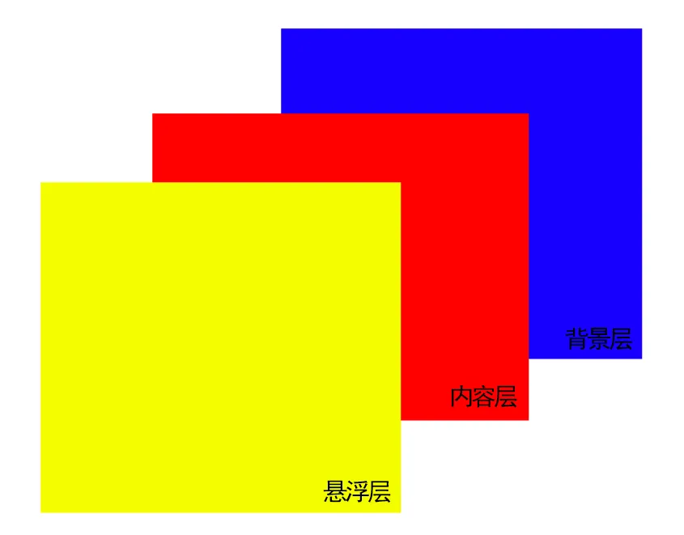

# CSS3

## css选择器

| **选择器**     | **格式**      | **优先级权重** |
| -------------- | ------------- | -------------- |
| id选择器       | #id           | 100            |
| 类选择器       | .classname    | 10             |
| 属性选择器     | a[ref=“eee”]  | 10             |
| 伪类选择器     | li:last-child | 10             |
| 标签选择器     | div           | 1              |
| 伪元素选择器   | li::after     | 1              |
| 相邻兄弟选择器 | h1+p          | 0              |
| 子选择器       | ul>li         | 0              |
| 后代选择器     | li a          | 0              |
| 通配符选择器   | *             | 0              |

选择器的**优先级**：

- 标签选择器、伪元素选择器：1；
- 类选择器、伪类选择器、属性选择器：10；
- id 选择器：100；
- 内联样式：1000；

总结：!import > 行内元素 > id选择器 > 类选择器 > 标签选择器 > 通配符

## css3有哪些更新

- 新增各种CSS选择器 （: not(.input)：所有 class 不是“input”的节点）
- 圆角 （border-radius:8px）
- 多列布局 （multi-column layout）
- 阴影和反射 （Shadoweflect）
- 文字特效 （text-shadow）
- 文字渲染 （Text-decoration）
- 线性渐变 （gradient）
- 旋转 （transform）
- 增加了旋转,缩放,定位,倾斜,动画,多背景

## 隐藏元素的方法有哪些

- **display: none**：渲染树不会包含该渲染对象，因此该元素不会在页面中占据位置，也不会响应绑定的监听事件。
- **visibility: hidden**：元素在页面中仍占据空间，但是不会响应绑定的监听事件。
- **opacity: 0**：将元素的透明度设置为 0，以此来实现元素的隐藏。元素在页面中仍然占据空间，并且能够响应元素绑定的监听事件。
- **position: absolute**：通过使用绝对定位将元素移除可视区域内，以此来实现元素的隐藏。
- **z-index: 负值**：来使其他元素遮盖住该元素，以此来实现隐藏。
- **clip/clip-path** ：使用元素裁剪的方法来实现元素的隐藏，这种方法下，元素仍在页面中占据位置，但是不会响应绑定的监听事件。
- **transform: scale(0,0)**：将元素缩放为 0，来实现元素的隐藏。这种方法下，元素仍在页面中占据位置，但是不会响应绑定的监听事件。

## 对盒模型的理解

CSS3中的盒模型有以下两种：标准盒子模型、IE盒子模型（怪异盒模型）

盒模型都是由四个部分组成的，分别是margin、border、padding和content。

标准盒模型和IE盒模型的区别在于设置width和height时，所对应的范围不同：

- 标准盒模型的width和height属性的范围只包含了content，
- IE盒模型的width和height属性的范围包含了border、padding和content。

可以通过修改元素的box-sizing属性来改变元素的盒模型：

- `box-sizing: content-box`表示标准盒模型（默认值）
- `box-sizing: border-box`表示IE盒模型（怪异盒模型）

## 对BFC的理解

BFC是一个独立的布局环境，可以理解为一个容器，在这个容器中按照一定规则进行物品摆放，并且不会影响其它环境中的物品。如果一个元素符合触发BFC的条件，则BFC中的元素布局不受外部影响。

**创建BFC的条件：**

- 根元素：body；
- 元素设置浮动：float 除 none 以外的值；
- 元素设置绝对定位：position (absolute、fixed)；
- display 值为：inline-block、table-cell、table-caption、flex等；
- overflow 值为：hidden、auto、scroll；

**BFC的作用：**

- **解决margin的重叠问题**：由于BFC是一个独立的区域，内部的元素和外部的元素互不影响，将两个元素变为两个BFC，就解决了margin重叠的问题。
- **解决高度塌陷的问题**：在对子元素设置浮动后，父元素会发生高度塌陷，也就是父元素的高度变为0。解决这个问题，只需要把父元素变成一个BFC。常用的办法是给父元素设置`overflow:hidden`。
- **创建自适应两栏布局**：可以用来创建自适应两栏布局：左边的宽度固定，右边的宽度自适应。

## 块级元素和行内元素

- **块级元素**：div、ul、li、dl、dt、dd、p、h1-h6等
- **行内元素**：span、a、b、img、input、button、textarea等
- 区别是块级元素独占一行，可以设置宽高属性

## CSS元素哪些可以继承

- 文本样式
- 字体样式
- 元素可见性
- 表格布局属性
- 列表布局属性

## 如何简单实现 0.5px 边框

使用 `box-shadow`

```css
.box {
    width: 100px;
    height: 100px;
    box-shadow: 0 0 0 0.5px #ccc;
}
```

## 如何实现三角形

### 实心三角形

```css
.border {
  width: 0;
  height: 0;
  border-style:solid;
  border-width: 0 50px 50px;
  border-color: transparent transparent #d9534f;
}
```

### 空心三角形

```css
.border {
  width: 0;
  height: 0;
  border-style:solid;
  border-width: 0 50px 50px;
  border-color: transparent transparent #d9534f;
  position: relative;
}
.border:after {
  content: '';
  border-style: solid;
  border-width: 0 40px 40px;
  border-color: transparent transparent #96ceb4;
  position: absolute;
  top: 6px;
  left: -40px;
}
```

## 文本溢出省略

### 单行文本溢出省略

```css
.box {
    width: 100px;
    overflow: hidden;
    white-space: nowrap;
    text-overflow: ellipsis;
}
```

### 多行文本溢出省略

多行文本溢出的时候，我们可以分为两种情况：

- 基于高度截断
- 基于行数截断

#### 基于高度截断

核心的`css`代码结构如下：

- position: relative：为伪元素绝对定位
- overflow: hidden：文本溢出限定的宽度就隐藏内容）
- position: absolute：给省略号绝对定位
- line-height: 20px：结合元素高度,高度固定的情况下,设定行高, 控制显示行数
- height: 40px：设定当前元素高度
- ::after {} ：设置省略号样式

```html
<style>
  .demo {
    position: relative;
    line-height: 20px;
    height: 40px;
    overflow: hidden;
  }
  .demo::after {
    content: "...";
    position: absolute;
    bottom: 0;
    right: 0;
    padding: 0 20px 0 10px;
  }
</style>

<body>
  <div class='demo'>这是一段很长的文本</div>
</body>
```

实现原理很好理解，就是通过伪元素绝对定位到行尾并遮住文字，再通过 `overflow: hidden` 隐藏多余文字

这种实现具有以下优点：

- 兼容性好，对各大主流浏览器有好的支持
- 响应式截断，根据不同宽度做出调整

一般文本存在英文的时候，可以设置`word-break: break-all`使一个单词能够在换行时进行拆分

#### 基于行数截断

纯`css`实现也非常简单，核心的`css`代码如下：

- -webkit-line-clamp: 2：用来限制在一个块元素显示的文本的行数，为了实现该效果，它需要组合其他的WebKit属性）
- display: -webkit-box：和1结合使用，将对象作为弹性伸缩盒子模型显示
- -webkit-box-orient: vertical：和1结合使用 ，设置或检索伸缩盒对象的子元素的排列方式
- overflow: hidden：文本溢出限定的宽度就隐藏内容
- text-overflow: ellipsis：多行文本的情况下，用省略号“…”隐藏溢出范围的文本

```html
<style>
    p {
        width: 400px;
        border-radius: 1px solid red;
        -webkit-line-clamp: 2;
        display: -webkit-box;
        -webkit-box-orient: vertical;
        overflow: hidden;
        text-overflow: ellipsis;
    }
</style>
<p>
    这是一些文本这是一些文本这是一些文本这是一些文本这是一些文本
    这是一些文本这是一些文本这是一些文本这是一些文本这是一些文本
</p>
```

通过css + js 实现

```css
p {
    position: relative;
    width: 400px;
    line-height: 20px;
    overflow: hidden;

}
.p-after:after{
    content: "..."; 
    position: absolute; 
    bottom: 0; 
    right: 0; 
    padding-left: 40px;
    background: -webkit-linear-gradient(left, transparent, #fff 55%);
    background: -moz-linear-gradient(left, transparent, #fff 55%);
    background: -o-linear-gradient(left, transparent, #fff 55%);
    background: linear-gradient(to right, transparent, #fff 55%);
}
```

```js
$(function(){
 //获取文本的行高，并获取文本的高度，假设我们规定的行数是五行，那么对超过行数的部分进行限制高度，并加上省略号
   $('p').each(function(i, obj){
        var lineHeight = parseInt($(this).css("line-height"));
        var height = parseInt($(this).height());
        if((height / lineHeight) >3 ){
            $(this).addClass("p-after")
            $(this).css("height","60px");
        }else{
            $(this).removeClass("p-after");
        }
    });
})
```

## 重绘和回流

### 重绘

**重绘就是将渲染树节点转换为屏幕上的实际像素，不涉及重新布局阶段的位置与大小计算。** 如：`color`、`background-color`、`visibility` 等

### 回流

**触发条件：**

1. 页面一开始渲染的时候（无法避免）
2. 添加或删除可见的DOM元素
3. 元素的位置发生变化
4. 元素的尺寸发生变化（包括外边距、内边框、边框大小、高度和宽度等）
5. 内容发生变化（文本变化或图片被另一个不同尺寸的图片所替代等）
6. 浏览器的窗口尺寸变化（因为回流是根据视口的大小来计算元素的位置和大小的）

> - 一般节点的布局改变或者宽高的改变，浏览器窗口大小的改变都会触发回流和重绘
>
> - 元素的颜色、透明度、transform改变时只会触发重绘
>
> - **回流一定会触发重绘，而重绘不一定会回流**

## 居中对齐有哪些实现方式

1. 水平居中

- inline 元素：text-centent: center;
- block 元素：margin: 0 auto;
- absolute 元素：left: 50% + margin-left: 负值

2. 垂直居中

- inline 元素：line-height 的值等于 height 的值
- absolute 元素：top: 50% + margin-top: 负值
- absolute 元素：transform(-50%, -50%)
- absolute 元素：top,left,right,bottom = 0 + margin: auto

> 第一种和第二种需要知道盒子的大小，不知道盒子大小的时候，可以使用第三种和第四种

3. 水平垂直居中

- 利用绝对定位，先将元素的左上角通过top:50%和left:50%定位到页面的中心，然后再通过translate来调整元素的中心点到页面的中心。

```css
.parent {
    position: relative;
}
 
.child {
    position: absolute;
    left: 50%;
    top: 50%;
    transform: translate(-50%,-50%);
}
```

- 利用绝对定位，设置四个方向的值都为0，并将margin设置为auto，由于宽高固定，因此对应方向实现平分，可以实现水平和垂直方向上的居中。

```css
.parent {
    position: relative;
}
 
.child {
    position: absolute;
    top: 0;
    bottom: 0;
    left: 0;
    right: 0;
    margin: auto;
}
```

- 利用绝对定位，先将元素的左上角通过top:50%和left:50%定位到页面的中心，然后再通过margin负值来调整元素的中心点到页面的中心。

```css
.parent {
    position: relative;
}
 
.child {
    position: absolute;
    top: 50%;
    left: 50%;
    margin-top: -50px;     /* 自身 height 的一半 */
    margin-left: -50px;    /* 自身 width 的一半 */
}
```

- 使用flex布局，通过align-items:center和justify-content:center设置容器的垂直和水平方向上为居中对齐，然后它的子元素也可以实现垂直和水平的居中。

```css
.parent {
    display: flex;
    justify-content:center;
    align-items:center;
}
```

## 如何设置小于 12px 的文字

- `zoom`：非标属性，有兼容问题，缩放会改变了元素占据的空间大小，触发重排
- `-webkit-transform:scale()`：大部分现代浏览器支持，并且对英文、数字、中文也能够生效，缩放不会改变了元素占据的空间大小，页面布局不会发生变化
- `-webkit-text-size-adjust:none`：对谷歌浏览器有版本要求，在27之后，就取消了该属性的支持，并且只对英文、数字生效

### zoom

- zoom:50%，表示缩小到原来的一半
- zoom:0.5，表示缩小到原来的一半

```css
<style type="text/css">
    .span1{
        font-size: 12px;
        display: inline-block;
        zoom: 0.8;
    }
    .span2{
        display: inline-block;
        font-size: 12px;
    }
</style>
<body>
    <span class="span1">测试10px</span>
    <span class="span2">测试12px</span>
</body>
```

需要注意的是，`Zoom` 并不是标准属性，需要考虑其兼容性

### -webkit-transform:scale()

缩放

```html
<style type="text/css">
    .span1{
        font-size: 12px;
        display: inline-block;
        -webkit-transform:scale(0.8);
    }
    .span2{
        display: inline-block;
        font-size: 12px;
    }
</style>
<body>
    <span class="span1">测试10px</span>
    <span class="span2">测试12px</span>
</body>
```

### -webkit-text-size-adjust:none

该属性用来设定文字大小是否根据设备(浏览器)来自动调整显示大小

属性值：

- percentage：字体显示的大小；
- auto：默认，字体大小会根据设备/浏览器来自动调整；
- none:字体大小不会自动调整

```css
html { 
  -webkit-text-size-adjust: none; 
}
```

这样设置之后会有一个问题，就是当你放大网页时，一般情况下字体也会随着变大，而设置了以上代码后，字体只会显示你当前设置的字体大小，不会随着网页放大而变大了

所以，我们不建议全局应用该属性，而是单独对某一属性使用

需要注意的是，自从`chrome 27`之后，就取消了对这个属性的支持。同时，该属性只对英文、数字生效，对中文不生效

## 如何实现视差滚动效果

视差滚动（Parallax Scrolling）是指多层背景以不同的速度移动，形成立体的运动效果，带来非常出色的视觉体验

我们可以把网页解刨成：背景层、内容层、悬浮层



使用`css`形式实现视觉差滚动效果的方式有：

- background-attachment
- transform:translate3D

### background-attachment

作用是设置背景图像是否固定或者随着页面的其余部分滚动

值分别有如下：

- scroll：默认值，背景图像会随着页面其余部分的滚动而移动
- fixed：当页面的其余部分滚动时，背景图像不会移动
- inherit：继承父元素background-attachment属性的值

完成滚动视觉差就需要将`background-attachment`属性设置为`fixed`，让背景相对于视口固定。及时一个元素有滚动机制，背景也不会随着元素的内容而滚动

也就是说，背景一开始就已经被固定在初始的位置

完整代码案例

```html
<!DOCTYPE html>
<html lang="en">
<head>
  <meta charset="UTF-8">
  <meta name="viewport" content="width=device-width, initial-scale=1.0">
  <title>视差滚动</title>
  <style>
	div {
	    height: 100vh;
	    background: rgba(0, 0, 0, .7);
	    color: #fff;
	    line-height: 100vh;
	    text-align: center;
	    font-size: 20vh;
	}

	.a-img1 {
	    background-image: url(https://images.pexels.com/photos/1097491/pexels-photo-1097491.jpeg);
	    background-attachment: fixed;
	    background-size: cover;
	    background-position: center center;
	}

	.a-img2 {
	    background-image: url(https://images.pexels.com/photos/2437299/pexels-photo-2437299.jpeg);
	    background-attachment: fixed;
	    background-size: cover;
	    background-position: center center;
	}

	.a-img3 {
	    background-image: url(https://images.pexels.com/photos/1005417/pexels-photo-1005417.jpeg);
	    background-attachment: fixed;
	    background-size: cover;
	    background-position: center center;
	}
</style>
</head>
<body>
	<div class="a-text">1</div>
		<div class="a-img1">2</div>
		<div class="a-text">3</div>
		<div class="a-img2">4</div>
		<div class="a-text">5</div>
		<div class="a-img3">6</div>
		<div class="a-text">7</div>
	</div>
</body>
</html>
```

## 如何提高 CSS 的性能

实现方式有很多种，主要有如下：

- 内联首屏关键CSS
- 异步加载CSS
- 资源压缩：利用webpack 等模块化工具，对css进行压缩，从而加快加载速度
- 合理使用选择器
- 减少使用昂贵的属性
- 不要使用@import

### 内联首屏关键 css

在打开一个页面，页面首要内容出现在屏幕的时间影响着用户的体验，而通过内联`css`关键代码能够使浏览器在下载完`html`后就能立刻渲染

而如果外部引用`css`代码，在解析`html`结构过程中遇到外部`css`文件，才会开始下载`css`代码，再渲染

所以，`CSS`内联使用使渲染时间提前

注意：但是较大的`css`代码并不合适内联（初始拥塞窗口、没有缓存），而其余代码则采取外部引用方式

### 异步加载 css

- 使用javascript将link标签插到head标签最后

```javascript
// 创建link标签
const myCSS = document.createElement( "link" );
myCSS.rel = "stylesheet";
myCSS.href = "mystyles.css";
// 插入到header的最后位置
document.head.insertBefore( myCSS, document.head.childNodes[ document.head.childNodes.length - 1 ].nextSibling );
```

- 设置link标签media属性为noexis，浏览器会认为当前样式表不适用当前类型，会在不阻塞页面渲染的情况下再进行下载。加载完成后，将`media`的值设为`screen`或`all`，从而让浏览器开始解析CSS

```html
<link rel="stylesheet" href="mystyles.css" media="noexist" onload="this.media='all'">
```

- 通过rel属性将link元素标记为alternate可选样式表，也能实现浏览器异步加载。同样别忘了加载完成之后，将rel设回stylesheet

```html
<link rel="alternate stylesheet" href="mystyles.css" onload="this.rel='stylesheet'">
```

### 合理使用选择器

`css`匹配的规则是从右往左开始匹配，例如`#markdown .content h3`匹配规则如下：

- 先找到h3标签元素
- 然后去除祖先不是.content的元素
- 最后去除祖先不是#markdown的元素

如果嵌套的层级更多，页面中的元素更多，那么匹配所要花费的时间代价自然更高

所以我们在编写选择器的时候，可以遵循以下规则：

- 不要嵌套使用过多复杂选择器，最好不要三层以上
- 使用id选择器就没必要再进行嵌套
- 通配符和属性选择器效率最低，避免使用

### 减少使用昂贵的属性

在页面发生重绘的时候，昂贵属性如`box-shadow`/`border-radius`/`filter`/透明度/`:nth-child`等，会降低浏览器的渲染性能

### 尽量不要使用@import

css样式文件有两种引入方式，一种是`link`元素，另一种是`@import`

`@import`会影响浏览器的并行下载，使得页面在加载时增加额外的延迟，增添了额外的往返耗时

而且多个`@import`可能会导致下载顺序紊乱

比如一个css文件`index.css`包含了以下内容：`@import url("reset.css")`

那么浏览器就必须先把`index.css`下载、解析和执行后，才下载、解析和执行第二个文件`reset.css`

### 其他

- 减少重排操作，以及减少不必要的重绘
- 了解哪些属性可以继承而来，避免对这些属性重复编写
- cssSprite，合成所有icon图片，用宽高加上backgroud-position的背景图方式显现出我们要的icon图，减少了http请求
- 把小的icon图片转成base64编码
- CSS3动画或者过渡尽量使用transform和opacity来实现动画，不要使用left和top属性

## css预处理器

**预处理器**，如：`less`，`scss`，`stylus`，用来预编译`scss`或者`less`，增加了`css`代码的复用性。层级，`mixin`， 变量，循环， 函数等对编写以及开发UI组件都极为方便。

### Scss 和 Less 的区别

Scss 和 Less 都是 css 预处理器，它们的不同点：

- 编译环境不一样：Less 是基于 js 的，是在客户端进行处理的，Scss 是基于 ruby 的，是在服务器端进行处理的
- 变量符不一样：Less 使用`@` ，Scss 使用 `$`
- 变量作用域不一样
- Scss 支持 if-else、for，Less 不支持
- 输出：Less 不支持输出设置，Scss提供四种输出选项：nested（嵌套缩进）、compact（展开多行）、compressed（简洁格式） 和 expanded（压缩后）。

## 响应式设计的概念及基本原理

响应式网站设计`（Responsive Web design`）是一个网站能够兼容多个终端，而不是为每一个终端做一个特定的版本。

关于原理： 基本原理是通过媒体查询`（@media）`查询检测不同的设备屏幕尺寸做处理。

关于兼容： 页面头部必须有`meta`声明的`viewport`。

```html
<meta name="’viewport’" content="”width=device-width," initial-scale="1." maximum-scale="1,user-scalable=no”"/>
```

## css中的单位

相对长度单位。 其长度单位会随着它的参考值的变化而变化。

- px,像素
- em,元素的字体高度
- %,百分比
- rem,根元素的font-size
- vm,视窗宽度，1vw=视窗宽度的1%
- vh,视窗高度，1vh=视窗高度的1%

### rpx

**rpx 是微信小程序解决自适应屏幕尺寸的尺寸单位。微信小程序规定屏幕的宽度为750rpx。**

无论是在iPhone6上面还是其他机型上面都是750rpx的屏幕宽度，拿iPhone6来讲，屏幕宽度为375px，把它分为750rpx后， 1rpx = 0.5px = 1物理像素。

微信小程序也支持rem尺寸单位，rem和rpx的换算关系：rem: 规定屏幕宽度为20rem；1rem = (750/20)rpx 。

## 圣杯布局和双飞翼布局

### 圣杯布局的实现

1. 先创建好大概的内容

```html
<style>
    body {
        min-width: 550px;
    }

    header {
        text-align: center;
        background-color: #ccc;
    }

    .col {
        float: left;
    }

    .main {
        width: 100%;
        background-color: pink;
    }

    .left {
        width: 190px;
        background-color: skyblue;
    }

    .right {
        width: 100px;
        background-color: cyan;
    }

    footer {
        text-align: center;
        background-color: #ccc;
        clear: both;
    }
</style>
</head>

<body>
    <header>header</header>
    <div class="content">
        <div class="main col">main</div>
        <div class="left col">left</div>
        <div class="right col">right</div>
    </div>
    <footer>footer</footer>
</body>
```


2. 给外层容器添加左右内边距，padding-left、padding-right

```html
<style>
    .content {
        padding-left: 190px;
        padding-right: 100px;
    }
</style>
```


3. 将 left 移动到左侧，给 left 添加 margin 负值，left 需要使用定位才能实现。

```html
<style>
    .left {
        width: 190px;
        backgroud-color: skyblue;
        display: relative;
        left: -190px;
        margin: -100%;
    }
</style>
```


4. 将 right 移动到右侧，给 right 设置 margin-right 负值，这个负值为 right 的宽度，这样right 的内容就被覆盖了，就移动上去了。

```html
<style>
    .right {
        width: 100px;
        background-color: cyan;
        margin-right: -100px;
    }
</style>
```


### 双飞翼布局的实现

1. 先创建好大概的内容

```html
<style>
    body {
        min-width: 550px;
    }

    .col {
        float: left;
    }

    .main {
        width: 100%;
        height: 100px;
        background-color: pink;
    }

    .left {
        width: 190px;
        height: 100px;
        background-color: skyblue;
    }

    .right {
        width: 100px;
        height: 100px;
        background-color: cyan;
    }
</style>

<body>
    <div class="main col">
        <div class="main-wrapper">main</div>
    </div>
    <div class="left col">left</div>
    <div class="right col">right</div>
</body>
```


2. 设置 main-wrapper 的左右外边距

```html
<style>
    .main-wrapper {
        margin-left: 190px;
        margin-right: 100px;
    }
</style>
```


3. 使用 margin-left 负值的方法，将 left 移上去，100% 代表的是 mian 的宽度。

```html
<style>
    .left {
        width: 190px;
        height: 100px;
        background-color: skyblue;
        margin-left: -100%;
    }
</style>
```


4. 使用 margin-left 负值的方法，将 right 移上去，100px 代表 right 的宽度。

```html
<style>
    .right {
        width: 100px;
        height: 100px;
        background-color: cyan;
        margin-left: -100px;
    }
</style>
```


### 总结

- 使用 float 布局
- 两侧使用 margin 负值，以便和中间内容横向重叠
- 防止中间内容被两次覆盖，一个用 padding，一个用 margin

## css 清除浮动

使用 clear: both; 来清除浮动

```css
.clearfix::after {
    content: '';
    display: table;
    clear: both;
}
/* 兼容 IE */
.clearfix {
    *zoom: 1;
}
```