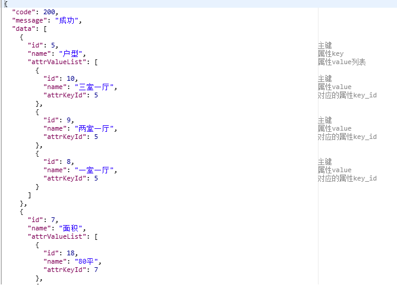
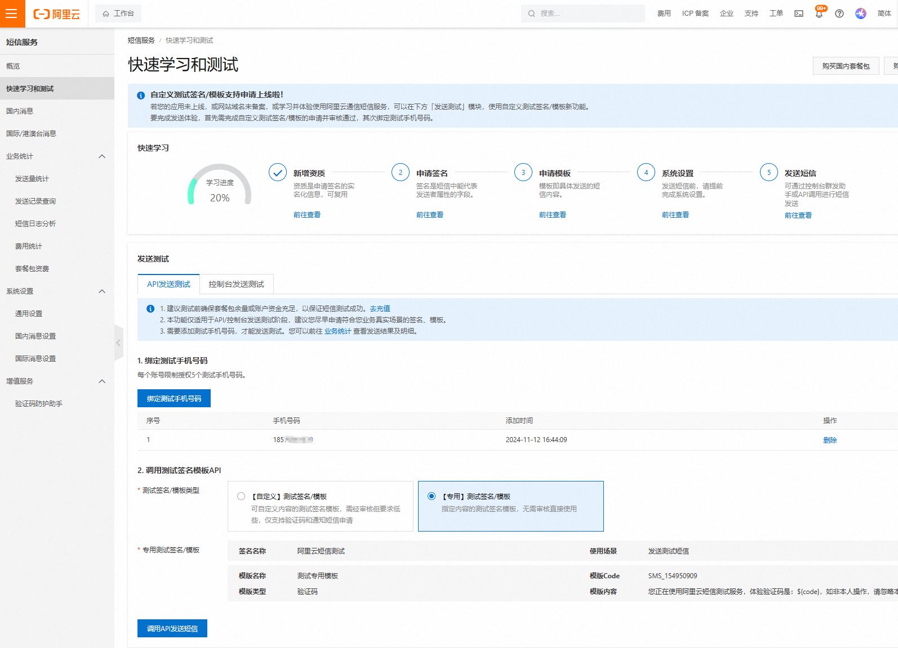
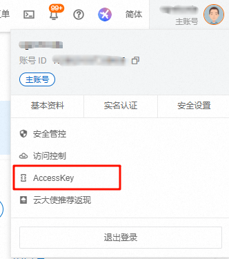

# Spring Boot 租房项目

总结项目不熟悉的知识点

[项目源码](https://github.com/Fanvvv/learn-java/tree/master/springBoot-project-lease)

## 逻辑删除功能

获取列表数据时，由于数据库中所有表均采用逻辑删除策略，所以查询数据时均需要增加过滤条件`is_deleted=0`。

上述操作虽不难实现，但是每个查询接口都要考虑到，也显得有些繁琐。为简化上述操作，可以使用`Mybatis Plus`提供的逻辑删除功能，它可以自动为查询操作增加`is_deleted=0`过滤条件，并将删除操作转为更新语句。

[官方文档](https://baomidou.com/guides/logic-delete/#%E6%AD%A5%E9%AA%A4-1-%E9%85%8D%E7%BD%AE%E5%85%A8%E5%B1%80%E9%80%BB%E8%BE%91%E5%88%A0%E9%99%A4%E5%B1%9E%E6%80%A7)

1. 在 `application.yml` 中配置 `MyBatis-Plus` 的全局逻辑删除属性

   ```yaml
   mybatis-plus:
     global-config:
       db-config:
         logic-delete-field: is_deleted # 全局逻辑删除字段名
         logic-delete-value: 1 # 逻辑已删除值 默认为1 可省略
         logic-not-delete-value: 0 # 逻辑未删除值 默认为0 可省略
   ```

2. 可以在实体类中使用`@TableLogic` 注解

   ```java
   @Data
   public class BaseEntity implements Serializable {
   
       // ...... 
   
       @Schema(description = "逻辑删除")
       @TableField("is_deleted")
   	// 逻辑删除
       @TableLogic
   	// json序列化时忽略该字段
       @JsonIgnore
       private Byte isDeleted;
   }
   ```

:::warning 注意

逻辑删除功能只对`Mybatis-Plus`自动注入的`sql`起效，也就是说，对于手动在`Mapper.xml`文件配置的`sql`不会生效，需要单独考虑。

:::

## 响应数据忽略特定字段

通常情况下接口响应的Json对象中并不需要`create_time`、`update_time`、`is_deleted`等字段，这时只需在实体类中的相应字段添加`@JsonIgnore`注解，该字段就会在序列化时被忽略。[官方文档](https://github.com/FasterXML/jackson-annotations#annotations-for-ignoring-properties)

```java
@Data
public class BaseEntity implements Serializable {

    @Schema(description = "主键")
    @TableId(value = "id", type = IdType.AUTO)
    private Long id;

    @Schema(description = "创建时间")
    @TableField(value = "create_time", fill = FieldFill.INSERT)
	//    json序列化时忽略该字段
    @JsonIgnore
    private Date createTime;

    @Schema(description = "更新时间")
    @TableField(value = "update_time", fill = FieldFill.UPDATE)
	//    json序列化时忽略该字段
    @JsonIgnore
    private Date updateTime;

    @Schema(description = "逻辑删除")
    @TableField("is_deleted")
	//    逻辑删除
    @TableLogic
	//    json序列化时忽略该字段
    @JsonIgnore
    private Byte isDeleted;

}
```

## 新增或更新时数据的填充问题

新增或更新数据时，前端通常不会传入`isDeleted`、`createTime`、`updateTime`这三个字段，因此我们需要手动赋值。但是数据库中每张表都有上述字段，所以手动去赋值就显得有些繁琐。为简化上述操作，我们可采取以下措施。

- `is_deleted`字段：可将数据库中该字段的默认值设置为`0`

- `create_time`和`update_time`：可使用`mybatis-plus`的自动填充功能，所谓自动填充，就是通过统一配置，在插入或更新数据时，自动为某些字段赋值，具体配置如下，详细信息可参考[官方文档](https://baomidou.com/guides/auto-fill-field/)。

  - 在实体类中，你需要使用 `@TableField` 注解来标记哪些字段需要自动填充，并指定填充的策略。

    ```java
    public class User {
        @TableField(fill = FieldFill.INSERT)
        private String createTime;
    
        @TableField(fill = FieldFill.UPDATE)
        private String updateTime;
    
        // 其他字段...
    }
    ```

  - 实现 MetaObjectHandler：创建一个类来实现 `MetaObjectHandler` 接口，并重写 `insertFill` 和 `updateFill` 方法。

    ```java
    @Component
    public class MyMetaObjectHandler implements MetaObjectHandler {
    
        @Override
        public void insertFill(MetaObject metaObject) {
            log.info("开始插入填充...");
            this.strictInsertFill(metaObject, "createTime", LocalDateTime.class, LocalDateTime.now());
        }
    
        @Override
        public void updateFill(MetaObject metaObject) {
            log.info("开始更新填充...");
            this.strictUpdateFill(metaObject, "updateTime", LocalDateTime.class, LocalDateTime.now());
        }
    }
    ```

  - 配置自动填充处理器：确保你的 `MyMetaObjectHandler` 类被 `Spring` 管理，可以通过 `@Component` 或 `@Bean` 注解来实现

## 类型枚举查询条件的类型转换问题

在查询列表数据时，通常有通过类型来过滤数据的。`type` 字段在数据库、实体类、前后端交互的过程中有多种不同的形式，因此在请求和响应的过程中，`type`字段会涉及到多次类型转换

- 在数据库中为 `tinyint` 类型
- 在实体类中为 `enum` 类型
- 在前后的交互中可能为数字也可能为字符串

具体转换过程如下图所示：

- **请求流程**

  

  **说明**

  - SpringMVC中的`WebDataBinder`组件负责将HTTP的请求参数绑定到Controller方法的参数，并实现参数类型的转换。
  - Mybatis中的`TypeHandler`用于处理Java中的实体对象与数据库之间的数据类型转换。

- **响应流程**

  

  **说明**

  - SpringMVC中的`HTTPMessageConverter`组件负责将Controller方法的返回值（Java对象）转换为HTTP响应体中的JSON字符串，或者将请求体中的JSON字符串转换为Controller方法中的参数（Java对象），例如下一个接口**保存或更新标签信息**

  

下面介绍一下每个环节的类型转换原理

- **WebDataBinder枚举类型转换**

  `WebDataBinder`依赖于[`Converter`](https://docs.spring.io/spring-framework/reference/core/validation/convert.html)实现类型转换，若Controller方法声明的`@RequestParam`参数的类型不是`String`，`WebDataBinder`就会自动进行数据类型转换。SpringMVC提供了常用类型的转换器，例如`String`到`Integer`、`String`到`Date`，`String`到`Boolean`等等，其中也包括`String`到枚举类型，但是`String`到枚举类型的默认转换规则是根据实例名称（"APARTMENT"）转换为枚举对象实例（ItemType.APARTMENT）。若想实现`code`属性到枚举对象实例的转换，需要自定义`Converter`，代码如下，具体内容可参考[官方文档](https://docs.spring.io/spring-framework/reference/core/validation/convert.html#core-convert-Converter-API)。

  - 在**web-admin模块**自定义`com.fan.web.admin.custom.converter.StringToItemTypeConverter`

    ```java
    @Component
    public class StringToItemTypeConverter implements Converter<String, ItemType> {
        @Override
        public ItemType convert(String code) {
            //ItemType.values() 获取ItemType这个枚举类型中的所有选项值
            return Arrays.stream(ItemType.values())
                    .filter(itemType -> source.equals(""+itemType.getCode()))
                    .findFirst()
                    .orElseThrow(IllegalArgumentException::new) ;
        }
    }
    ```

  - 注册上述的`StringToItemTypeConverter`，在**web-admin模块**创建`com.fan.web.admin.custom.config.WebMvcConfiguration`，内容如下：

  ```java
  @Configuration
  public class WebMvcConfiguration implements WebMvcConfigurer {
    
        @Autowired
        private StringToItemTypeConverter stringToItemTypeConverter;
    
        @Override
        public void addFormatters(FormatterRegistry registry) {
            registry.addConverter(this.stringToItemTypeConverter);
        }
    }
  ```

  但是我们有很多的枚举类型都需要考虑类型转换这个问题，按照上述思路，我们需要为每个枚举类型都定义一个Converter，并且每个Converter的转换逻辑都完全相同，针对这种情况，我们使用[`ConverterFactory`](https://docs.spring.io/spring-framework/reference/core/validation/convert.html#core-convert-ConverterFactory-SPI)接口更为合适，这个接口可以将同一个转换逻辑应用到一个接口的所有实现类，因此我们可以定义一个`BaseEnum`接口，然后另所有的枚举类都实现该接口，然后就可以自定义`ConverterFactory`，集中编写各枚举类的转换逻辑了。具体实现如下：

- 在**model模块**定义`com.fan.model.enums.BaseEnum`接口

  ```java
  public interface BaseEnum {
      Integer getCode();
      String getName();
  }
  ```

  - 令所有`com.fan.model.enums`包下的枚举类都实现`BaseEnun`接口

- 在**web-admin模块**自定义`com.fan.web.admin.custom.converter.StringToBaseEnumConverterFactory`

  ```java
  @Component
  public class StringToBaseEnumConverterFactory implements ConverterFactory<String, BaseEnum> {
        @Override
        public <T extends BaseEnum> Converter<String, T> getConverter(Class<T> targetType) {
            return new Converter<String, T>() {
                @Override
                public T convert(String source) {
                    // Class有一个API：getEnumConstants()  用来获取枚举常量值
                    // 第一种写法
                    // T[] enumConstants = targetType.getEnumConstants();
                    // for (T enumConstant : enumConstants) {
                    // 		if (enumConstant.getCode().equals(Integer.valueOf(code))) {
                    // 			return enumConstant;
                    // 		}
                    // }
                    // throw new IllegalArgumentException("没有找到对应的枚举类型");
                    // 第二种写法
                    return Arrays.stream(targetType.getEnumConstants())
                            .filter(t -> source.equals(t.getCode()+""))
                            .findFirst()
                            .orElseThrow(IllegalArgumentException::new);
                }
            };
        }
    }
  ```

  > 获取枚举常量值有两种方式： ① 枚举名称.values()    ② 枚举class.getEnumConstants()

  - 注册上述的`ConverterFactory`，在**web-admin模块**创建`com.fan.web.admin.custom.config.WebMvcConfiguration`，内容如下：

    ```java
    @Configuration
    public class WebMvcConfiguration implements WebMvcConfigurer {
    
        @Autowired
      private StringToBaseEnumConverterFactory stringToBaseEnumConverterFactory;
    
        @Override
        public void addFormatters(FormatterRegistry registry) {
            registry.addConverterFactory(this.stringToBaseEnumConverterFactory);
        }
    }
    ```

    **注意：**

    最终采用的是`ConverterFactory`方案，因此`StringToItemTypeConverter`相关代码可以直接删除。

- **TypeHandler枚举类型转换**

  `Mybatis`预置的`TypeHandler`可以处理常用的数据类型转换，例如`String`、`Integer`、`Date`等等，其中也包含枚举类型，但是枚举类型的默认转换规则是枚举对象实例（`ItemType.APARTMENT`）和实例名称（`"APARTMENT"`）相互映射。若想实现`code`属性到枚举对象实例的相互映射，需要自定义`TypeHandler`。

  不过`MybatisPlus`提供了一个[通用的处理枚举类型的TypeHandler](https://baomidou.com/reference/annotation/#enumvalue)。其使用十分简单，只需在`ItemType`枚举类的`code`属性上增加一个注解`@EnumValue`，`Mybatis-Plus`便可完成从`ItemType`对象到`code`属性之间的相互映射，具体配置如下。

  ```java
  public enum ItemType {
  
      APARTMENT(1, "公寓"),
      ROOM(2, "房间");
  
      @EnumValue
      private Integer code;
      private String name;
  
      ItemType(Integer code, String name) {
          this.code = code;
          this.name = name;
      }
  }
  ```

- **HTTPMessageConverter枚举类型转换**

  `HttpMessageConverter`依赖于Json序列化框架（默认使用Jackson）。其对枚举类型的默认处理规则也是枚举对象实例（`ItemType.APARTMENT`）和实例名称（`"APARTMENT"`）相互映射。不过其提供了一个注解`@JsonValue`，同样只需在`ItemType`枚举类的`code`属性上增加一个注解`@JsonValue`，Jackson便可完成从`ItemType`对象到`code`属性之间的互相映射。具体配置如下，详细信息可参考Jackson[官方文档](https://fasterxml.github.io/jackson-annotations/javadoc/2.8/com/fasterxml/jackson/annotation/JsonValue.html)。

  ```java
  @Getter
  public enum ItemType {
  
      APARTMENT(1, "公寓"),
      ROOM(2, "房间");
  
      @EnumValue
    	@JsonValue
      private Integer code;
      private String name;
  
      ItemType(Integer code, String name) {
          this.code = code;
          this.name = name;
      }
  }
  ```

  :::tip 作用

  1. @JsonValue的作用是：

  > 已知请求体参数中有`{type:1,name:"公寓"}`,那么`label_info`中的`type`属性到底存储的是枚举的`type`还是`name`属性？ 依据是哪个属性被`@JsonValue`修饰

  2. @EnumValue的作用是：

  > 已知从数据库中查询出的数据是：` {type:1}` , 那么这个`type:1`应该要对应一个枚举值，但是枚举`ItemType`有两个属性：`code , name` , 到底这个数字`1`要赋值给哪个属性，就看哪个属性被`@EnumValue`修饰

  :::

## 多表查询组合返回数据

比如查询属性列表，需要在`attr_key`和`attr_value`两个表中查询数据，组成属性列表返回

1. 在 `Controller` 层添加如下内容，调用 `service` 层的方法

   ```java
   @Operation(summary = "查询全部属性名称和属性值列表")
   @GetMapping("list")
   public Result<List<AttrKeyVo>> listAttrInfo() {
       List<AttrKeyVo> list = attrKeyService.listAttrInfo();
       return Result.ok(list);
   }
   ```

2. 在 `Service` 层增加这个方法

   ```java
   public interface AttrKeyService extends IService<AttrKey> {
       List<AttrKeyVo> listAttrInfo();
   }
   ```

3. 在 `ServiceImpl` 中增加如下内容

   ```java
   @Service
   public class AttrKeyServiceImpl extends ServiceImpl<AttrKeyMapper, AttrKey>
       implements AttrKeyService{
   
       @Autowired
       private AttrKeyMapper attrKeyMapper;
   
       @Override
       public List<AttrKeyVo> listAttrInfo() {
           return attrKeyMapper.listAttrInfo();
       }
   }
   ```

4. 编写 mapper 层

   ```java
   public interface AttrKeyMapper extends BaseMapper<AttrKey> {
   
       List<AttrKeyVo> listAttrInfo();
   }
   ```

   在对应的 `mapper.xml` 文件中书写 `sql `语句

   ```xml
   <?xml version="1.0" encoding="UTF-8"?>
   <!DOCTYPE mapper
           PUBLIC "-//mybatis.org//DTD Mapper 3.0//EN"
           "http://mybatis.org/dtd/mybatis-3-mapper.dtd">
   <mapper namespace="com.fan.web.admin.mapper.AttrKeyMapper">
       <!-- 定义一个结果集映射，id为BaseResultMap，映射到AttrKeyVo类 -->
       <resultMap id="BaseResultMap" type="com.fan.web.admin.vo.attr.AttrKeyVo">
           <!-- 映射id字段到id属性 -->
           <id column="id" property="id"/>
           <!-- 映射name字段到name属性 -->
           <result column="name" property="name"/>
           <!-- 定义一个集合属性映射，映射到AttrValue类的列表 -->
           <collection property="attrValueList" ofType="com.fan.model.entity.AttrValue">
               <!-- 映射AttrValue类的id字段到value_id属性 -->
               <id column="value_id" property="id"/>
               <!-- 映射AttrValue类的name字段到name属性 -->
               <result column="value_name" property="name"/>
               <!-- 映射AttrValue类的attrKeyId字段到key_id属性 -->
               <result column="key_id" property="attrKeyId"/>
           </collection>
       </resultMap>
   
       <!-- 定义一个查询语句，id为listAttrInfo，使用BaseResultMap作为结果集映射 -->
       <select id="listAttrInfo" resultMap="BaseResultMap">
           <!-- 查询语句，从attr_key表左连接attr_value表，筛选出未删除的属性值 -->
           select k.id, k.name,
                  v.id value_id, v.name value_name, v.attr_key_id key_id
           from attr_key k
               left join attr_value v on k.id = v.attr_key_id and v.is_deleted = 0
           where k.is_deleted = 0
       </select>
   </mapper>
   ```

::: warning 注意

`left join` 语句后的 `where` 只能添加主表的 `k.is_deleted = 0` 筛选条件，不能添加 `v.is_deleted = 0`，否则属性值为空的数据会被过滤掉

:::

数据获取结果：



## 公寓信息的新增和更新操作

公寓信息的表结构如下


在我们做更新公寓信息操作的时候，可能需要更新多个表。

如果是更新操作（如果前端传入id便是更新操作），我们可以将原来的表关系进行删除，删除后做新增操作

第一种写法：

```java
@Autowired
private ApartmentInfoService apartmentInfoService;

@Operation(summary = "保存或更新公寓信息")
@PostMapping("saveOrUpdate")
public Result saveOrUpdate(@RequestBody ApartmentSubmitVo apartmentSubmitVo) {
    apartmentInfoService.saveOrUpdateApartment(apartmentSubmitVo);
    return Result.ok();
}
```

`ApartmentInfoServiceImpl` 中实现 `saveOrUpdateApartment` 方法

```java
package com.fan.web.admin.service.impl;

import com.baomidou.mybatisplus.core.conditions.query.LambdaQueryWrapper;
import com.fan.model.entity.*;
import com.fan.model.enums.ItemType;
import com.fan.web.admin.mapper.ApartmentInfoMapper;
import com.fan.web.admin.service.*;
import com.baomidou.mybatisplus.extension.service.impl.ServiceImpl;
import com.fan.web.admin.vo.apartment.ApartmentSubmitVo;
import com.fan.web.admin.vo.graph.GraphVo;
import org.springframework.beans.factory.annotation.Autowired;
import org.springframework.stereotype.Service;
import org.springframework.util.CollectionUtils;

import java.util.ArrayList;
import java.util.List;

/**
 * @description 针对表【apartment_info(公寓信息表)】的数据库操作Service实现
 */
@Service
public class ApartmentInfoServiceImpl extends ServiceImpl<ApartmentInfoMapper, ApartmentInfo>
        implements ApartmentInfoService {

    @Autowired
    private GraphInfoService graphInfoService;

    @Autowired
    private ApartmentFacilityService apartmentFacilityService;

    @Autowired
    private ApartmentLabelService apartmentLabelService;

    @Autowired
    private ApartmentFeeValueService apartmentFeeValueService;

    @Override
    public void saveOrUpdateApartment(ApartmentSubmitVo apartmentSubmitVo) {
        boolean isUpdate = apartmentSubmitVo.getId() != null;
        // 保存 apartmentInfo
        super.saveOrUpdate(apartmentSubmitVo);
        // 有 id 则是更新，否则新增
        if (isUpdate) {
            // 更新操作把原来的列表都删除掉，再进行赋值，就不用进行比较了
            // 1.删除图片列表
            LambdaQueryWrapper<GraphInfo> graphInfoLambdaQueryWrapper = new LambdaQueryWrapper<>();
            // 根据id和公寓类型进行删除
            graphInfoLambdaQueryWrapper.eq(GraphInfo::getItemType, ItemType.APARTMENT);
            graphInfoLambdaQueryWrapper.eq(GraphInfo::getItemId, apartmentSubmitVo.getId());
            graphInfoService.remove(graphInfoLambdaQueryWrapper);
            // 2.删除配套列表
            LambdaQueryWrapper<ApartmentFacility> apartmentFacilityLambdaQueryWrapper = new LambdaQueryWrapper<>();
            apartmentFacilityLambdaQueryWrapper.eq(ApartmentFacility::getApartmentId, apartmentSubmitVo.getId());
            apartmentFacilityService.remove(apartmentFacilityLambdaQueryWrapper);
            // 3.删除标签列表
            LambdaQueryWrapper<ApartmentLabel> apartmentLabelLambdaQueryWrapper = new LambdaQueryWrapper<>();
            apartmentLabelLambdaQueryWrapper.eq(ApartmentLabel::getApartmentId, apartmentSubmitVo.getId());
            apartmentLabelService.remove(apartmentLabelLambdaQueryWrapper);
            // 4.删除杂费列表
            LambdaQueryWrapper<ApartmentFeeValue> apartmentFeeValueLambdaQueryWrapper = new LambdaQueryWrapper<>();
            apartmentFeeValueLambdaQueryWrapper.eq(ApartmentFeeValue::getApartmentId, apartmentSubmitVo.getId());
            apartmentFeeValueService.remove(apartmentFeeValueLambdaQueryWrapper);
        }
        // 插入数据
        List<GraphVo> graphVoList = apartmentSubmitVo.getGraphVoList();
        if (!CollectionUtils.isEmpty(graphVoList)) {
            ArrayList<GraphInfo> graphInfos = new ArrayList<>();
            // 假如列表不会空
            for (GraphVo graphVo : graphVoList) {
                GraphInfo graphInfo = new GraphInfo();
                graphInfo.setName(graphVo.getName());
                graphInfo.setUrl(graphVo.getUrl());
                graphInfo.setItemId(apartmentSubmitVo.getId());
                graphInfo.setItemType(ItemType.APARTMENT);
                graphInfos.add(graphInfo);
            }
            graphInfoService.saveBatch(graphInfos);
        }
        List<Long> facilityInfoIds = apartmentSubmitVo.getFacilityInfoIds();
        if (!CollectionUtils.isEmpty(facilityInfoIds)) {
            ArrayList<ApartmentFacility> apartmentFacilities = new ArrayList<>();
            for (Long facilityInfoId : facilityInfoIds) {
//                无参构造器写法
//                ApartmentFacility apartmentFacility = new ApartmentFacility();
//                apartmentFacility.setApartmentId(apartmentSubmitVo.getId());
//                apartmentFacility.setFacilityId(facilityInfoId);
//                Builder写法
                ApartmentFacility apartmentFacility = ApartmentFacility.builder()
                        .apartmentId(apartmentSubmitVo.getId())
                        .facilityId(facilityInfoId).build();
                apartmentFacilities.add(apartmentFacility);
            }
            apartmentFacilityService.saveBatch(apartmentFacilities);
        }
        List<Long> labelIds = apartmentSubmitVo.getLabelIds();
        if (!CollectionUtils.isEmpty(labelIds)) {
            ArrayList<ApartmentLabel> apartmentLabels = new ArrayList<>();
            for (Long labelId : labelIds) {
//                无参构造器写法
//                ApartmentLabel apartmentLabel = new ApartmentLabel();
//                apartmentLabel.setApartmentId(apartmentSubmitVo.getId());
//                apartmentLabel.setLabelId(labelId);
//                Builder写法
                ApartmentLabel apartmentLabel = ApartmentLabel.builder()
                        .apartmentId(apartmentSubmitVo.getId())
                        .labelId(labelId).build();
                apartmentLabels.add(apartmentLabel);
            }
            apartmentLabelService.saveBatch(apartmentLabels);
        }
        List<Long> feeValueIds = apartmentSubmitVo.getFeeValueIds();
        if (!CollectionUtils.isEmpty(feeValueIds)) {
            ArrayList<ApartmentFeeValue> apartmentFeeValues = new ArrayList<>();
            for (Long feeValueId : feeValueIds) {
//                无参构造器写法
//                ApartmentFeeValue feeValue = new ApartmentFeeValue();
//                feeValue.setApartmentId(apartmentSubmitVo.getId());
//                feeValue.setFeeValueId(feeValueId);
//                Builder写法
                ApartmentFeeValue feeValue = ApartmentFeeValue.builder().apartmentId(apartmentSubmitVo.getId())
                        .feeValueId(feeValueId).build();
                apartmentFeeValues.add(feeValue);
            }
            apartmentFeeValueService.saveBatch(apartmentFeeValues);
        }

    }
}
```

第二种写法：

直接在 `ApartmentController` 中实现

```java
@Operation(summary = "保存或更新公寓信息")
@PostMapping("saveOrUpdate")
public Result saveOrUpdate(@RequestBody ApartmentSubmitVo apartmentSubmitVo) {
    // 判断是否为更新操作
    boolean isUpdate = apartmentSubmitVo.getId() != null;
    if (isUpdate) {
        // 删除原来的数据
        graphInfoService.remove(new LambdaQueryWrapper<GraphInfo>()
                                .eq(GraphInfo::getItemType, ItemType.APARTMENT)
                                .eq(GraphInfo::getItemId, apartmentSubmitVo.getId())
                               );
        apartmentFacilityService.remove(new LambdaQueryWrapper<ApartmentFacility>()
                                        .eq(ApartmentFacility::getApartmentId, apartmentSubmitVo.getId())
                                       );
        apartmentLabelService.remove(new LambdaQueryWrapper<ApartmentLabel>()
                                     .eq(ApartmentLabel::getApartmentId, apartmentSubmitVo.getId())
                                    );
        apartmentFeeValueService.remove(new LambdaQueryWrapper<ApartmentFeeValue>()
                                        .eq(ApartmentFeeValue::getApartmentId, apartmentSubmitVo.getId())
                                       );
    }

    apartmentInfoService.saveOrUpdate(apartmentSubmitVo);
    Long apartmentSubmitVoId = apartmentSubmitVo.getId();
    // 新增数据
    List<GraphInfo> graphInfoList = apartmentSubmitVo.getGraphVoList().stream().map(graphVo -> {
        GraphInfo graphInfo = new GraphInfo();
        // 属性复制
        BeanUtils.copyProperties(graphVo, graphInfo);
        graphInfo.setItemId(apartmentSubmitVoId);
        graphInfo.setItemType(ItemType.APARTMENT);
        return graphInfo;
    }).collect(Collectors.toList());
    graphInfoService.saveBatch(graphInfoList);
    apartmentFacilityService.saveBatch(apartmentSubmitVo.getFacilityInfoIds().stream().map(facilityId ->
                                                                                           ApartmentFacility.builder().facilityId(facilityId).apartmentId(apartmentSubmitVoId).build()
                                                                                          ).collect(Collectors.toList()));
    apartmentLabelService.saveBatch(apartmentSubmitVo.getLabelIds().stream().map(labelId ->
                                                                                 ApartmentLabel.builder().labelId(labelId).apartmentId(apartmentSubmitVoId).build()
                                                                                ).collect(Collectors.toList()));
    apartmentFeeValueService.saveBatch(apartmentSubmitVo.getFeeValueIds().stream().map(feeValueId ->
                                                                                       ApartmentFeeValue.builder().feeValueId(feeValueId).apartmentId(apartmentSubmitVoId).build()
                                                                                      ).collect(Collectors.toList()));

    return Result.ok();
}
```

## 配置上传图片到 minio

引入依赖

```xml
<dependency>
    <groupId>io.minio</groupId>
    <artifactId>minio</artifactId>
</dependency>
```

在 `application.yml` 中添加 `minio` 的配置

```yaml
# minio配置
minio:
  endpoint: http://192.168.10.150:9000
  accessKey: fanfan0124
  secretKey: fanfan0124
  bucketName: lease
```

创建 `minio `的属性配置类，用于获取配置中的内容

```java
package com.fan.common.minio;

import lombok.Data;
import org.springframework.boot.context.properties.ConfigurationProperties;

@ConfigurationProperties(prefix = "minio")
@Data
public class MinioProperties {

    private String endpoint;

    private String accessKey;

    private String secretKey;

    private String bucketName;
}
```

实现创建 `minio` 客户端的方法

```java
package com.fan.common.minio;

import io.minio.MinioClient;
import org.springframework.beans.factory.annotation.Autowired;
import org.springframework.boot.context.properties.ConfigurationPropertiesScan;
import org.springframework.boot.context.properties.EnableConfigurationProperties;
import org.springframework.context.annotation.Bean;
import org.springframework.context.annotation.Configuration;

@Configuration
/**
 * 两种写法：
 * @EnableConfigurationProperties 指定配置类
 * @ConfigurationPropertiesScan 扫描指定包
 */
@EnableConfigurationProperties(MinioProperties.class)
//@ConfigurationPropertiesScan(basePackages = "com.fan.common.minio")
public class MinioConfiguration {

    @Autowired
    private MinioProperties minioProperties;

    @Bean
    public MinioClient minioClient() {
        return MinioClient.builder()
                .endpoint(minioProperties.getEndpoint())
                .credentials(minioProperties.getAccessKey(), minioProperties.getSecretKey())
                .build();
    }
}
```

实现上传文件到 `minio`

```java
package com.fan.web.admin.service.impl;

import com.fan.common.minio.MinioProperties;
import com.fan.web.admin.service.FileService;
import io.minio.*;
import io.minio.errors.*;
import org.springframework.beans.factory.annotation.Autowired;
import org.springframework.stereotype.Service;
import org.springframework.web.multipart.MultipartFile;

import java.io.IOException;
import java.security.InvalidKeyException;
import java.security.NoSuchAlgorithmException;
import java.text.SimpleDateFormat;
import java.util.Date;
import java.util.UUID;

@Service
public class FileServiceImpl implements FileService {

    @Autowired
    private MinioProperties minioProperties;

    @Autowired
    private MinioClient minioClient;

    @Override
    public String upload(MultipartFile file) throws ServerException, InsufficientDataException, ErrorResponseException, IOException, NoSuchAlgorithmException, InvalidKeyException, InvalidResponseException, XmlParserException, InternalException {
        // 根据名称获取存储桶
        boolean bucketExists = minioClient.bucketExists(BucketExistsArgs.builder().bucket(minioProperties.getBucketName()).build());
        // 判断存储桶是否存在
        if (!bucketExists) {
            // 不存在则创建存储桶
            minioClient.makeBucket(MakeBucketArgs.builder().bucket(minioProperties.getBucketName()).build());
            // 设置存储桶属性
            minioClient.setBucketPolicy(SetBucketPolicyArgs.builder().bucket(minioProperties.getBucketName())
                    .config(createBucketPolicyConfig(minioProperties.getBucketName())).build());
        }
        // 文件随机名称
        String filename = new SimpleDateFormat("yyyyMMdd").format(new Date()) + "/" + UUID.randomUUID() + "-" + file.getOriginalFilename();

        minioClient.putObject(PutObjectArgs.builder().bucket(minioProperties.getBucketName())
                .object(filename).stream(file.getInputStream(), file.getSize(), -1)
                .contentType(file.getContentType()).build());

        return String.join("/", minioProperties.getEndpoint(), minioProperties.getBucketName(), filename);
    }

    private String createBucketPolicyConfig(String bucketName) {

        return """
            {
              "Statement" : [ {
                "Action" : "s3:GetObject",
                "Effect" : "Allow",
                "Principal" : "*",
                "Resource" : "arn:aws:s3:::%s/*"
              } ],
              "Version" : "2012-10-17"
            }
            """.formatted(bucketName);
    }

}
```

## 格式化返回值中的时间

可以在实体类中的某个属性使用 `@JsonFormat`注解，设置对应格式化格式，比如 `yyyy-MM-dd`

```java
@Schema(description = "租约开始日期")
@JsonFormat(pattern = "yyyy-MM-dd")
@TableField(value = "lease_start_date")
private Date leaseStartDate;
```

## 调度器实现定时任务

首先使用 `@EnableScheduling` 注解开启调度器

```java
package com.fan;


import org.springframework.boot.SpringApplication;
import org.springframework.boot.autoconfigure.SpringBootApplication;
import org.springframework.scheduling.annotation.EnableScheduling;

@SpringBootApplication
@EnableScheduling
public class AdminWebApplication {
    public static void main(String[] args) {

        SpringApplication.run(AdminWebApplication.class, args);
    }
}
```

创建一个调度任务，定时什么时候出发，比如每天的`12.10`分触发

```java
package com.fan.web.admin.schedule;

import com.baomidou.mybatisplus.core.conditions.update.LambdaUpdateWrapper;
import com.fan.model.entity.LeaseAgreement;
import com.fan.model.enums.LeaseStatus;
import com.fan.web.admin.service.LeaseAgreementService;
import org.springframework.beans.factory.annotation.Autowired;
import org.springframework.scheduling.annotation.Scheduled;
import org.springframework.stereotype.Component;

import java.util.Date;

@Component
public class ScheduledTasks {

    @Autowired
    private LeaseAgreementService leaseAgreementService;

    /**
     * cron 语法：
     *   ┌───────────── second (0-59)
     *   │ ┌───────────── minute (0 - 59)
     *   │ │ ┌───────────── hour (0 - 23)
     *   │ │ │ ┌───────────── day of the month (1 - 31)
     *   │ │ │ │ ┌───────────── month (1 - 12) (or JAN-DEC)
     *   │ │ │ │ │ ┌───────────── day of the week (0 - 7)
     *   │ │ │ │ │ │          (0 or 7 is Sunday, or MON-SUN)
     *   │ │ │ │ │ │
     *   * * * * * *
     */
    @Scheduled(cron = "0 10 12 * * *")
    public void updateLeaseStatus() {
        /**
         * 查询是否到期，到期将租约状态更新为已到期
         */
        leaseAgreementService.update(new LambdaUpdateWrapper<LeaseAgreement>().le(LeaseAgreement::getLeaseEndDate, new Date())
                .in(LeaseAgreement::getStatus, LeaseStatus.SIGNED, LeaseStatus.WITHDRAWING)
                .set(LeaseAgreement::getStatus, LeaseStatus.EXPIRED)
        );
    }
}
```

## Mybatis Plus 更新策略

使用`Mybatis-Plus`提供的更新方法时，若实体中的字段为`null`，默认情况下，最终生成的update语句中，不会包含该字段。若想改变默认行为，可做以下配置。

- 全局配置：在`application.yml`中配置

  ```yaml
  mybatis-plus:
    global-config:
      db-config:
        update-strategy: <strategy>
  ```

- 局部配置：在实体类中的具体字段通过`@TableField`注解进行配置

  ```java
  @Schema(description = "密码")
  @TableField(value = "password", updateStrategy = FieldStrategy.NOT_EMPTY)
  private String password;
  ```

:::tip 注：

上述`<strategy>`可选值有：`ignore`、`not_null`、`not_empty`、`never`，默认值为`not_null`

- `ignore`：忽略空值判断，不管字段是否为空，都会进行更新
- `not_null`：进行非空判断，字段非空才会进行判断
- `not_empty`：进行非空判断，并进行非空串（""）判断，主要针对字符串类型
- `never`：从不进行更新，不管该字段为何值，都不更新

:::

## 实现简单的验证码功能

使用的是**EasyCaptcha**，其支持多种类型的验证码，例如gif、中文、算术等，并且简单易用，具体内容可参考其[官方文档](https://gitee.com/ele-admin/EasyCaptcha)。

导入`easy-captcha`依赖

```xml
<dependency>
    <groupId>com.github.whvcse</groupId>
    <artifactId>easy-captcha</artifactId>
</dependency>
```

redis依赖

```xml
<dependency>
    <groupId>org.springframework.boot</groupId>
    <artifactId>spring-boot-starter-data-redis</artifactId>
</dependency>
```

redis配置 `application.yml`

```yaml
spring:
  data:
    redis:
      host: <hostname>
      port: <port>
      database: 0
```

实现 `Controller` 层：

```java
@Autowired
private LoginService loginService;

@Operation(summary = "获取图形验证码")
@GetMapping("login/captcha")
public Result<CaptchaVo> getCaptcha() {
    CaptchaVo captcha = loginService.getCaptcha();
    return Result.ok(captcha);
}
```

实现 `getCaptcha` 方法

```java
// `spring-boot-starter-data-redis`已经完成了`StringRedisTemplate`的自动配置，直接注入即可
@Autowired
private StringRedisTemplate redisTemplate;

@Override
public CaptchaVo getCaptcha() {
    SpecCaptcha specCaptcha = new SpecCaptcha(130, 48, 4);
    specCaptcha.setCharType(SpecCaptcha.TYPE_DEFAULT);

    String code = specCaptcha.text().toLowerCase();
    String key = RedisConstant.ADMIN_LOGIN_PREFIX + UUID.randomUUID();
    String image = specCaptcha.toBase64();
    redisTemplate.opsForValue().set(key, code, RedisConstant.ADMIN_LOGIN_CAPTCHA_TTL_SEC, TimeUnit.SECONDS);

    return new CaptchaVo(image, key);
}
```

为方便管理，可以将Reids相关的一些值定义为常量，例如key的前缀、TTL时长。可以定义 redis 相关的常量

```java
package com.fan.common.constant;

public class RedisConstant {
    // 后端管理系统登录前缀
    public static final String ADMIN_LOGIN_PREFIX = "admin:login:";
    // 登录验证码验证码有效期
    public static final Integer ADMIN_LOGIN_CAPTCHA_TTL_SEC = 60;
    // APP端登录前缀
    public static final String APP_LOGIN_PREFIX = "app:login:";
    // 登录验证码发送间隔时间
    public static final Integer APP_LOGIN_CODE_RESEND_TIME_SEC = 60;
    // 登录验证码有效期
    public static final Integer APP_LOGIN_CODE_TTL_SEC = 60 * 10;

}
```

## JWT登录功能实现

可以使用JWT工具**Java-JWT**，具体内容可参考[官方文档](https://github.com/jwtk/jjwt)。

引入所需依赖

```xml
<dependency>
    <groupId>io.jsonwebtoken</groupId>
    <artifactId>jjwt-api</artifactId>
</dependency>

<dependency>
    <groupId>io.jsonwebtoken</groupId>
    <artifactId>jjwt-impl</artifactId>
    <scope>runtime</scope>
</dependency>

<dependency>
    <groupId>io.jsonwebtoken</groupId>
    <artifactId>jjwt-jackson</artifactId>
    <scope>runtime</scope>
</dependency>

<!--密码加密工具-->
<dependency>
    <groupId>commons-codec</groupId>
    <artifactId>commons-codec</artifactId>
</dependency>
```

实现创建和解析jwt方法

```java
package com.fan.common.utils;

import com.fan.common.exception.LeaseException;
import com.fan.common.result.ResultCodeEnum;
import io.jsonwebtoken.*;
import io.jsonwebtoken.security.Keys;

import javax.crypto.SecretKey;
import java.util.Date;

public class JwtUtil {

    private static long tokenExpiration = 60 * 60 * 1000L;
    private static SecretKey tokenSignKey = Keys.hmacShaKeyFor("M0PKKI6pYGVWWfDZw90a0lTpGYX1d4AQ".getBytes());

    public static String createToken(Long userId, String username) {
        String token = Jwts.builder().
                setSubject("USER_INFO").
                setExpiration(new Date(System.currentTimeMillis() + tokenExpiration)).
                claim("userId", userId).
                claim("username", username).
                signWith(tokenSignKey).
                compressWith(CompressionCodecs.GZIP).
                compact();
        return token;
    }

    public static Claims parseToken(String token) {
        try {
            Jws<Claims> claimsJws = Jwts.parserBuilder().
                    setSigningKey(tokenSignKey).
                    build().parseClaimsJws(token);
            return claimsJws.getBody();

        } catch (ExpiredJwtException e) {
            throw new LeaseException(ResultCodeEnum.TOKEN_EXPIRED);
        } catch (JwtException e) {
            throw new LeaseException(ResultCodeEnum.TOKEN_INVALID);
        }
    }
}
```

实现登录方法，`Controller` 层

```java
@Operation(summary = "登录")
@PostMapping("login")
public Result<String> login(@RequestBody LoginVo loginVo) {
    String token = loginService.login(loginVo);
    return Result.ok(token);
}
```

`LoginServiceImpl ` 实现 `login` 方法，需要考虑到

- 是否有输入验证码
- 验证码是否过期
- 验证码是否正确
- 校验用户是否存在
- 校验用户是否被禁用
- 校验用户的密码是否正确

```java
@Override
public String login(LoginVo loginVo) {
    // 1.判断是否输入验证码
    if (StringUtils.isNullOrEmpty(loginVo.getCaptchaCode())) {
        throw new LeaseException(ResultCodeEnum.ADMIN_CAPTCHA_CODE_NOT_FOUND);
    }
    // 2.校验验证码
    String code = redisTemplate.opsForValue().get(loginVo.getCaptchaKey());
    if (code == null) {
        // 验证码已过期
        throw new LeaseException(ResultCodeEnum.ADMIN_CAPTCHA_CODE_EXPIRED);
    }
    if (!code.equals(loginVo.getCaptchaCode().toLowerCase())) {
        // 验证码错误
        throw new LeaseException(ResultCodeEnum.ADMIN_CAPTCHA_CODE_ERROR);
    }
    // 3.校验用户是否存在
    // 因为实体中 password 字段添加了 select = false, mybatis-plus 会忽略该字段，需要自己写sql语句进行查询
    SystemUser systemUser = systemUserMapper.getInfoByUsername(loginVo.getUsername());
    if (systemUser == null) {
        // 账号不存在
        throw new LeaseException(ResultCodeEnum.ADMIN_ACCOUNT_NOT_EXIST_ERROR);
    }
    // 4.校验用户是否被禁
    if (systemUser.getStatus() == BaseStatus.DISABLE) {
        // 账号被禁用
        throw new LeaseException(ResultCodeEnum.ADMIN_ACCOUNT_DISABLED_ERROR);
    }
    // 5.校验用户密码
    // 加密算法需要与注册的时候的算法相匹配
    if (!systemUser.getPassword().equals(DigestUtils.md5Hex(loginVo.getPassword()))) {
        // 用户名或密码错误
        throw new LeaseException(ResultCodeEnum.ADMIN_ACCOUNT_ERROR);
    }

    return JwtUtil.createToken(systemUser.getId(), systemUser.getUsername());
}
```

因为实体中` password `字段添加了 `select = false`, `mybatis-plus` 会忽略该字段，需要自己写`sql`语句进行查询，在`SystemUserMapper`中写查询语句

```xml
<select id="getInfoByUsername" resultType="com.fan.model.entity.SystemUser">
    select
    id, username, password, name, type, phone, avatar_url, additional_info, post_id, status
    from system_user
    where is_deleted = 0
    and username = #{username}
</select>
```

### HandlerInterceptor 拦截器

我们需要为所有受保护的接口增加校验JWT合法性的逻辑，否则，登录功能将没有任何意义。具体实现如下，有关`HanderInterceptor`的相关内容，可参考[官方文档](https://docs.spring.io/spring-framework/reference/web/webmvc/mvc-servlet/handlermapping-interceptor.html)。

创建`com.fan.web.admin.custom.interceptor.AuthenticationInterceptor`类

```java
package com.fan.web.admin.custom.interceptor;

import com.fan.common.exception.LeaseException;
import com.fan.common.result.ResultCodeEnum;
import com.fan.common.utils.JwtUtil;
import jakarta.servlet.http.HttpServletRequest;
import jakarta.servlet.http.HttpServletResponse;
import org.springframework.stereotype.Component;
import org.springframework.web.servlet.HandlerInterceptor;

@Component
public class AuthenticationInterceptor implements HandlerInterceptor {

    /**
     * 拦截器
     * 请求前判断是否携带 token
     * @param request
     * @param response
     * @param handler
     * @return
     * @throws Exception
     */
    @Override
    public boolean preHandle(HttpServletRequest request, HttpServletResponse response, Object handler) throws Exception {
        String token = request.getHeader("access_token");

        if (token == null) {
            throw new LeaseException(ResultCodeEnum.ADMIN_LOGIN_AUTH);
        } else {
            JwtUtil.parseToken(token);
        }
        return true;
    }
}
```

在 `com.fan.web.admin.custom.config.WebMvcConfiguration` 中增加如下内容

```java
@Autowired
private AuthenticationInterceptor authenticationInterceptor;

// 包含的接口路径
@Value("${admin.auth.path-patterns.include}")
private String[] includePathPatterns;

// 排除的接口路径
@Value("${admin.auth.path-patterns.exclude}")
private String[] excludePathPatterns;

@Override
public void addInterceptors(InterceptorRegistry registry) {
    // 添加拦截器
    registry.addInterceptor(this.authenticationInterceptor).addPathPatterns(includePathPatterns).excludePathPatterns(excludePathPatterns);
}
```

`application.yml` 中添加路径配置

```yaml
# 拦截器匹配和排除的接口路径
admin:
  auth:
    path-patterns:
      include: /admin/**
      exclude: /admin/login/**
```

### Knife4j 配置认证

在编写完上述的登录认证逻辑后，使用Knife4j访问接口时，也同样需要进行认证

`com.fan.web.admin.custom.config.Knife4jConfiguration`

```java
package com.fan.web.admin.custom.config;

import io.swagger.v3.oas.models.Components;
import io.swagger.v3.oas.models.OpenAPI;
import io.swagger.v3.oas.models.info.Info;
import io.swagger.v3.oas.models.info.License;
import io.swagger.v3.oas.models.security.SecurityRequirement;
import io.swagger.v3.oas.models.security.SecurityScheme;
import org.springdoc.core.models.GroupedOpenApi;
import org.springframework.context.annotation.Bean;
import org.springframework.context.annotation.Configuration;

@Configuration
public class Knife4jConfiguration {

    @Bean
    public OpenAPI customOpenAPI() {

        return new OpenAPI()
                .info(new Info()
                        .title("后台管理系统API")
                        .version("1.0")
                        .description("后台管理系统API")
                        .termsOfService("http://doc.xiaominfo.com")
                        .license(new License().name("Apache 2.0").url("http://doc.xiaominfo.com")))
                .components(new Components().addSecuritySchemes("access_token", new SecurityScheme().type(SecurityScheme.Type.APIKEY).in(SecurityScheme.In.HEADER).name("access_token")));
    }

    @Bean
    public GroupedOpenApi systemAPI() {

        return GroupedOpenApi.builder().group("系统信息管理").
                addOperationCustomizer((operation, handlerMethod) -> operation.addSecurityItem(new SecurityRequirement().addList("access_token"))).
                pathsToMatch(
                        "/admin/system/**"
                ).
                build();
    }

    @Bean
    public GroupedOpenApi loginAPI() {
        return GroupedOpenApi.builder().group("登录管理").
                addOperationCustomizer((operation, handlerMethod) -> operation.addSecurityItem(new SecurityRequirement().addList("access_token"))).
                pathsToMatch(
                        "/admin/login/**",
                        "/admin/info").
                build();
    }

    @Bean
    public GroupedOpenApi apartmentAPI() {

        return GroupedOpenApi.builder().group("公寓信息管理").
                addOperationCustomizer((operation, handlerMethod) -> operation.addSecurityItem(new SecurityRequirement().addList("access_token"))).
                pathsToMatch(
                        "/admin/apartment/**",
                        "/admin/room/**",
                        "/admin/label/**",
                        "/admin/facility/**",
                        "/admin/fee/**",
                        "/admin/attr/**",
                        "/admin/payment/**",
                        "/admin/region/**",
                        "/admin/term/**",
                        "/admin/file/**"
                ).build();
    }

    @Bean
    public GroupedOpenApi leaseAPI() {
        return GroupedOpenApi.builder().group("租赁信息管理").
                addOperationCustomizer((operation, handlerMethod) -> operation.addSecurityItem(new SecurityRequirement().addList("access_token"))).
                pathsToMatch(
                        "/admin/appointment/**",
                        "/admin/agreement/**"
                ).build();
    }

    @Bean
    public GroupedOpenApi userAPI() {
        return GroupedOpenApi.builder().group("平台用户管理").
                addOperationCustomizer((operation, handlerMethod) -> operation.addSecurityItem(new SecurityRequirement().addList("access_token"))).
                pathsToMatch(
                        "/admin/user/**"
                ).build();
    }
}
```

## 获取用户信息

前端若想获取当前登录用户的个人信息，需要传递当前用户的`id`到后端进行查询。但是由于请求中携带的JWT中就包含了当前登录用户的`id`，故请求个人信息时，就无需再传递`id`，我们可直接从Header中获取`access_token`再进行解析，进而得到用户的`id`，例如

```java
@Operation(summary = "获取登陆用户个人信息")
@GetMapping("info")
public Result<SystemUserInfoVo> info(@RequestHeader("access_token") String token) {
    Long id = JwtUtil.parseToken(token).get("userId",Long.class);
}
```

由于配置了`AuthenticationInterceptor`，所以相关的某些接口被调用时，JWT都会被重复的解析两次，一次是在拦截器中，一次是在`Controller`中。

为了避免重复解析，也为了方便使用当前登录用户的信息。我们可以修改一下`AuthenticationInterceptor`的逻辑，在解析完JWT后，将得到的用户信息保存到线程本地变量`ThreadLocal`中，由于Spring MVC中每个请求的处理流程都是在单个线程中完成的，所以将登陆用户的信息放置于`ThreadLocal`中后，我们在`Controller`、`Service`中都可以十分方便的获取到。

1. 定义登录用户信息实体

   ```java
   package com.fan.common.context;
   
   import lombok.AllArgsConstructor;
   import lombok.Data;
   import lombok.NoArgsConstructor;
   
   @Data
   @AllArgsConstructor
   @NoArgsConstructor
   public class LoginUser {
   
       private Long userId;
   
       private String username;
   }
   ```

2. 定义 **ThreadLocal** 工具类

   ```java
   package com.fan.common.context;
   
   public class LoginUserContext {
   
       private static final ThreadLocal<LoginUser> loginUser = new ThreadLocal<>();
   
       public static LoginUser getLoginUser() {
           return loginUser.get();
       }
   
       public static void setLoginUser(LoginUser loginUser) {
           LoginUserContext.loginUser.set(loginUser);
       }
   
       public static void remove() {
           loginUser.remove();
       }
   }
   ```

3. 修改**AuthenticationInterceptor**

   ```java
   	/**
   	 * 拦截器
        * 请求前判断是否携带 token
        * @param request
        * @param response
        * @param handler
        * @return
        * @throws Exception
        */
   @Override
   public boolean preHandle(HttpServletRequest request, HttpServletResponse response, Object handler) throws Exception {
       String token = request.getHeader("access_token");
   
       if (token == null) {
           throw new LeaseException(ResultCodeEnum.ADMIN_LOGIN_AUTH);
       } else {
           Claims claims = JwtUtil.parseToken(token);
           Long userId = claims.get("userId", Long.class);
           String username = claims.get("username", String.class);
           // 将用户信息放入线程变量
           LoginUserContext.setLoginUser(new LoginUser(userId, username));
       }
       return true;
   }
   
       /**
        * 请求结束后清除线程变量
        * @param request
        * @param response
        * @param handler
        * @param ex
        * @throws Exception
        */
   @Override
   public void afterCompletion(HttpServletRequest request, HttpServletResponse response, Object handler, Exception ex) throws Exception {
       LoginUserContext.remove();
   }
   ```

完善获取登陆用户个人信息接口

```java
@Operation(summary = "获取登陆用户个人信息")
@GetMapping("info")
public Result<SystemUserInfoVo> info(@RequestHeader("access_token") String token) {
    // Long id = JwtUtil.parseToken(token).get("userId",Long.class);
    LoginUser loginUser = LoginUserContext.getLoginUser();
    Long userId = loginUser.getUserId();
    SystemUser systemUser = systemUserService.getById(userId);
    SystemUserInfoVo systemUserInfoVo = new SystemUserInfoVo();
    BeanUtils.copyProperties(systemUser, systemUserInfoVo);

    return Result.ok(systemUserInfoVo);
}
```


## 阿里云短信登录

### 进入阿里云

找到**短信服务** -> **免费开通** -> **快速学习和测试** -> **绑定手机号测试一下短信**



### 创建 **AccessKey**



### 配置所需依赖

如需调用阿里云的短信服务，需使用其提供的SDK，具体可参考[官方文档](https://next.api.aliyun.com/api-tools/sdk/Dysmsapi?spm=a2c4g.215759.0.0.43e6807dDRAZVz&version=2017-05-25&language=java-tea&tab=primer-doc#doc-summary)。

在**common模块**的pom.xml文件中增加如下内容

```xml
<dependency>
    <groupId>com.aliyun</groupId>
    <artifactId>dysmsapi20170525</artifactId>
</dependency>
```

### 配置发送短信客户端

在`application.yml`中增加配置

```yaml
# 短信配置
aliyun:
  sms:
    access-key-id: key-id
    access-key-secret: key-secret
    endpoint: dysmsapi.aliyuncs.com
```

### 配置短信Client

sms 属性类`ConfigurationProperties`，用于获取yml配置中的内容

```java
package com.fan.common.sms;

import lombok.Data;
import org.springframework.boot.context.properties.ConfigurationProperties;

@Data
@ConfigurationProperties(prefix = "aliyun.sms")
public class AliyunSMSProperties {

    private String accessKeyId;

    private String accessKeySecret;

    private String endpoint;
}
```

创建 Client

```java
package com.fan.common.sms;

import com.aliyun.dysmsapi20170525.Client;
import com.aliyun.teaopenapi.models.Config;
import org.springframework.beans.factory.annotation.Autowired;
import org.springframework.boot.autoconfigure.condition.ConditionalOnProperty;
import org.springframework.boot.context.properties.EnableConfigurationProperties;
import org.springframework.context.annotation.Bean;
import org.springframework.context.annotation.Configuration;

@Configuration
@EnableConfigurationProperties(AliyunSMSProperties.class)
@ConditionalOnProperty(prefix = "aliyun.sms", name = "endpoint")
public class AliyunSMSConfiguration {

    @Autowired
    private AliyunSMSProperties aliyunSMSProperties;

    @Bean
    public Client smsClient() {
        Config config = new Config();
        config.setAccessKeyId(aliyunSMSProperties.getAccessKeyId());
        config.setAccessKeySecret(aliyunSMSProperties.getAccessKeySecret());
        config.setEndpoint(aliyunSMSProperties.getEndpoint());
        try {
            return new Client(config);
        } catch (Exception e) {
            throw new RuntimeException(e);
        }
    }
}
```

### 实现一个验证码随机生成工具类

```java
package com.fan.common.utils;

/**
 * 随机生成验证码工具类
 */
public class VerifyCodeUtil {
    /**
     * 生成指定长度的验证码
     * @param length 验证码长度
     * @return
     */
    public static String generateCode(int length) {
        StringBuilder sb = new StringBuilder();
        for (int i = 0; i < length; i++) {
            int number = (int) (Math.random() * 10);
            sb.append(number);
        }
        return sb.toString();
    }
}
```

### 完成登录接口

通过验证手机号和验证码，进行登录，返回 token

```java
@PostMapping("login")
@Operation(summary = "登录")
public Result<String> login(@RequestBody LoginVo loginVo) {
    String token = loginService.login(loginVo);
    return Result.ok(token);
}
```

```java
@Override
public String login(LoginVo loginVo) {
    // 判断手机号码和验证码是否为空
    if (StringUtils.isNullOrEmpty(loginVo.getPhone())) {
        throw new LeaseException(ResultCodeEnum.APP_LOGIN_PHONE_EMPTY);
    }

    if (StringUtils.isNullOrEmpty(loginVo.getCode())) {
        throw new LeaseException(ResultCodeEnum.APP_LOGIN_CODE_EMPTY);
    }

    // 校验验证码
    String key = RedisConstant.APP_LOGIN_PREFIX + loginVo.getPhone();
    String code = (String) redisTemplate.opsForValue().get(key);
    if (code == null) {
        // 验证码已过期
        throw new LeaseException(ResultCodeEnum.APP_LOGIN_CODE_EXPIRED);
    }
    if (!code.equals(loginVo.getCode())) {
        // 验证码错误
        throw new LeaseException(ResultCodeEnum.APP_LOGIN_CODE_ERROR);
    }
    // 判断用户是否存在,不存在则注册（创建用户）
    UserInfo userInfo = userInfoService.getOne(new LambdaQueryWrapper<UserInfo>().eq(UserInfo::getPhone, loginVo.getPhone()));
    if (userInfo == null) {
        userInfo = new UserInfo();
        userInfo.setPhone(loginVo.getPhone());
        userInfo.setStatus(BaseStatus.ENABLE);
        userInfo.setNickname("用户-" + loginVo.getPhone().substring(5));
        userInfoService.save(userInfo);
    }
    // 判断用户是否被禁
    if (userInfo.getStatus() == BaseStatus.DISABLE) {
        throw new LeaseException(ResultCodeEnum.APP_ACCOUNT_DISABLED_ERROR);
    }
    // 创建并返回TOKEN
    return JwtUtil.createToken(userInfo.getId(), loginVo.getPhone());
}
```

:::tip 注

登录认证跟 admin 类似，就不赘述了

:::

## Mybatis Plus 分页插件的注意事项

使用Mybatis-Plus的分页插件进行分页查询时，若查询语句中包含一对多的查询，只能使用**[嵌套查询（Nested Select for Collection）](https://mybatis.org/mybatis-3/sqlmap-xml.html#nested-select-for-collection)**，而不能使用**[嵌套结果映射（Nested Results for Collection）](https://mybatis.org/mybatis-3/sqlmap-xml.html#nested-results-for-collection)**。

例如有`room_info`和`graph_info`两张表，其关系为一对多，如下



**嵌套查询**

这种方法使用两个独立的查询语句来获取一对多关系的数据。首先，Mybatis会执行一个查询来获取主实体（`room_info`），然后对于每个主实体，Mybatis会执行另一个查询来获取与之相关联的多个子实体（`graph_info`）。



limit 是加在主查询上的

```sql
select id, number, rent from room_info limit 2
```

**嵌套结果映射**

这种方法使用单个查询语句来同时获取主实体（`room_info`）和其相关联的多个子实体（`graph_info`），然后Mybatis再将同一主实体对应的多个子实体压缩到一个集合中。



嵌套结果映射的主查询是这样的

```sql
select ri.id, ri.number, ri.rent,
	gi.id, gi.url, gi.room_id
from room_info ri left join graph_info gi on ri.id = gi.room_id limit 2
```

由于Mybatis-plus的分页插件是直接对`主SQL`语句进行改造，所以使用**嵌套结果映射**的方式，会导致分页逻辑错误。

### 分页查询房间列表接口

使用**嵌套查询**进行分页查询房间列表

`RoomController`：

```java
@Operation(summary = "分页查询房间列表")
@GetMapping("pageItem")
public Result<IPage<RoomItemVo>> pageItem(@RequestParam long current, @RequestParam long size, RoomQueryVo queryVo) {
    IPage<RoomItemVo> roomItemVoPage = new Page<>(current, size);
    IPage<RoomItemVo> page = roomInfoService.pageItemByQuery(roomItemVoPage, queryVo);
    return Result.ok(page);
}
```

`RoomInfoMapper.xml`：

```xml
<resultMap id="RoomItemVo" type="com.fan.web.app.vo.room.RoomItemVo" autoMapping="true">
    <id column="id" property="id"/>
    <association property="apartmentInfo" javaType="com.fan.model.entity.ApartmentInfo" autoMapping="true">
        <id column="apartment_id" property="id"/>
    </association>
    <collection property="graphVoList" ofType="com.fan.model.entity.GraphInfo" select="graphVoListByRoomId" column="id"/>
    <collection property="labelInfoList" ofType="com.fan.model.entity.LabelInfo" select="labelInfoListByRoomId" column="id" />
</resultMap>

<select id="pageItemByQuery" resultMap="RoomItemVo">
    select
    ri.id, ri.room_number, ri.rent,
    ai.id as apartment_id, ai.name, ai.introduction, ai.district_id, ai.district_name, ai.city_id, ai.city_name, ai.province_id, ai.province_name, ai.address_detail, ai.latitude, ai.longitude, ai.phone, ai.is_release
    from room_info ri
    left join apartment_info ai on ai.id = ri.apartment_id and ai.is_deleted = 0
    <where>
        ri.is_deleted = 0
        and ri.is_release = 1
        and ri.id not in (select room_id from lease_agreement where is_deleted = 0 and status in (2, 5))
        <if test="queryVo.provinceId != null">
            and ai.province_id = #{queryVo.provinceId}
        </if>
        <if test="queryVo.cityId != null">
            and ai.city_id = #{queryVo.cityId}
        </if>
        <if test="queryVo.districtId != null">
            and ai.district_id = #{queryVo.districtId}
        </if>
        <if test="queryVo.minRent != null and queryVo.maxRent != null">
            and (ri.rent &gt;= #{queryVo.minRent} and ri.rent &lt;= #{queryVo.maxRent})
        </if>
        <if test="queryVo.paymentTypeId != null">
            and ri.id in (select room_id from room_payment_type where is_deleted = 0 and payment_type_id = #{queryVo.paymentTypeId})
        </if>
    </where>
    <if test="queryVo.orderType == 'desc' or queryVo.orderType == 'asc'">
        order by ri.rent ${queryVo.orderType}
    </if>
</select>

<select id="graphVoListByRoomId" resultType="com.fan.web.app.vo.graph.GraphVo">
    select name, url from graph_info where is_deleted = 0 and item_id = #{id}
</select>

<select id="labelInfoListByRoomId" resultType="com.fan.model.entity.LabelInfo">
    select id, type, name
    from label_info where is_deleted = 0 and id in (
    select label_id from room_label where is_deleted = 0 and room_id = #{id}
    )
</select>
```

:::warning 注意

xml 中的 `<` 和`>`需要进行转义处理

转义符分别为`&lt;`和`&gt;`

:::