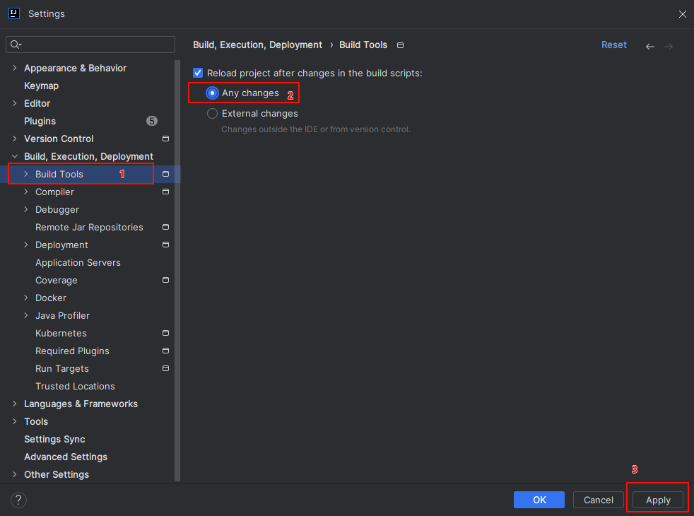

## 传统方式 vs Maven

**传统方式**：

1. 包管理不方便，比如想在项目中增加对数据库的操作，得下载mysql-connector-java.jar 包，放入项目的 lib 目录中，然后再 `Add as Library` 导入 
2. 如果想把项目打包成 jar 包，比较麻烦
3. 项目越大，包越来越多，包可能会出现版本冲突
4. 还有就是兼容性问题，比如spring5.x 需要使用jackson-2.9.x.jar的包，处理JSON
5. 项目很大，包括很多个模块，模块有共用的 jar包难处理

**Maven**：它很好的解决了以上问题。更方便进行项目构建和项目 jar 包管理，包括：build项目，切换 jar 版本，添加 jar，删除 jar包等，会自动引入所依赖jar包，很好的处理了兼容性问题。

## Maven 安装

maven 的安装比较简单

1. 下载压缩包（[下载地址](https://archive.apache.org/dist/maven/maven-3/)），解压apache-maven-3.6.1.rar既安装完成
2. 配置环境变量`MAVEN_HOME`为安装路径的bin目录


1. 配置本地仓库：打开解压后的文件夹，找到 conf 文件夹，修改 `conf/settings.xml` 中的`<localRepository>`为一个指定目录，可以在安装目录新建一个mvn_resp当作本地仓库


1. 配置阿里云私服：修改`conf/settings.xml`中的`<mirrors>`标签，为其添加如下子标签：

```xml
<mirror>
  <id>alimaven</id>
  <name>aliyunmaven</name>
  <!-- 老版
  <url>http://maven.aliyun.com/nexus/content/groups/public/</url> -->
  <!-- 新版 -->
  <url>https://maven.aliyun.com/repository/public/</url>
  <mirrorOf>central</mirrorOf>
</mirror>
```


## Maven 工作原理

**maven 模型图：**


1. 在 maven 项目的pom.xml，可以配置项目依赖的jar（指定坐标即可）
2. maven根据配置，到中央仓库/私服去获取jar，下载到本地仓库
3. maven项目，会引用本地仓库的jar，完成项目开发
4. 在maven项目构建生命周期中，每个阶段的执行都有相应的插件完成
5. 各个插件执行过程中，会附带输出内容，比如jar/war/xml/源码
6. 程序员可以使用maven默认的插件，也可以自定义插件，完成定制任务

## IDEA 配置 Maven

### 配置 Maven 环境

1. 选择IDEA中File-->Settings
2. 搜索 maven
3. 设置IDEA使用本地安装的Maven，并修改配置文件路径


## 坐标

**什么是坐标？**

- Maven 中的坐标是资源的唯一标识
- 使用坐标来定义项目或引入项目中需要的依赖

### Maven 坐标主要组成：

- groupId：定义当前Maven项目隶属组织名称（通常是域名反写，例如：com.fan）
- artifactId：定义当前Maven项目名称（通常是模块名称，例如 order-service、goods-service）
- version：定义当前项目版本号

解读 pom.xml 文件

modelVersion：

1. 描述这个pom文件 / pom模型遵循的哪个版本
2. 对应 maven2 和 maven3 而言，`modelVersion` 版本只能是 `4.0.0`


创建该项目时指定的坐标：

1. groupId：组织名
2. artifactId：项目名
3. version：版本号


依赖包：

1. 下面是引入项目需要的jar包，类似传统项目的import jar的作用
2. 在 dependencies 标签内，可以指定多个需要依赖的 jar / 导入 jar
3. 引入的 jar 包需要一个完整的 jar 包坐标，从 mvn 仓库能查询得到


### 获取坐标

进入[中央仓库](https://mvnrepository.com/)搜索想要的 jar 包


找到想要的版本


即可得到坐标


## 生命周期

Maven 构建项目生命周期描述的是一次构建过程经历经历了多少个事件

Maven 对项目构建的生命周期划分为3套

- clean：清理工作
- default：核心工作，例如编译，测试，打包，安装等
- site：产生报告，发布站点等


**生命周期是分阶段执行的：**并不是每次都完整执行，比如执行 `compile`，那么就执行到 `compile` 这个阶段

### default 构建生命周期

- validate（校验）			校验项目是否正确并且所有必要的信息可以完成项目的构建过程。
- initialize（初始化）			初始化构建状态，比如设置属性值。
- generate-sources（生成源代码）		生成包含在编译阶段中的任何源代码。
- process-sources（处理源代码）		处理源代码，比如说，过滤任意值。
- generate-resources（生成资源文件）		生成将会包含在项目包中的资源文件。
- process-resources （处理资源文件）		复制和处理资源到目标目录，为打包阶段最好准备。
- **compile（编译）**			编译项目的源代码。
- process-classes（处理类文件）		处理编译生成的文件，比如说对Java class文件做字节码改善优化。
- generate-test-sources（生成测试源代码）		生成包含在编译阶段中的任何测试源代码。
- process-test-sources（处理测试源代码）		处理测试源代码，比如说，过滤任意值。
- generate-test-resources（生成测试资源文件）	为测试创建资源文件。
- process-test-resources（处理测试资源文件）		复制和处理测试资源到目标目录。
- test-compile（编译测试源码）		编译测试源代码到测试目标目录.
- process-test-classes（处理测试类文件）		处理测试源码编译生成的文件。
- **test（测试）**			使用合适的单元测试框架运行测试（Juint是其中之一）。
- prepare-package（准备打包）		在实际打包之前，执行任何的必要的操作为打包做准备。
- **package（打包）**			将编译后的代码打包成可分发格式的文件，比如JAR、WAR或者EAR文件。
- pre-integration-test（集成测试前）		在执行集成测试前进行必要的动作。比如说，搭建需要的环境。
- integration-test（集成测试）		处理和部署项目到可以运行集成测试环境中。
- post-integration-test（集成测试后）		在执行集成测试完成后进行必要的动作。比如说，清理集成测试环境。
- verify （验证）			运行任意的检查来验证项目包有效且达到质量标准。
- **install（安装）**			安装项目包到本地仓库，这样项目包可以用作其他本地项目的依赖。
- deploy（部署）			将最终的项目包复制到远程仓库中与其他开发者和项目共享。

## 插件

插件与生命周期内的某个阶段绑定，**在执行到对应生命周期时, 由对应插件来完成任务/功能**

- 可以在[官网](https://maven.apache.org/plugins/index.html)获取插件，部分插件：


- 我们也可以根据自己的业务需求，自己实现自定义插件（提示：加入自定义插件后，ide 可能会爆红，重启项目即可）

## 手动创建 maven 项目

通过手动创建 maven 项目，了解项目的结构，熟悉 maven 中常用的命令


- main：目录里面编写代码

- - java：java代码
  - resources：需要的资源，静态文件、css、js等

- test：项目测试

### 编写代码

在 `src/main/java/com/fan/Hello.java` 中编写代码

```java
package com.fan;

public class Hello {
	public String sum(int n1, int n2){
		System.out.println("sum= "+ (n1 + n2));
		return "sum= "+ (n1 + n2);
	}
}
```

在 `src/test/java/com/fan/HelloTest.java`中编写测试代码

```java
package com.fan;

import org.junit.Test;
import org.junit.Assert;

public class HelloTest{
	@Test
	public void testSum(){
		Hello h = new Hello();
		String res = h.sum(1, 8);
		Assert.assertEquals("sum= 9",res);
	}
}
```

在 `src` 同级目录下新建 `pom.xml` 文件，编写项目的构建配置和 jar包依赖配置

```xml
<?xml version="1.0" encoding="UTF-8"?>
<project xmlns = "http://maven.apache.org/POM/4.0.0"
    xmlns:xsi = "http://www.w3.org/2001/XMLSchema-instance"
    xsi:schemaLocation = "http://maven.apache.org/POM/4.0.0
    http://maven.apache.org/xsd/maven-4.0.0.xsd">
	<modelVersion>4.0.0</modelVersion>
	<groupId>com.fan</groupId>
	<artifactId>maven-01-manually-created</artifactId>
	<version>1.0-SNAPSHOT</version>

  <!-- 指定java版本 -->
	<properties>
		<maven.compiler.target>17</maven.compiler.target>
		<maven.compiler.source>17</maven.compiler.source>
	</properties>
  <!-- 依赖 -->
	<dependencies>
		<dependency>
			<groupId>junit</groupId>
			<artifactId>junit</artifactId>
			<version>4.12</version>
		</dependency>
	</dependencies>
</project>
```

### 编译

使用 `mvn compile` 命令进行编译


编译完成后，会自动创建target目录，并生成对应的 class 文件

说明：第一次编译需要下载相关 jar 包，会比较慢，后面编译就快了


### 测试

使用 `mvn test` 命令对项目进行测试


测试完成后会生成测试结果报告


- txt文件：输出简单结果
- xml文件：报告比较详细，比如运行环境，版本，结果等

### 打包

使用 `mvn package` 命令进行打包，打包后会输出一个 jar 包，可以供其他模块使用。


### 安装

使用 `mvn install` 可以将打包得到的 jar包，提交到本地仓库


成功后，我们可以在我们本地仓库找到我们的 jar 包，这样我们打包的项目就可以在其他项目中使用了


### 清理

使用 `mvn clean` 命令，可以对 maven 项目进行清理，会清除生成的 `target` 目录

**应用场景：**比如我们希望把源码进行拷贝或移植，或者希望再来一次全新的 build，就可以先 clean

## 依赖管理

### 导入 jar 包

#### 手动填写坐标

1. 在 pom.xml 中编写 `<dependencies>` 标签
2. 在 `<dependencies>` 标签中 使用 `<dependency>` 引入坐标
3. 定义坐标的 groupId，artifactId，version
4. 点击刷新按钮，使坐标生效


#### 快捷方式

1. 在 pom.xml 中 按 alt + insert，选择 Dependency
2. 在弹出的面板中搜索对应坐标，然后双击选中对应坐标
3. 点击刷新按钮，使坐标生效


#### 设置自动导入

1. 选择 IDEA中 File --> Settings
2. 在弹出的面板中找到 Build Tools
3. 选择 Any changes，点击 ok 即可生效

**设置完成后就不需要我们手动刷新了**



### 依赖范围

我们可以设置依赖的作用域，限制它在某些场景下使用。可以设置对应 jar 包的作用范围：**编译环境、测试环境、运行环境**

使用 `<scope>` 来设置（默认值为：compile）

```xml
<dependency>
  <groupId>junit</groupId>
  <artifactId>junit</artifactId>
  <version>4.12</version>
  <scope>test</scope>
</dependency>
```

scope 有以下选项：


### 依赖传递

#### 直接依赖

通过依赖配置建立的依赖关系


#### 间接依赖

直接依赖了 A 包，A 包又依赖了 B 包，B包就是间接依赖


#### 依赖冲突

**路径优先：**在依赖中出现相同的资源时，层级越深，优先级越低，层级越浅，优先级越高


**声明优先：**当资源在相同层级被依赖时，配置顺序靠前的覆盖配置顺序靠后的

比如 依赖A 先声明，A 里面有依赖 B，B 再声明，用的就是 A


**特殊优先：**当同级配置了相同资源的不同版本，后配置的覆盖先配置的

**提醒：要尽量避免这种没有意义的冲突**

```xml
<!-- 后配置覆盖前面的配置，所以版本是 5.1.43 -->
<dependencies>
  <dependency>
    <groupId>mysql</groupId>
    <artifactId>mysql-connector-java</artifactId>
    <version>5.1.47</version>
  </dependency>
  <!-- 引入 mysql5.1.43 -->
  <dependency>
    <groupId>mysql</groupId>
    <artifactId>mysql-connector-java</artifactId>
    <version>5.1.43</version>
  </dependency>
</dependencies>
```

#### 可选依赖

可以使用 `optional` 来配置依赖是否隐藏，隐藏后在 maven 依赖列表中就看不到该依赖

- false：不隐藏
- true：隐藏

```xml
<dependencies>
  <dependency>
    <groupId>junit</groupId>
    <artifactId>junit</artifactId>
    <version>4.13.2</version>
    <!-- 隐藏依赖 -->
    <optional>true</optional>
  </dependency>
</dependencies>
```

#### 排除依赖

排除依赖指主动断开依赖的资源， 被排除的资源无需指定版本，排除后，在依赖列表中也看不到该依赖

使用 `exclusions` 来配置

```xml
<exclusions>
  <exclusion>
    <groupId>junit</groupId>
    <artifactId>junit</artifactId>
  </exclusion>
</exclusions>
```

#### 可选依赖 vs 排除依赖

隐藏依赖是不让其他项目来引用（**我不给**）, 排除依赖是主动不要引入的某个资源（**我不要**）