# Mybatis Plus 入门

[笔记代码](https://github.com/Fanvvv/learn-java/tree/master/mybatis-01-quickstart)

## 与SpringBoot集成

Mybatis Plus与SpringBoot的集成十分简单，具体操作如下

### 1.引入Maven依赖

spring boot3使用

```xml
<dependency>
    <groupId>com.baomidou</groupId>
    <artifactId>mybatis-plus-spring-boot3-starter</artifactId>
    <version>3.5.9</version>
</dependency>
```

### 2.配置 application.yml 文件

配置连接数据库：

```yaml
spring:
  datasource:
    driver-class-name: com.mysql.cj.jdbc.Driver
    username: root
    password: root
    url: jdbc:mysql://192.168.10.150:3316/hello_mp?useUnicode=true&characterEncoding=utf-8&serverTimezone=GMT%2b8
```

## 创建实体类

创建 user 表实体

```java
package com.fan.pojo;

import com.baomidou.mybatisplus.annotation.IdType;
import com.baomidou.mybatisplus.annotation.TableField;
import com.baomidou.mybatisplus.annotation.TableId;
import com.baomidou.mybatisplus.annotation.TableName;
import lombok.Data;

@Data
@TableName("user")
public class User {

    @TableId(value = "id", type = IdType.AUTO)
    private Long id;

    @TableField(value = "name")
    private String name;

    @TableField(value = "age")
    private Integer age;

    @TableField(value = "email")
    private String email;
}
```

注解解释：

- `@TableName`：表名注解，用于标识实体类所对应的表
  - `value`：用于声明表名
- `@TableId`：主键注解，用于标识主键字段
  - `value`：用于声明主键的字段名
  - `type`：用于声明主键的生成策略，常用的策略有`AUTO`、`ASSIGN_UUID`、`INPUT`等等

- `@TableField`：普通字段注解，用于标识属性所对应的表字段
  - `value`：用于声明普通字段的字段名

## 通用 Mapper

通用Mapper提供了通用的CRUD方法，使用它可以省去大量编写简单重复的SQL语句的工作

### 1.创建Mapper接口

继承 `mybatis plus` 提供的 `BaseMapper<T>` 接口

```java
package com.fan.mapper;

import com.baomidou.mybatisplus.core.mapper.BaseMapper;
import com.fan.pojo.User;

@Mapper
public interface UserMapper extends BaseMapper<User> {
}
```

::: tip 统一配置

若Mapper接口过多，可不用逐一配置 `@Mapper` 注解，而使用 `@MapperScan` 注解指定包扫描路径进行统一管理

```java
package com.fan;

import org.mybatis.spring.annotation.MapperScan;
import org.springframework.boot.SpringApplication;
import org.springframework.boot.autoconfigure.SpringBootApplication;

@SpringBootApplication
@MapperScan(basePackages = "com.fan.mapper")
public class Mybatis01QuickstartApplication {

    public static void main(String[] args) {
        SpringApplication.run(Mybatis01QuickstartApplication.class, args);
    }

}
```

:::

### 2.测试通用Mapper

创建测试类 `UserMapperTest`，从数据库中查找id为1的数据

```java
package com.fan.mapper;

import com.fan.pojo.User;
import org.junit.jupiter.api.Test;
import org.springframework.beans.factory.annotation.Autowired;
import org.springframework.boot.test.context.SpringBootTest;

@SpringBootTest
public class UserMapperTest {

    @Autowired
    private UserMapper userMapper;

    @Test
    public void testSelectById() {
        User user = userMapper.selectById(1);
        System.out.println(user);
    }
}
```

测试结果：


::: tip 控制台日志配置

如果想要在控制台日志打印执行的SQL，可以做如下配置：

```yaml
mybatis-plus:
  configuration:
    log-impl: org.apache.ibatis.logging.stdout.StdOutImpl
  logging:
    level:
      com.fan.mapper: debug
```

:::

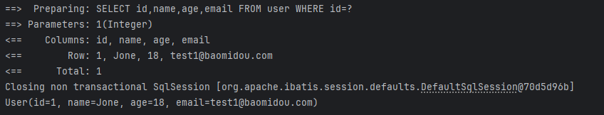

## 通用 service

通用Service进一步封装了通用Mapper的CRUD方法，并提供了例如`saveOrUpdate`、`saveBatch`等高级方法。

### 1.创建 Service 接口

```java
package com.fan.service;

import com.baomidou.mybatisplus.extension.service.IService;
import com.fan.pojo.User;

public interface UserService extends IService<User> {
}
```

### 2.创建 Service 实现类

```java
package com.fan.service;

import com.baomidou.mybatisplus.extension.service.impl.ServiceImpl;
import com.fan.mapper.UserMapper;
import com.fan.pojo.User;
import org.springframework.stereotype.Service;

@Service
public class UserServiceImpl extends ServiceImpl<UserMapper, User> implements UserService {
}
```

### 3.测试通用 Service

```java
package com.fan.service;

import com.fan.pojo.User;
import org.junit.jupiter.api.Test;
import org.springframework.beans.factory.annotation.Autowired;
import org.springframework.boot.test.context.SpringBootTest;

import java.util.List;

@SpringBootTest
public class UserServiceImplTest {

    @Autowired
    private UserService userService;

    /**
     * 保存或更新
     */
    @Test
    public void testSaveOrUpdate() {
        User user1 = userService.getById(2);
        user1.setName("张三1");
        userService.saveOrUpdate(user1);

        User user2 = new User();
        user2.setName("李四2");
        user2.setAge(22);
        user2.setEmail("lisi@qq.com");
        userService.saveOrUpdate(user2);
    }

    /**
     * 批量保存
     */
    @Test
    public void testSaveBatch() {
        User user1 = new User();
        user1.setName("张三3");
        user1.setAge(22);
        user1.setEmail("zhangsan@qq.com");

        User user2 = new User();
        user2.setName("李四4");
        user2.setAge(22);
        user2.setEmail("lisi@qq.com");

        List<User> users = List.of(user1, user2);
        userService.saveBatch(users);
    }
}
```

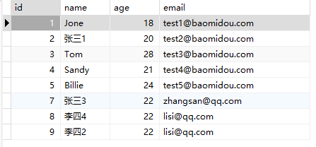

## 条件构造器

MyBatis Plus共提供了两类构造器，分别是`QueryWrapper`和`UpdateWrapper`。其中`QueryWrapper`主要用于查询、删除操作，`UpdateWrapper`主要用于更新操作

### 1.创建`WrapperTest`测试类

```java
package com.fan;

import com.baomidou.mybatisplus.core.conditions.query.QueryWrapper;
import com.baomidou.mybatisplus.core.conditions.update.UpdateWrapper;
import com.fan.pojo.User;
import com.fan.service.UserService;
import org.junit.jupiter.api.Test;
import org.springframework.beans.factory.annotation.Autowired;
import org.springframework.boot.test.context.SpringBootTest;

import java.util.List;

@SpringBootTest
public class WrapperTest {

    @Autowired
    private UserService userService;

    @Test
    public void testQueryWrapper() {

        //查询name=Tom的所有用户
        QueryWrapper<User> queryWrapper1 = new QueryWrapper<>();
        queryWrapper1.eq("name", "Tom");

        //查询邮箱域名为baomidou.com的所有用户
        QueryWrapper<User> queryWrapper2 = new QueryWrapper<>();
        queryWrapper2.like("email", "baomidou.com");

        //查询所有用户信息并按照age字段降序排序
        QueryWrapper<User> queryWrapper3 = new QueryWrapper<>();
        queryWrapper3.orderByDesc("age");

        //查询age介于[20,30]的所有用户
        QueryWrapper<User> queryWrapper4 = new QueryWrapper<>();
        queryWrapper4.between("age", 20, 30);

        //查询age小于20或大于30的用户
        QueryWrapper<User> queryWrapper5 = new QueryWrapper<>();
        queryWrapper5.lt("age", 20).or().gt("age", 30);

        //邮箱域名为baomidou.com且年龄小于30或大于40且的用户
        QueryWrapper<User> queryWrapper6 = new QueryWrapper<>();
        queryWrapper6.like("email", "baomidou.com").and(wrapper -> wrapper.lt("age", 30).or().gt("age", 40));

        List<User> list = userService.list(queryWrapper6);
        list.forEach(System.out::println);
    }

    @Test
    public void testUpdateWrapper() {

        //将name=Tom的用户的email改为Tom@baobidou.com
        UpdateWrapper<User> updateWrapper = new UpdateWrapper<>();
        updateWrapper.eq("name", "Tom");
        updateWrapper.set("email", "Tom@baobidou.com");

        userService.update(updateWrapper);
    }

}
```

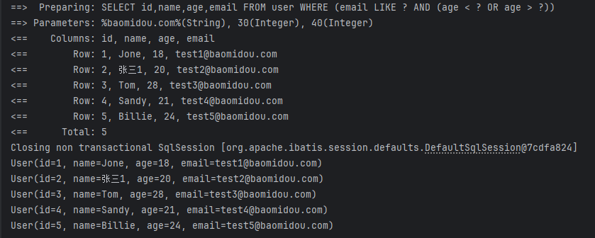

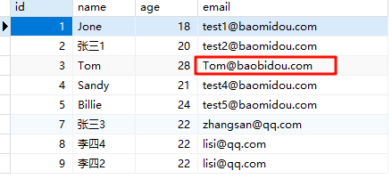

### 2.创建`LambdaWrapperTest`测试类

`QueryWrapper`和`UpdateWrapper`均有一个`Lambda`版本，也就是`LambdaQueryWrapper`和`LambdaUpdateWrapper`，`Lambda`版本的优势在于，可以省去字段名的硬编码

```java
package com.fan;

import com.baomidou.mybatisplus.core.conditions.query.LambdaQueryWrapper;
import com.baomidou.mybatisplus.core.conditions.update.LambdaUpdateWrapper;
import com.fan.pojo.User;
import com.fan.service.UserService;
import org.junit.jupiter.api.Test;
import org.springframework.beans.factory.annotation.Autowired;
import org.springframework.boot.test.context.SpringBootTest;

import java.util.List;

@SpringBootTest
public class LambdaWrapper {

    @Autowired
    private UserService userService;

    @Test
    public void testLambdaWrapper() {
        //查询name=Tom的所有用户
        LambdaQueryWrapper<User> lambdaQueryWrapper = new LambdaQueryWrapper<>();
        lambdaQueryWrapper.eq(User::getName, "Tom");

        List<User> list = userService.list(lambdaQueryWrapper);
        list.forEach(System.out::println);
    }

    @Test
    public void testLambdaUpdateWrapper() {
        //将name=Tom的用户的邮箱改为Tom@tom.com
        LambdaUpdateWrapper<User> lambdaUpdateWrapper = new LambdaUpdateWrapper<>();
        lambdaUpdateWrapper.eq(User::getName, "Tom");
        lambdaUpdateWrapper.set(User::getEmail, "Tom@Tom.com");

        userService.update(lambdaUpdateWrapper);
    }
}
```

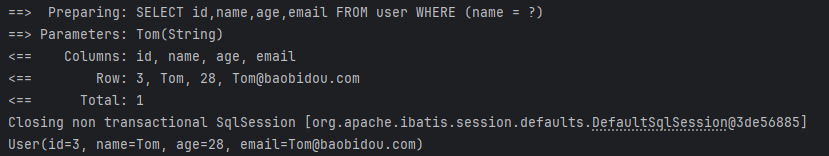

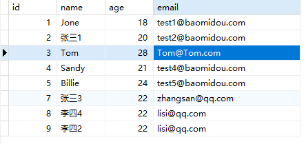

## 逻辑删除

逻辑删除，可以方便地实现对数据库记录的逻辑删除而不是物理删除。逻辑删除是指通过更改记录的状态或添加标记字段来模拟删除操作，从而保留了删除前的数据，便于后续的数据分析和恢复。

- 物理删除：真实删除，将对应数据从数据库中删除，之后查询不到此条被删除的数据
- 逻辑删除：假删除，将对应数据中代表是否被删除字段的状态修改为“被删除状态”，之后在数据库中仍旧能看到此条数据记录

1. 数据库和实体类添加逻辑删除字段 

   1. 表添加逻辑删除字段

      可以是一个布尔类型、整数类型或枚举类型。

      ```sql
      ALTER TABLE USER ADD deleted INT DEFAULT 0 ;  # int 类型 1 逻辑删除 0 未逻辑删除
      ```

   2. 实体类添加属性

      ```java
      @Data
      public class User {
      
         // @TableId
          private Integer id;
          private String name;
          private Integer age;
          private String email;
          
          @TableLogic
          //逻辑删除字段 int mybatis-plus下,默认 逻辑删除值为1 未逻辑删除 0 
          private Integer deleted;
      }
      ```

2. 指定逻辑删除字段和属性值 

   1. 单一指定

      ```java
      @Data
      public class User {
      
         // @TableId
          private Integer id;
          private String name;
          private Integer age;
          private String email;
           @TableLogic
          //逻辑删除字段 int mybatis-plus下,默认 逻辑删除值为1 未逻辑删除 0 
          private Integer deleted;
      }
      ```

   2. 全局配置

      ```yaml
      mybatis-plus:
        global-config:
          db-config:
            logic-delete-field: deleted # 全局逻辑删除的实体字段名(since 3.3.0,配置后可以忽略不配置步骤2)
            logic-delete-value: 1 # 逻辑已删除值(默认为 1)
            logic-not-delete-value: 0 # 逻辑未删除值(默认为 0)
      ```

3. 逻辑删除操作

   ```java
   @Test
   public void testDeleteById() {
       userMapper.deleteById(5);
   }
   ```

   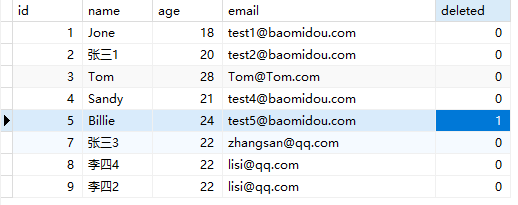

   查询没被逻辑删除的数据

   ```java
   @Test
   public void testSelectList() {
       userMapper.selectList(null);
   }
   ```

   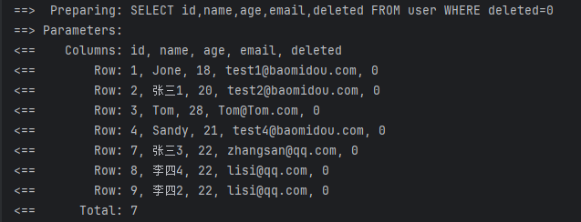

## 分页插件

分页查询是一个很常见的需求，故`Mybatis Plus`提供了一个分页插件，使用它可以十分方便的完成分页查询

[官方文档](https://baomidou.com/plugins/pagination/#_top)

- 配置分页插件

  创建配置类`com.fan.config.MPConfig`

  ```java
  package com.fan.config;
  
  import com.baomidou.mybatisplus.annotation.DbType;
  import com.baomidou.mybatisplus.extension.plugins.MybatisPlusInterceptor;
  import com.baomidou.mybatisplus.extension.plugins.inner.PaginationInnerInterceptor;
  import org.mybatis.spring.annotation.MapperScan;
  import org.springframework.context.annotation.Bean;
  import org.springframework.context.annotation.Configuration;
  
  @Configuration
  @MapperScan("com.fan.mapper")
  public class MPConfiguration {
      /**
       * 添加分页插件
       */
      @Bean
      public MybatisPlusInterceptor mybatisPlusInterceptor() {
          MybatisPlusInterceptor interceptor = new MybatisPlusInterceptor();
          interceptor.addInnerInterceptor(new PaginationInnerInterceptor(DbType.MYSQL)); // 如果配置多个插件, 切记分页最后添加
          // 如果有多数据源可以不配具体类型, 否则都建议配上具体的 DbType
          return interceptor;
      }
  }
  ```

  :::warning 注意

  `mybatis-plus-spring-boot3-starter` 版本3.5.9 将 `PaginationInnerInterceptor `抽离出来了，在`inner` 中就找不到 `PaginationInnerInterceptor` 了。可以根据[官网更新日志中的方法](https://github.com/baomidou/mybatis-plus/blob/3.0/CHANGELOG.md#v359-20241023)进行修改，也可以选择将版本降会3.5.8

  :::

- 分页插件使用说明

  - 构造分页对象

    分页对象包含了分页的各项信息，其核心属性如下：
  
    
    | 属性名  | 类型 | 默认值    | 描述                   |
    | ------- | ---- | --------- | ---------------------- |
    | records | List | emptyList | 查询数据列表           |
    | total   | Long | 0         | 查询列表总记录数       |
    | size    | Long | 10        | 每页显示条数，默认`10` |
    | current | Long | 1         | 当前页                 |

    分页对象既作为分页查询的参数，也作为分页查询的返回结果，当作为查询参数时，通常只需提供`current`和`size`属性，如下
    
    ```java
    IPage<T> page = new Page<>(current, size);
    ```
    
    注：`IPage`为分页接口，`Page`为`IPage`接口的一个实现类。
  
  
  - 分页查询
  
    Mybatis Plus的`BaseMapper`和`ServiceImpl`均提供了常用的分页查询的方法，例如：
  
    - `BaseMapper`的分页查询：
  
      ```java
      IPage<T> selectPage(IPage<T> page,Wrapper<T> queryWrapper);
      ```
  
    - `ServiceImpl`的分页查询：
  
      ```java
      // 无条件分页查询
      IPage<T> page(IPage<T> page);
      // 条件分页查询
      IPage<T> page(IPage<T> page, Wrapper<T> queryWrapper);
      ```
  
    - 自定义Mapper
  
        对于自定义SQL，也可以十分方便的完成分页查询，如下

        `Mapper`接口：

        ```java
        IPage<UserVo> selectPageVo(IPage<?> page, Integer state);
        ```

        `Mapper.xml`：

        ```java
        <select id="selectPageVo" resultType="xxx.xxx.xxx.UserVo">
            SELECT id,name FROM user WHERE state=#{state}
        </select>
        ```

        **注意**：`Mapper.xml`中的SQL只需实现查询`list`的逻辑即可，无需关注分页的逻辑。

- 创建`PageTest`测试类

```java
package com.fan;

import com.baomidou.mybatisplus.core.metadata.IPage;
import com.baomidou.mybatisplus.extension.plugins.pagination.Page;
import com.fan.mapper.UserMapper;
import com.fan.pojo.User;
import com.fan.service.UserService;
import org.springframework.beans.factory.annotation.Autowired;
import org.springframework.boot.test.context.SpringBootTest;

@SpringBootTest
public class PageTest {

    @Autowired
    private UserService userService;

    @Autowired
    private UserMapper userMapper;

    /**
     * 通用Service分页查询
     */
    public void testServicePage() {
        Page<User> page = new Page<>(1, 3);
        Page<User> userPage = userService.page(page);
        userPage.getRecords().forEach(System.out::println);
    }

    /**
     * 通用Mapper分页查询
     */
    public void testMapperPage() {
        IPage<User> page = new Page<>(1, 3);
        IPage<User> userPage = userMapper.selectPage(page, null);
        userPage.getRecords().forEach(System.out::println);
    }

    /**
     * 自定义sql分页查询
     */
    public void testCustomPage() {
        IPage<User> page = new Page<>(1, 3);
        IPage<User> userPage = userMapper.selectUserPage(page);
        userPage.getRecords().forEach(System.out::println);
    }
}
```

在UserMapper中声明分页查询方法如下

```java
IPage<User> selectUserPage(IPage<User> page);
```

创建`resources/mapper/UserMapper.xml`文件，内容如下

```xml
<?xml version="1.0" encoding="UTF-8"?>
<!DOCTYPE mapper
        PUBLIC "-//mybatis.org//DTD Mapper 3.0//EN"
        "http://mybatis.org/dtd/mybatis-3-mapper.dtd">
<mapper namespace="com.fan.mapper.UserMapper">
    <select id="selectUserPage" resultType="com.fan.pojo.User">
        select * from user
    </select>
</mapper>
```

:::warning 注意

`Mybatis Plus` 中`Mapper.xml`文件路径默认为：`classpath*:/mapper/**/*.xml`，可在`application.yml`中配置以下参数进行修改，下面为默认值，可以修改为自己指定的路径

```yaml
mybatis-plus:
	mapper-locations: classpath*:/mapper/**/*.xml
```

:::

## MyBatisX插件

使用它可根据数据库快速生成`Entity`、`Mapper`、`Mapper.xml`、`Service`、`ServiceImpl`等代码

### 1.搜索插件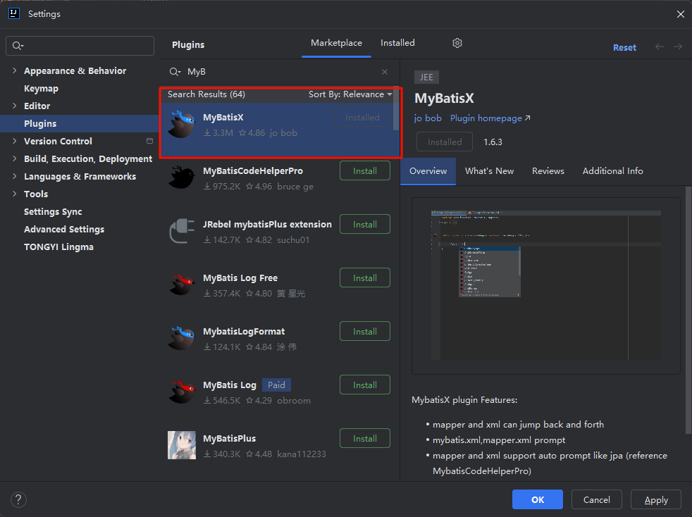

### 2.配置数据库连接

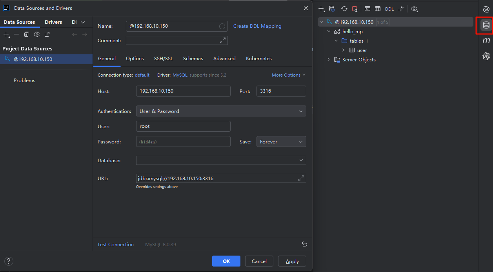

### 3.生成代码

可以将之前写的代码`User`、`UserMapper`、`UserServcie`、`UserServiceImpl`全部删除，我这里学习记录，为了保留之前写的，就重新生成到 `generate` 包

右击所需要生成的数据库表

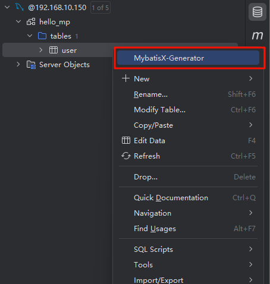

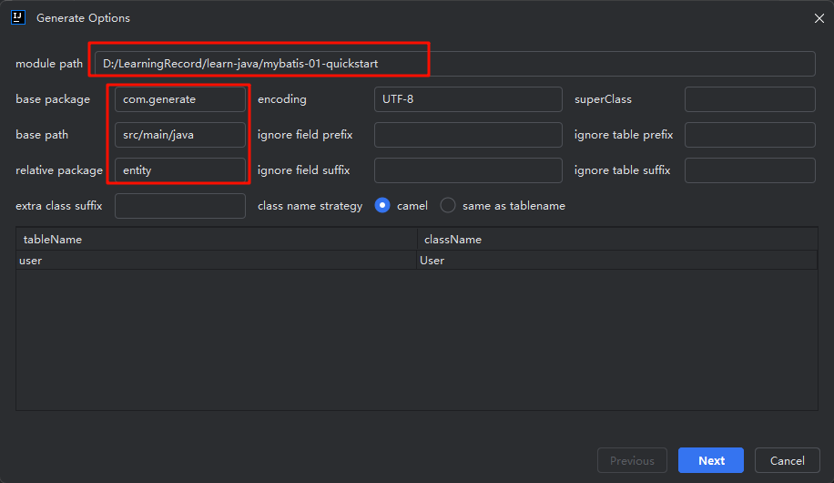

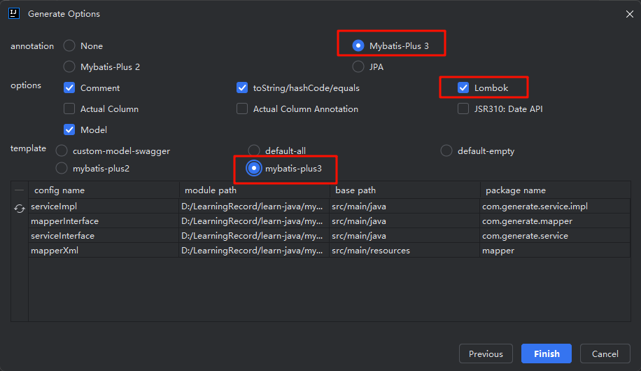

点击 finish 即可生成，查看生成后的代码

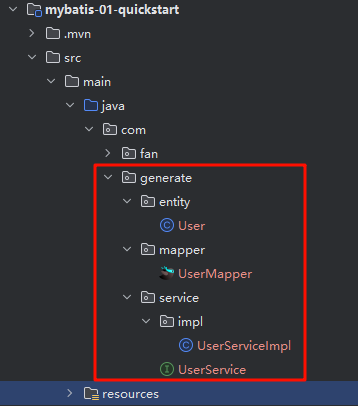