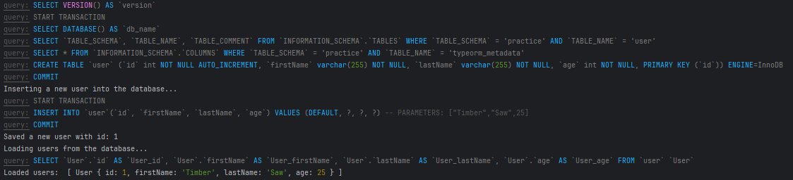
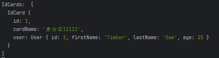
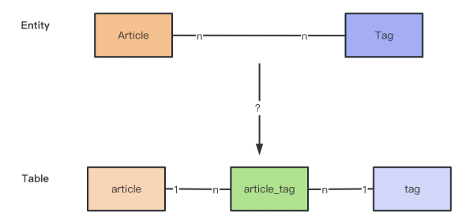

# TypeORM

## 入门

使用命令新建 TypeORM 项目

```bash
npx typeorm@latest init --name typeorm-all-feature --database mysql
```

使用的是 mysql ，安装 mysql2

```bash
npm install --save mysql2
```

配置数据库连接 `data-source.ts`

```ts
import "reflect-metadata"
import { DataSource } from "typeorm"
import { User } from "./entity/User"

export const AppDataSource = new DataSource({
    type: "mysql",
    host: "localhost",
    port: 3306,
    username: "root",
    password: "Fan0124.",
    database: "practice",
    synchronize: true, // 根据同步建表，也就是当 database 里没有和 Entity 对应的表的时候，会自动生成建表 sql 语句并执行
    logging: true, // 打印生成的 sql 语句
    entities: [User], // 指定有哪些和数据库的表对应的 Entity
    migrations: [], // 修改表结构之类的 sql
    subscribers: [], // 一些 Entity 生命周期的订阅者，比如 insert、update、remove 前后，可以加入一些逻辑
    poolSize: 10, // 指定数据库连接池中连接的最大数量
    connectorPackage: 'mysql2', // 驱动包
    extra: { // 额外发送给驱动包的一些选项
        authPlugin: 'sha256_password',
    }
})
```

启动项目看看效果

```bash
npm run start
```

User 实体是这样的

```ts
import { Entity, PrimaryGeneratedColumn, Column } from "typeorm"

@Entity()
export class User {

    @PrimaryGeneratedColumn()
    id: number

    @Column()
    firstName: string

    @Column()
    lastName: string

    @Column()
    age: number

}
```

控制台的 sql 语句 log 是这样的

```sql
SELECT VERSION() AS `version`
START TRANSACTION
SELECT DATABASE() AS `db_name`
SELECT `TABLE_SCHEMA`, `TABLE_NAME`, `TABLE_COMMENT` FROM `INFORMATION_SCHEMA`.`TABLES` WHERE `TABLE_SCHEMA` = 'practice' AND `TABLE_NAME` = 'user'
SELECT * FROM `INFORMATION_SCHEMA`.`COLUMNS` WHERE `TABLE_SCHEMA` = 'practice' AND `TABLE_NAME` = 'typeorm_metadata'
CREATE TABLE `user` (`id` int NOT NULL AUTO_INCREMENT, `firstName` varchar(255) NOT NULL, `lastName` varchar(255) NOT NULL, `age` int NOT NULL, PRIMARY KEY (`id`)) ENGINE=InnoDB
COMMIT
```

### 插入数据

`index.ts` ：插入 user 数据

```ts
import { AppDataSource } from "./data-source"
import { User } from "./entity/User"

AppDataSource.initialize().then(async () => {

    console.log("Inserting a new user into the database...")
    const user = new User()
    user.firstName = "Timber"
    user.lastName = "Saw"
    user.age = 25
    await AppDataSource.manager.save(user)
    console.log("Saved a new user with id: " + user.id)

    console.log("Loading users from the database...")
    const users = await AppDataSource.manager.find(User)
    console.log("Loaded users: ", users)

    console.log("Here you can setup and run express / fastify / any other framework.")

}).catch(error => console.log(error))
```

使用 `AppDataSource.manager.save` 方法进行保存数据

运行效果：插入了一条数据（Timber、Saw、 25）




### 修改数据

如果指定 id 就会变成修改

```ts
AppDataSource.initialize().then(async () => {

    const user = new User()
    user.id = 1
    user.firstName = "Fan"
    user.lastName = "xx"
    user.age = 18
    await AppDataSource.manager.save(user)

    const users = await AppDataSource.manager.find(User)
    console.log("user: ", users)

}).catch(error => console.log(error))
```


### 批量插入或修改

批量处理操作，不传id就是新增，传id就是修改

```ts
AppDataSource.initialize().then(async () => {

    await AppDataSource.manager.save(User, [
        { id: 1, firstName: "Timber", lastName: "Saw", age: 25 },
        { firstName: "f", lastName: "a", age: 1 },
        { firstName: "n", lastName: "f", age: 2 },
    ])

    const users = await AppDataSource.manager.find(User)
    console.log("user: ", users)

}).catch(error => console.log(error))
```


### 批量删除

删除可以使用delete 和remove。**delete 和 remove 的区别是，delete 直接传 id、而 remove 则是传入 entity 对象**

```ts
await AppDataSource.manager.delete(User, 2)
const user = new User()
user.id = 3
await AppDataSource.manager.remove(User, user)

const users = await AppDataSource.manager.find(User)
console.log("user: ", users)
```


### 查找

给数据库多添加几条数据


查找有很多中方法

- findOne 查找一个
- findBy 根据条件查询
- findOneBy 根据条件查询一个
- findAndCount 查询并统计
- findOneOrFail / findOneByOrFail，如果没找到，会抛一个 EntityNotFoundError 的异常
- query 执行sql查询
- queryBuild 构造器查询
- 还有一些其他的查询：如关联查询、分页查询、排序查询，可以在find的options中添加配置
  - take 分页
  - order 排序
  - relations 关联

```ts
// findOne 查询一个
const findOneUser = await AppDataSource.manager.findOne(User, { where: { firstName: 'fan' } })
console.log("findOneUser: ", findOneUser)
// findBy 根据条件查询
const findByUser = await AppDataSource.manager.findBy(User, { firstName: 'fan' })
console.log("findByUser: ", findByUser)
// findAndCount 查询并统计
const [users, count] = await AppDataSource.manager.findAndCount(User, { where: { firstName: 'fan' } })
console.log("users: ", users, "count: ", count)
// query sql查询
const queryUser = await AppDataSource.manager.query("SELECT * FROM user WHERE firstName = ?", ['fan'])
console.log("queryUser: ", queryUser)
// 构造器查询
const findBuilderUser = await AppDataSource.manager.createQueryBuilder(User, "user")
.where("user.firstName = :firstName", { firstName: 'fan' })
.getMany()
console.log("findBuilderUser: ", findBuilderUser)

    /**
     * findOne
     * SELECT `User`.`id` AS `User_id`, `User`.`firstName` AS `User_firstName`, `User`.`lastName` AS `User_lastName`, `User`.`age` AS `User_age` FROM `user` `User` WHERE ((`User`.`firstName` = ?)) LIMIT 1 -- PARAMETERS: ["fan"]
     * findBy
     * SELECT `User`.`id` AS `User_id`, `User`.`firstName` AS `User_firstName`, `User`.`lastName` AS `User_lastName`, `User`.`age` AS `User_age` FROM `user` `User` WHERE ((`User`.`firstName` = ?)) -- PARAMETERS: ["fan"]
     * findAndCount
     * SELECT `User`.`id` AS `User_id`, `User`.`firstName` AS `User_firstName`, `User`.`lastName` AS `User_lastName`, `User`.`age` AS `User_age` FROM `user` `User` WHERE ((`User`.`firstName` = ?)) -- PARAMETERS: ["fan"]
     * SELECT COUNT(1) AS `cnt` FROM `user` `User` WHERE ((`User`.`firstName` = ?)) -- PARAMETERS: ["fan"]
     * query
     * SELECT * FROM user WHERE firstName = ? -- PARAMETERS: ["fan"]
     * createQueryBuilder
     * SELECT `user`.`id` AS `user_id`, `user`.`firstName` AS `user_firstName`, `user`.`lastName` AS `user_lastName`, `user`.`age` AS `user_age` FROM `user` `user` WHERE `user`.`firstName` = ? -- PARAMETERS: ["fan"]
     */
```

### 事务

使用 transaction 开启事务

```ts
await AppDataSource.manager.transaction(async manager => {
    await manager.save(User, {
        id: 4,
        firstName: 'eee',
        lastName: 'eee',
        age: 20
    });
});
```

### getRepository简化Entity的传入

每次都需要传入 User 实体，可以是用 getRepository 先包一层再调用方法

```ts
const userRepo = AppDataSource.getRepository(User)
await userRepo.save({
    id: 5,
    firstName: 'asd',
    lastName: 'asd',
    age: 22
});
```

### 总结图


## 映射

创建数据库表 `typeorm_relation_mapping`

创建用于测试的项目

```bash
npx typeorm@latest init --name typeorm-relation-mapping --database mysql
```

### 一对一映射


通过 typeorm entity:create 命令创建身份证表：

```bash
npx typeorm entity:create src/entity/IdCard
```

在 data-source 中引入IdCard实体

```ts
import "reflect-metadata"
import { DataSource } from "typeorm"
import { User } from "./entity/User"
import { IdCard } from "./entity/IdCard"

export const AppDataSource = new DataSource({
    type: "mysql",
    host: "localhost",
    port: 3306,
    username: "root",
    password: "Fan0124.",
    database: "typeorm_relation_mapping",
    synchronize: true, // 根据同步建表，也就是当 database 里没有和 Entity 对应的表的时候，会自动生成建表 sql 语句并执行
    logging: true, // 打印生成的 sql 语句
    entities: [User, IdCard], // 指定有哪些和数据库的表对应的 Entity
    migrations: [], // 修改表结构之类的 sql
    subscribers: [], // 一些 Entity 生命周期的订阅者，比如 insert、update、remove 前后，可以加入一些逻辑
    poolSize: 10, // 指定数据库连接池中连接的最大数量
    connectorPackage: 'mysql2', // 驱动包
    extra: { // 额外发送给驱动包的一些选项
        authPlugin: 'sha256_password',
    }
})
```

IdCard 中使用 JoinColumn 注解设置

```ts
import {Column, Entity, JoinColumn, OneToOne, PrimaryGeneratedColumn} from "typeorm"
import {User} from "./User"

@Entity({
    name: 'id_card'
})
export class IdCard {
    @PrimaryGeneratedColumn()
    id: number

    @Column({
        length: 50,
        comment: '身份证号'
    })
    cardName: string

    /**
     * JoinColumn() 显式定义关系中的外键列 默认情况下，TypeORM 会根据实体名称（表名）和关系名（字段名）自动生成外键列的名称。
     * JoinColumn({ name: 'user_id' }) 自定义外键列的名称
     * OneToOne 表示一对一关系
     * cascade: true 表示级联操作
     * onDelete: 'CASCADE' 表示级联删除
     * onUpdate: 'CASCADE' 表示级联更新
     */
    @JoinColumn()
    @OneToOne(() => User, {
        cascade: true,
        onDelete: 'CASCADE',
        onUpdate: 'CASCADE'
    })
    user: User
}
```

在index中给表各插入一条数据

```ts
import { AppDataSource } from "./data-source"
import { User } from "./entity/User"
import { IdCard } from "./entity/IdCard"

AppDataSource.initialize().then(async () => {

    const user = new User()
    user.firstName = "Timber"
    user.lastName = "Saw"
    user.age = 25

    const idCard = new IdCard()
    idCard.cardName = '身份证11111'
    idCard.user = user

    // 设置了级联操作，就可以只保存 idCard，会自动保存 user
    // await AppDataSource.manager.save(user)
    await AppDataSource.manager.save(idCard)

}).catch(error => console.log(error))
```

查询 IdCard

```ts
const IdCards = await AppDataSource.manager.find(IdCard)
console.log("IdCards: ", IdCards)
```

会发现查出来的数据中，没有user


需要有user的话，可以设置relation关联

```ts
const IdCards = await AppDataSource.manager.find(IdCard, {
    relations: {
        user: true
    }
})
console.log("IdCards: ", IdCards)
```



不过现在我们只是在 idCard 里访问 user，如果想在 user 里访问 idCard 呢？

同样需要加一个 @OneToOne 的装饰器：

```ts
import {Entity, PrimaryGeneratedColumn, Column, OneToOne} from "typeorm"
import {IdCard} from "./IdCard"

@Entity()
export class User {

    @PrimaryGeneratedColumn()
    id: number

    @Column()
    firstName: string

    @Column()
    lastName: string

    @Column()
    age: number

    @OneToOne(() => IdCard, idCard => idCard.user)
    idCard: IdCard
}
```

这样通过user也能查到 idCard

```ts
const user = await AppDataSource.manager.find(User, {
    relations: {
        idCard: true
    }
})
console.log("user: ", user)
```


### 一对多映射


Department 和 Employee 两个实体：

```bash
npx typeorm entity:create src/entity/Department
npx typeorm entity:create src/entity/Employee
```

添加 Department 和 Employee 的映射信息：

```ts
import {Column, Entity, OneToMany, PrimaryGeneratedColumn} from "typeorm"
import {Employee} from "./Employee";

@Entity()
export class Department {
    @PrimaryGeneratedColumn()
    id: number;

    @Column({
        length: 50
    })
    name: string;

    @OneToMany(() => Employee, employee => employee.department, {
        cascade: true
    })
    employees: Employee[];
}


import {Column, Entity, ManyToOne, PrimaryGeneratedColumn} from "typeorm"
import {Department} from "./Department";

@Entity()
export class Employee {
    @PrimaryGeneratedColumn()
    id: number;

    @Column({
        length: 50
    })
    name: string;

    @ManyToOne(() => Department)
    department: Department;
}
```

index中插入数据并查询

```ts
const department = new Department()
const employee1 = new Employee()
employee1.name = 'employee1'
const employee2 = new Employee()
employee2.name = 'employee2'

department.name = 'department1'
department.employees = [employee1, employee2]
await AppDataSource.manager.save(Department, department)

const departments = await AppDataSource.manager.find(Department, {
    relations: {
        employees: true
    }
})
console.log("departments: ", departments)
```


> 注意：
>
> 1.为什么不需要JoinColumn？
>
> 因为一对多的关系只可能是在多的那一方保存外键
>
> 2.注意只能有一方设置 cascade，否则会无限循环

### 多对多映射


多对多可以拆成两个一对多



创建 Article 和 Tag 两个实体：

```bash
npx typeorm entity:create src/entity/Article
npx typeorm entity:create src/entity/Tag
```

实体内容

```ts
import {Column, Entity, JoinTable, ManyToMany, PrimaryGeneratedColumn} from "typeorm"
import {Tag} from "./Tag";

@Entity()
export class Article {
    @PrimaryGeneratedColumn()
    id: number;

    @Column({
        length: 100,
        comment: '文章标题'
    })
    title: string;

    @Column({
        type: 'text',
        comment: '文章内容'
    })
    content: string;

    @JoinTable()
    @ManyToMany(() => Tag, tag => tag.article, {
        cascade: true
    })
    tag: Tag[];
}


import {Column, Entity, ManyToMany, PrimaryGeneratedColumn} from "typeorm"
import {Article} from "./Article";

@Entity()
export class Tag {

    @PrimaryGeneratedColumn()
    id: number

    @Column({
        length: 100
    })
    name: string

    @ManyToMany(() => Article, article => article.tag)
    article: Article
}
```

index中插入数据并查询

```ts
const article = new Article()
article.title = 'article1'
article.content = 'article1 content'
const tag1 = new Tag()
tag1.name = 'tag1'
const tag2 = new Tag()
tag2.name = 'tag2'
article.tag = [tag1, tag2]
await AppDataSource.manager.save(Article, article)

const articles = await AppDataSource.manager.find(Article, {
    relations: {
        tag: true
    }
})
console.log("articles: ", articles)
```


@JoinTable 会创建一个中间表，用于映射多对多的关系


## nest 中集成 TypeORM

创建一个 nest 项目

```bash
nest new nest-typeorm -p npm
```

生成user模块代码

```bash
nest g resource user
```

安装依赖

```bash
npm install --save @nestjs/typeorm typeorm mysql2
```

添加配置

```ts
import { Module } from '@nestjs/common';
import { AppController } from './app.controller';
import { AppService } from './app.service';
import { UserModule } from './user/user.module';
import { TypeOrmModule } from '@nestjs/typeorm';
import { User } from './user/entities/user.entity';

@Module({
  imports: [
    UserModule,
    TypeOrmModule.forRoot({
      type: 'mysql',
      host: 'localhost',
      port: 3306,
      username: 'root',
      password: 'Fan0124.',
      database: 'nest_typeorm',
      synchronize: true, // 根据同步建表，也就是当 database 里没有和 Entity 对应的表的时候，会自动生成建表 sql 语句并执行
      logging: true, // 打印生成的 sql 语句
      entities: [User], // 指定有哪些和数据库的表对应的 Entity
      migrations: [], // 修改表结构之类的 sql
      subscribers: [], // 一些 Entity 生命周期的订阅者，比如 insert、update、remove 前后，可以加入一些逻辑
      poolSize: 10, // 指定数据库连接池中连接的最大数量
      connectorPackage: 'mysql2', // 驱动包
      extra: {
        // 额外发送给驱动包的一些选项
        authPlugin: 'sha256_password',
      },
    }),
  ],
  controllers: [AppController],
  providers: [AppService],
})
export class AppModule {}
```

给user实体添加字段

```ts
import { Column, Entity, PrimaryGeneratedColumn } from 'typeorm';

@Entity({
  name: 'user',
})
export class User {
  @PrimaryGeneratedColumn()
  id: number;

  @Column()
  name: string;

  @Column()
  age: number;
}
```

启动项目后会自动建表


基于这个表做简单的 curd

主要有三种注入方式：

- InjectEntityManager
- InjectRepository
- InjectDataSource

```ts
import { Injectable } from '@nestjs/common';
import { CreateUserDto } from './dto/create-user.dto';
import { UpdateUserDto } from './dto/update-user.dto';
import {
  InjectDataSource,
  InjectEntityManager,
  InjectRepository,
} from '@nestjs/typeorm';
import { DataSource, EntityManager, Repository } from 'typeorm';
import { User } from './entities/user.entity';

@Injectable()
export class UserService {
  @InjectEntityManager()
  private readonly entityManager: EntityManager;

  @InjectRepository(User)
  private readonly userRepository: Repository<User>;

  @InjectDataSource()
  private readonly dataSource: DataSource;

  create(createUserDto: CreateUserDto) {
    return this.entityManager.save(User, createUserDto);
  }

  findAll() {
    return this.userRepository.find();
  }

  findOne(id: number) {
    return this.userRepository.findOne({ where: { id } });
  }

  update(id: number, updateUserDto: UpdateUserDto) {
    return this.userRepository.update(id, updateUserDto);
  }

  remove(id: number) {
    return this.dataSource.getRepository(User).delete(id);
  }
}
```

在注入 repository 前，需要在 user 模块引入 TypeOrmModule.forFeature 对应的动态模块，传入 User 的 Entity，这样才能注入 repository

```ts
import { Module } from '@nestjs/common';
import { UserService } from './user.service';
import { UserController } from './user.controller';
import { TypeOrmModule } from '@nestjs/typeorm';
import { User } from './entities/user.entity';

@Module({
  imports: [TypeOrmModule.forFeature([User])],
  controllers: [UserController],
  providers: [UserService],
})
export class UserModule {}
```

一个简单的CURD就完成了

### forRoot 和 forFeature的区别

| **方法**           | `TypeOrmModule.forRoot()`      | `TypeOrmModule.forFeature()`               |
| :----------------- | :----------------------------- | :----------------------------------------- |
| **作用范围**       | 全局（整个应用）               | 模块内（局部）                             |
| **配置目标**       | 数据库连接、全局实体注册       | 注册当前模块所需的实体和存储库             |
| **调用位置**       | 主模块（如 `AppModule`）       | 特性模块（如 `UserModule`、`OrderModule`） |
| **典型配置内容**   | 数据库类型、主机、端口、密码等 | 实体类列表                                 |
| **是否生成存储库** | 否                             | 是                                         |

forRoot 示例

```ts
// 配置多个数据库
// 主数据源配置（app.module.ts）
TypeOrmModule.forRoot({
  name: 'primary', // 数据源名称
  type: 'postgres',
  entities: [User],
});

// 日志数据源配置
TypeOrmModule.forRoot({
  name: 'log',
  type: 'mysql',
  entities: [AuditLog],
});

// 在模块中指定使用特定数据源的实体
@Module({
  imports: [
    TypeOrmModule.forFeature([User], 'primary'),     // 使用主数据源
    TypeOrmModule.forFeature([AuditLog], 'log'),     // 使用日志数据源
  ],
})
export class MixedModule {}
```

forFeature 示例

```ts
// user.module.ts
@Module({
  imports: [
    // 注册 User 实体及其存储库
    TypeOrmModule.forFeature([User]),
  ],
  providers: [UserService],
})
export class UserModule {}

// 在 UserService 中可直接注入 User 实体的存储库
// user.service.ts
@Injectable()
export class UserService {
  constructor(
    @InjectRepository(User)
    private userRepository: Repository<User>
  ) {}

  findAll() {
    return this.userRepository.find();
  }
}

// 多实体聚合 要操作多个关联模块
// order.module.ts
@Module({
  imports: [
    TypeOrmModule.forFeature([Order, OrderItem]), // 注册多个实体
  ],
  providers: [OrderService],
})
export class OrderModule {}
```

## nest中保存多层级数据

基于上面的 nest-typeorm 做示例

创建 city 模块

```bash
nest g resource city --no-spec
```

在实体中设置字段

```ts
import {
  Column,
  CreateDateColumn,
  Entity,
  PrimaryGeneratedColumn,
  Tree,
  TreeChildren,
  TreeParent,
  UpdateDateColumn,
} from 'typeorm';

@Entity()
@Tree('closure-table')
export class City {
  @PrimaryGeneratedColumn()
  id: number;

  @Column({ default: 0 })
  status: number;

  @CreateDateColumn()
  createDate: Date;

  @UpdateDateColumn()
  updateDate: Date;

  @Column()
  name: string;

  @TreeChildren()
  children: City[];

  @TreeParent()
  parent: City;
}
```

### `@Tree`  的四个选项：

- closure-table 多建 city_closure 表来存父子关系
- materialized-path 会在 city 表中新增一个字段 mpath 来存父子关系
- adjacency-list 不建议使用，因为无法一次加载大型树
- nested-set 不建议使用，因为嵌套集合中不能有多个根

### 查询树形的方法

查询树形结构的方法以及对应的扁平化查询方法：

- findTrees 获取所有树形节点，对应的扁平化方法find
- findRoots 获取所有树形的根节点
- findAncestorsTree 获取某个节点的祖先节点，对应的扁平化方法findAncestors
- findDescendantsTree 获取某个节点的后代节点，对应的扁平化方法findDescendants
- countDescendants 获取某个节点的后代节点的数量
- countAncestors 获取某个节点的祖先节点的数量

代码示例

```ts
import { Injectable } from '@nestjs/common';
import { CreateCityDto } from './dto/create-city.dto';
import { UpdateCityDto } from './dto/update-city.dto';
import { InjectEntityManager, InjectRepository } from '@nestjs/typeorm';
import { EntityManager, Repository } from 'typeorm';
import { City } from './entities/city.entity';

@Injectable()
export class CityService {
  @InjectEntityManager()
  private entityManager: EntityManager;

  @InjectRepository(City)
  private cityRepository: Repository<City>;

  create(createCityDto: CreateCityDto) {
    return this.cityRepository.save(createCityDto);
  }

  findAll() {
    return this.cityRepository.find();
  }

  // 树形结构返回
  findTree() {
    return this.entityManager.getTreeRepository(City).findTrees();
  }

  // 获取所有根节点
  findRoots() {
    return this.entityManager.getTreeRepository(City).findRoots();
  }

  // 获取某个节点的所有后代节点
  async findDescendantsTree(id: number) {
    const parent = await this.cityRepository.findOne({ where: { id } });
    return parent
      ? this.entityManager.getTreeRepository(City).findDescendantsTree(parent)
      : {};
  }

  // 获取某个节点的所有祖先节点
  async findAncestorsTree(id: number) {
    const child = await this.cityRepository.findOne({ where: { id } });
    return child
      ? this.entityManager.getTreeRepository(City).findAncestorsTree(child)
      : {};
  }
}
```

