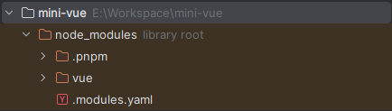
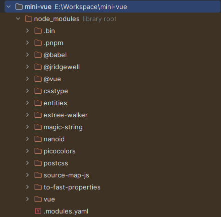
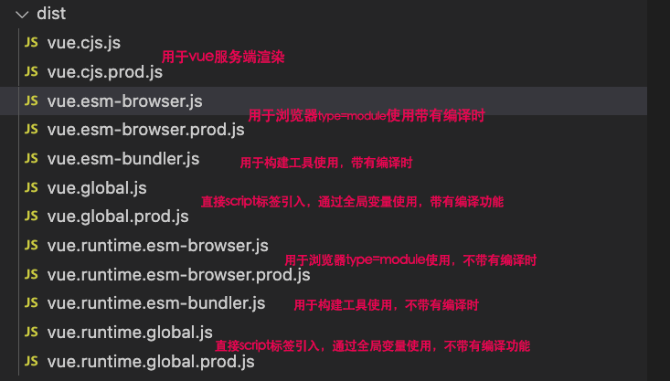
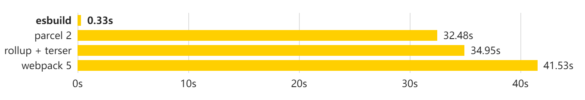
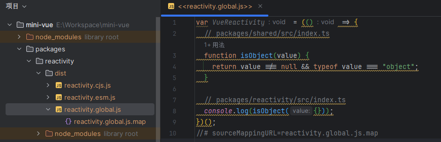
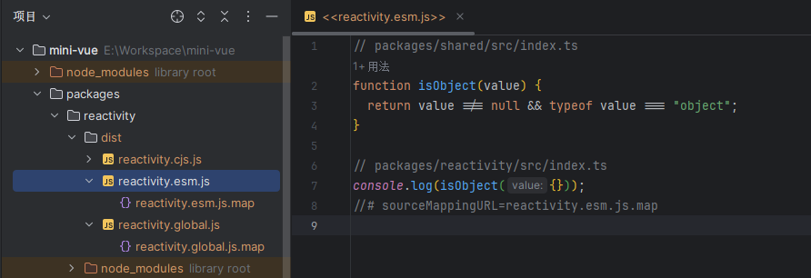

# Vue3 环境搭建

Vue3 中使用pnpm workspace来实现monorepo ([pnpm](https://pnpm.io/)是快速、节省磁盘空间的包管理器。主要采用符号链接的方式管理模块)

## 1. 全局安装 pnpm

```bash
npm i -g pnpm # 全局安装pnpm
pnpm init # 初始化配置文件
```

## 2. 创建 .npmrc 配置文件

```bash
shamefully-hoist = true
```

可以尝试使用 `pnpm install vue` 命令安装一个 vue 来对比它们的区别。默认情况下，vue3 中所依赖的模块不会被提升到 `node_modules`中，添加 **羞耻的提升(shamefully-hoist)** 可以将vue3所依赖的模块添加到 `node_modules`中。

没有配置 `shamefully-hoist`



配置了 `shamefully-hoist`



## 3. 配置 workspace

配置 pnpm 的工作空间，新建 `pnpm-workspace.yaml`

```yaml
package:
 - "packages/*"
```

将 packages 下所有的目录都作为包进行管理，这样我们的 Monorepo 就搭建好了，确实比 `lerna + yarn workspace` 更快捷

## 4. 安装依赖

首先介绍下 pnpm 的 `-w` 参数，它是 `--workspace-root` 的缩写，Monorepo 仓库在根目录也是会有一个 `node_modules` 目录，加上该参数，表示在工作空间的根目录进行安装或启动，而不是当前的工作目录。

vue3 开发环境采用的是 esbuild ，打包 vue3 项目采用的是 rollup 进行打包代码

| 依赖       |                         |
| ---------- | ----------------------- |
| typescript | 在项目中支持 typescript |
| esbuild    | 构建工具，默认支持 ts   |
| minimist   | 命令行解析工具          |

```bash
pnpm install typescript minimist esbuild -D -w
```

## 5. 初始化 TS

```bash
pnpm tsc --init
```

初始化，配置一些常用的配置，后续需要其他的再继续添加

```json
{
  "compilerOptions": {
    "outDir": "dist", // 输出的目录
    "sourceMap": true, // 采用sourcemap
    "target": "es2016", // 目标语法
    "module": "esnext", // 模块格式
    "moduleResolution": "node", // 模块解析方式
    "strict": false, // 严格模式
    "resolveJsonModule": true, // 解析json模块
    "esModuleInterop": true, // 允许通过es6语法引入commonjs模块
    "jsx": "preserve", // jsx 不转义
    "lib": ["esnext", "dom"] // 支持的类库 esnext及dom
  }
}
```

## 6. 创建初始模块

在 package 目录下新建两个包，用于手写响应式原来做准备

- reactivity：响应式模块
- share：共享模块

**所有包的入口均为** `**src/index.ts**` 这样可以实现统一打包，并在包信息中增添打包格式 `formats` 属性，用于最终打包后的格式。

- reactivity/package.json

```json
{
  "name": "@vue/reactivity",
  "version": "1.0.0",
  "main": "index.js",
  "module": "dist/reactivity.esm-bundler.js",
  "unpkg": "dist/reactivity.global.js",
  "buildOptions": {
    "name": "VueReactivity",
    "formats": ["esm-browser", "esm-bundler", "cjs", "global"]
  }
}
```

- share/package.json

```json
{
  "name": "@vue/shared",
  "version": "1.0.0",
  "main": "index.js",
  "module": "dist/shared.esm-bundler.js",
  "buildOptions": {
    "formats": ["esm-bundler", "cjs"]
  }
}
```

### 6.1. formats 配置打包格式

- `global` 立即执行函数的格式，会暴露全局对象
- `esm-browser` 在浏览器中使用的格式，内联所有的依赖项。
- `esm-bundler` 在构建工具中使用的格式，不提供.prod 格式，在构建应用程序时会被构建工具一起进行打包压缩。
- `cjs` 在 node 中使用的格式，服务端渲染。



### 6.2. monorepo 中包的互相引用

在 `reactivity` 包中想要引用我们自己写的 `shared` 包，可以使用以下命令进行安装

```bash
pnpm install @vue/shared@workspace --filter @vue/reactivity
```

在使用时，我们还需要配置 ts 的引用关系，否则导入会从 `node_modules` 中去找，而我们需要的是它从我们写的 `package` 目录中去找

```json
{
  // 添加以下配置，我们引入@vue/***的话，他就会从我们自己的 package 中去找
  "baseUrl": ".",
  "paths": {
      "@vue/*": ["packages/*/src"]
  }
}
```

## 7. 开发环境的搭建



创建开发时执行脚本，参数是要打包的模块

```json
{
  "script": {
    // 我们需要对 reactivity 模块进行打包，并且使用 esm 模式
    "dev": "node scripts/dev.js reactivity -f esm" 
  }
}
```

编写 dev 脚本

```javascript
// 使用 esbuild 加快开发构建速度。
// 仍使用 Rollup 进行生产构建，因为它会生成更小的文件，并提供更好的 tree-shaking 效果。

const { resolve } = require('path')
const { context } = require('esbuild')
const minimist = require('minimist')

// 解析用户执行命令行的参数
const args = minimist(process.argv.slice(2))
// 打包的格式，如果没传，默认用 global 模式
const format = args.f || 'global'
// 确定打包的模块
const target = args._[0] || 'reactivity'
// 读取对应的 package.json 内容
const pkg = require(resolve(__dirname, `../packages/${target}/package.json`))
// 打包输出的格式， 如果为 global 则使用 iife 自执行函数的方式
const outputFormat = format.startsWith('global') ? 'iife' : format === 'cjs' ? 'cjs' : 'esm'
// 输出文件
const outfile = resolve(__dirname, `../packages/${target}/dist/${target}.${format}.js`)

// esbuild 打包
context({
    entryPoints: [resolve(__dirname, `../packages/${target}/src/index.ts`)],
    outfile,
    bundle: true,
    sourcemap: true,
    format: outputFormat,
    globalName: pkg.buildOptions?.name,
    platform: format === "cjs" ? "node" : "browser",
}).then(ctx => {
    ctx.watch()
    console.log("watching~~~~")
})
```

我们可以对比一下 global 和 esm 两种模式下打包出来是什么样子的

在 `shared/index.ts` 中编写一个函数，用于判断是否为对象

```typescript
export function isObject(value: any) {
    return value !== null && typeof value === 'object'
}
```

在 `reactivity/index.ts` 中引入并使用一下

```typescript
import { isObject } from "@vue/shared"

console.log(isObject({}))
```

修改 `dev` 脚本

```json
"scripts": {
  "dev:global": "node scripts/dev.js reactivity -f global"
  "dev:esm": "node scripts/dev.js reactivity -f esm"
}
```

global



esm

