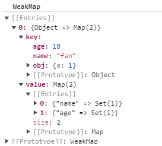
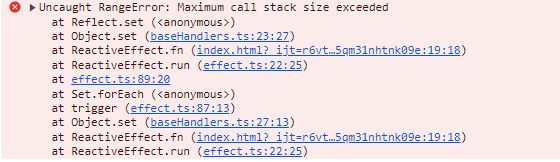
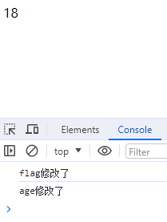

# Reactivity 响应式模块

可以在 `test` 目录下新建一个 `index.html` 文件来测试

```html
<script type="module">
    import { reactive, effect } from "../node_modules/@vue/reactivity/dist/reactivity.esm-browser.js" // 从 vue 中取 reactivity 模块
    const state = reactive({
        name: 'fan',
        age: 18
    })
    // 副作用函数 默认执行一次，响应式数据变化后再次执行
    effect(() => {
        document.getElementById('app').innerHTML = state.name
    })
</script>
```

`reactive` 方法会将对象变为 `proxy` 对象，`effect` 中使用 `reactive` 对象时会进行依赖收集，当属性发生变化时会重新执行 `effect` 函数

## 1. 编写 shared 包

创建一个共享的包，创建一个 `shared` 文件夹，使用 `pnpm init` 命令进行初始化

编辑 `package.json` 文件

```json
{
  "name": "@vue/shared",
  "version": "1.0.0",
  "main": "index.js",
  "module": "dist/shared.esm-bundler.js",
  "buildOptions": {
    "formats": ["esm-bundler", "cjs"]
  }
}
```

创建文件 `src/general.ts`， 写一个判断是否为对象的函数

```typescript
// 判断类型是否为对象
export const isObject = (val: unknown): val is Record<any, any> =>
    val !== null && typeof val === 'object'
```

在 `src/index.ts` 中进行统一导出

```typescript
export * from './general'
```

## 2. 编写 reactive 方法

1. 不对非对象的类型来进行处理
2. 对对象进行代理，通过代理对象操作属性（如果直接获取，会去源对象上进行获取，这时会有 this 问题，可以使用 `Reflect` 来解决这个问题）

```javascript
const person = {
  name: "John",
  get aliasName() { // this 指向的是 person 对象
    return this.name + " Doe";
  },
};

const proxy = new Proxy(person, {
    get(target, prop, receiver) {
        console.log("proxy get: " + prop);
        return target[prop];
    },
    set(target, prop, value, receiver) {
        target[prop] = value;
        return true;
    },
});
// 这样我们只监控到了 aliasName 的取值，name的取值操作监控不到
console.log("proxy: " + proxy.aliasName); // 取 aliasName 属性时，触发了获取 name 的操作

const person2 = {
    name: "Fan",
    get aliasName() { // this 指向的是 person2 对象
        return this.name + " fan";
    },
};

const proxy2 = new Proxy(person2, {
    get(target, prop, receiver) {
        console.log("proxy2 get: " + prop);
        return Reflect.get(target, prop, receiver);
    },
    set(target, prop, value, receiver) {
        return Reflect.set(target, prop, value, receiver);
    }
})
console.log("proxy2: " + proxy2.aliasName);
```

打印结果：

```bash
proxy get: aliasName
proxy: John Doe      
proxy2 get: aliasName
proxy2 get: name     
proxy2: Fan fan   
```

使用了 `Reflect` 后，就会**从 proxy 对象上取了，不是去源对象上取**

### 2.1. 创建 reactivity 包

创建一个 `reactivity` 文件夹，使用 `pnpm init` 命令进行初始化，并在 `src` 目录下创建`index.ts`、`reactive.ts`、`effect.ts`文件

reactive：响应式对象

effect：副作用函数

编辑 `package.json` 文件

```json
{
  "name": "@vue/reactivity",
  "version": "1.0.0",
  "main": "index.js",
  "module": "dist/reactivity.esm-bundler.js",
  "unpkg": "dist/reactivity.global.js",
  "buildOptions": {
    "name": "VueReactivity",
    "formats": [
      "esm-browser",
      "esm-bundler",
      "cjs",
      "global"
    ]
  },
}
```

### 2.2. 安装 shared 包

使用命令为 `reactivity` 包安装 `shared` 包

```bash
pnpm install @vue/shared@workspace --filter @vue/reactivity
```

### 2.3. 代码实现

#### 2.3.1. 代理对象

使用 proxy 对对象进行代理，并用 Reflect 解决 this 问题

```typescript
import { isObject } from "@vue/shared";

export function reactive(target) {
    if (!isObject(target)) {
        // 不对非对象类型进行处理
        return target
    }

    // 对对象进行代理
    const proxy = new Proxy(target, {
        get(target, p, receiver) {
            return Reflect.get(target, p, receiver)
        },
        set(target, p, newValue, receiver) {
            return Reflect.set(target, p, newValue, receiver)
        },
    })
    return proxy
}
```

在 index.html 中使用一下，使用它代理同一个对象，对比是否相等

```html
<script type="module">
    import { reactive } from './packages/reactivity/dist/reactivity.esm.js'

    const state = { name: 'fan', age: 18, obj: { a: 1 } }
    const p1 = reactive(state)
    const p2 = reactive(state)
    console.log(p1 === p2) // false
</script>
```

我们需要代理同一个对象时，返回都是相等的。可以使用 `WeakMap` 对对象进行缓存，然后下次使用 `reactive` 时判断 `WeakMap` 中是否存在该对象，存在的话就不再做代理

```typescript
import { isObject } from "@vue/shared";

const reactiveMap = new WeakMap() // key 只能是对象

export function reactive(target) {
    if (!isObject(target)) {
        // 不对非对象类型进行处理
        return target
    }
    // 对象被代理过直接 return
    const existProxy = reactiveMap.get(target)
    if (existProxy) {
        return existProxy
    }
    // 对对象进行代理
    const proxy = new Proxy(target, {
        get(target, p, receiver) {
            return Reflect.get(target, p, receiver)
        },
        set(target, p, newValue, receiver) {
            return Reflect.set(target, p, newValue, receiver)
        },
    })
    // 缓存一下，代理过的对象，下次再进行代理的时候，直接拿出来用即可
    reactiveMap.set(target, proxy)
    return proxy
}
```

如果我们对代理过的对象再进行代理，会发现他们就不相等了

```html
<script type="module">
    import { reactive } from './packages/reactivity/dist/reactivity.esm.js'

    const state = { name: 'fan', age: 18, obj: { a: 1 } }
    const p1 = reactive(state)
    const p2 = reactive(p1)
    console.log(p1 === p2) // false
</script>
```

这时候的映射关系为 `p1 -> state`、`p2 -> p1`，解决这个问题的方法：

1. 加个反向映射，但是这种方式需要再开辟一片内存空间，不是很方便
2. 通过加标识的方法，每个对象通过代理后都会有`get`、`set` 方法，可以在 `get` 方法中判断标识的时候返回一个 `true`，代表走的是代理对象的 `get` 方法

```typescript
import { isObject } from "@vue/shared";

export const enum ReactiveFlags {
    IS_REACTIVE = "__v_isReactive"
}

const mutableHandlers = {
    get(target, p, receiver) {
        // 被代理过的对象才会走 get方法
        if (ReactiveFlags.IS_REACTIVE === p) {
            return true
        }
        return Reflect.get(target, p, receiver)
    },
    set(target, p, newValue, receiver) {
        return Reflect.set(target, p, newValue, receiver)
    },
}

const reactiveMap = new WeakMap() // key 只能是对象

export function reactive(target) {
    if (!isObject(target)) {
        // 不对非对象类型进行处理
        return target
    }
    // 如果取值的时候走了代理对象的 get 方法，便是被代理过的，并没有增加这个属性
    if (target[ReactiveFlags.IS_REACTIVE]) {
        return target
    }
    // 对象被代理过直接 return
    const existProxy = reactiveMap.get(target)
    if (existProxy) {
        return existProxy
    }
    // 对对象进行代理
    const proxy = new Proxy(target, mutableHandlers)
    // 缓存一下，代理过的对象，下次再进行代理的时候，直接拿出来用即可
    reactiveMap.set(target, proxy)
    return proxy
}
```

这样就完成了 reactive 代理对象：

- 代理同一个对象，返回的是同一个对象
- 代理被代理过的对象，放回的是同一个对象

#### 2.3.2. reactive 深度代理

在使用 reactive 代理对象的时候，对象里面可能有对象，需要对深层的对象进行处理

```typescript
import { ReactiveFlags, reactive } from './reactive'
import { track, trigger } from './effect'
import { isObject } from '@vue/shared'

export const mutableHandlers = {
    get(target, p: string | symbol, receiver: object) {
        // 被代理过的对象才会走 get方法
        if (ReactiveFlags.IS_REACTIVE === p) {
            return true
        }
        // 触发 get 的时候进行依赖收集
        track(target, p)
        const r = Reflect.get(target, p, receiver)
        // 深度代理
        if (isObject(r)) {
            return reactive(r) // 只有用户取值的时候，才会进行二次代理，不用担心性能
        }
        return r
    },
    set(
        target: object,
        p: string | symbol,
        newValue: unknown,
        receiver: object,
    ) {
        // 用户赋值操作
        let oldValue = target[p] // 没有修改之前的值
        // 返回一个 boolean 类型
        const r = Reflect.set(target, p, newValue, receiver)
        // 新值和老值不相同，触发更新
        if (oldValue !== newValue) {
            trigger(target, p, newValue, oldValue)
        }
        return r
    },
}
```

## 3. 编写 effect 方法

effect 是副作用函数，也就是会产生副作用的函数。

```javascript
function effect() {
  document.body.innerText = p1.name + p1.age
}
```

`effect(fn)`： fn中的数据变了，需要重新执行fn。

如何处理 effect 嵌套关系呢，可以用以下两种方法

- 栈（以前使用的方式）
- 标记（现在使用的方式）：用 parent 记录effect的父子关系，默认为undefined。

```typescript
// 用一个全局变量存储被注册的副作用函数
export let activeEffect: ReactiveEffect | undefined

class ReactiveEffect<T = any> {
    active = true
    // effect 嵌套的父子关系
    parent = undefined
    // 记录 activeEffect 依赖了哪些属性
    deps = []
    constructor(public fn: () => T) {}

    run() {
        if (!this.active) {
            // 如果是失活的，表示不在effect函数中，直接函数执行即可
            return this.fn()
        }
        // 其他情况为激活状态，表示在 effect 函数中
        try {
            // 父子关系用于 effect 嵌套收集
            this.parent = activeEffect
            activeEffect = this
            return this.fn()
        } finally {
            activeEffect = this.parent
            this.parent = undefined
        }
    }
}

// 依赖收集 就是将当前的 effect 变成全局的 稍后取值的时候可以拿到这个全局的 effect
// 用于注册副作用函数
export function effect<T = any>(fn: () => T) {
    const _effect = new ReactiveEffect(fn)
    _effect.run() // 默认让响应式的 effect 执行一次
}
```

### 3.1. 编写 track 方法（依赖收集）

在代理对象get的时候进行依赖收集

```typescript
export const mutableHandlers = {
    get(target, p: string | symbol, receiver: object) {
        // 被代理过的对象才会走 get方法
        if (ReactiveFlags.IS_REACTIVE === p) {
            return true
        }
        // 触发 get 的时候进行依赖收集
        track(target, p)
        return Reflect.get(target, p, receiver)
    },
    set(
        target: object,
        p: string | symbol,
        newValue: unknown,
        receiver: object,
    ) {
        return Reflect.set(target, p, newValue, receiver)
    },
}
```

如果用 target 来表示一个代理对象所代理的原始对象，它会有一些属性，比如 name，它可以被注册多个副作用函数，它们的映射关系如下：

```typescript
const mapping = { // weakMap()
  target: { // Map()
    name: [activeEffect1, activeEffect2] // Set()
  }
}

/**
 * const state = reactive({ name: 'fan' })
 * effect(function activeEffect1() => {
 *   document.body.innerText = state.name
 * })
 * effect(function activeEffect2() => {
 *   document.body.innerText = state.name
 * })
 */
```

 一个属性对应多个 `effect`，一个 `effect` 对应多个属性

属性和 `effect` 的关系是多对多的关系

根据映射关系编写 track 方法

```typescript
const targetMap = new WeakMap()
export function track(target, key) {
    if (!activeEffect) {
        // 取值操作没有发生在 effect 中
        return
    }
    let depsMap = targetMap.get(target)
    if (!depsMap) {
        targetMap.set(target, (depsMap = new Map()))
    }
    let dep = depsMap.get(key)
    if (!dep) {
        depsMap.set(key, (dep = new Set()))
    }
    // 判断需不需要收集，没有 activeEffect 的时候进行收集
    let shouldTrack = !dep.has(activeEffect)
    if (shouldTrack) {
        dep.add(activeEffect)
        activeEffect.deps.push(dep)
    }
}
```

通过 `debugger` 观察映射关系：



### 3.2. 编写 trigger 方法（触发更新）

在当 `effect(fn)` 中的 fn 内收集的值发生了改变，需要进行触发更新。

在`mutableHandlers`的set中进行触发更新

```typescript
export const mutableHandlers = {
    get(target, p: string | symbol, receiver: object) {
        // 被代理过的对象才会走 get方法
        if (ReactiveFlags.IS_REACTIVE === p) {
            return true
        }
        // 触发 get 的时候进行依赖收集
        track(target, p)
        return Reflect.get(target, p, receiver)
    },
    set(
        target: object,
        p: string | symbol,
        newValue: unknown,
        receiver: object,
    ) {
        // 用户赋值操作
        let oldValue = target[p] // 没有修改之前的值
        // 返回一个 boolean 类型
        const r = Reflect.set(target, p, newValue, receiver)
        // 新值和老值不相同，触发更新
        if (oldValue !== newValue) {
            trigger(target, p, newValue, oldValue)
        }
        return r
    },
}
```

在重新执行 `effect` 的时候，需要注意，我们如果在 `effect` 中有频繁更改值的操作，会触发 set，直接执行 run 方法会导致堆栈溢出

```javascript
const state = reactive({ name: 'fan', age: 18, obj: { a: 1 } })
// 默认执行一次，数据变化后会再次执行
effect(() => {
  state.age = Math.random()
  document.body.innerText = state.name + state.age
})

setTimeout(() => {
  state.name = 'fanfan'
}, 1000)
export function trigger(target, key, newValue, oldValue) {
    // weakMap { obj: map(key, set(effect))}
    const depsMap = targetMap.get(target)
    // 判断 map 是否有值，没有直接返回
    if (!depsMap) {
        return
    }
    // 如果 set 有值才进行操作
    const dep = depsMap.get(key)
    if (dep) {
        // 遍历存放 effect 的set，执行fn函数
        dep.forEach(effect => {
            effect.run() // 直接执行会有问题
        })
    }
}
```

需要判断一下是否执行过

```typescript
export function trigger(target, key, newValue, oldValue) {
    // weakMap { obj: map(key, set(effect))}
    const depsMap = targetMap.get(target)
    // 判断 map 是否有值，没有直接返回
    if (!depsMap) {
        return
    }
    // 如果 set 有值才进行操作
    const dep = depsMap.get(key)
    if (dep) {
        // 遍历存放 effect 的set，执行fn函数
        dep.forEach(effect => {
            // effect.run() // 直接执行会有问题
            // 当重新执行此effect函数，会将当前的effect放在全局上 activeEffect
            // 判断是否与全局的一样，如果一样，表示执行过
            if (activeEffect != effect) {
                effect.run()
            }
        })
    }
}
```

#### 3.2.1. 清理依赖

下面这个例子，一秒钟后，flag 变成了 true，age更改后是不需要触发更新的。

```typescript
const state = reactive({ flag: false, name: 'fan', age: 18, obj: { a: 1 } })

effect(() => {
  document.body.innerText = state.flag ? state.name : state.age
})

// 默认第一次 flag 会收集 effect， age 会收集当前的 effect
// 默认第一次 flag 会收集 effect， name 会收集了我们的 effect， 
// 应该将age收集的依赖移除掉，否则更改age还是会触发更新
setTimeout(() => {
  state.flag = !state.flag

  setTimeout(() => {
    state.age = 20
  }, 1000)
}, 1000)
```

所以我们每次执行渲染的时候，应该先做一次清理操作

```typescript
run() {
    if (!this.active) {
        // 如果是失活的，表示不在effect函数中，直接函数执行即可
        return this.fn()
    }
    // 其他情况为激活状态，表示在 effect 函数中
    try {
        // 父子关系用于 effect 嵌套收集
        this.parent = activeEffect
        activeEffect = this
        cleanupEffect(this)
        return this.fn() // 这个地方做了依赖收集
    } finally {
        activeEffect = this.parent
        this.parent = undefined
    }
}
function cleanupEffect(effect: ReactiveEffect) {
    effect.deps.length = 0 // 清理对应数组的
}
```

先把 `set` 清空，再清除 `deps`，直接清除的话，`set` 中还是有数据的。清除 `deps` 中的 `set`：

```typescript
// 每次执行依赖收集前，先做清理操作
function cleanupEffect(effect: ReactiveEffect) {
    // 每次执行 effect 之前，我们应该清除掉 effect 中依赖的所有属性
    let { deps } = effect
    for (let i = 0; i < deps.length; i++) {
        deps[i].delete(effect) // 属性记录了 effect     { key: new Set() }
    }
    // 先把 set 清空，再清除 deps，直接清除的话，set 中还是有数据的
    effect.deps.length = 0 // 清理对应数组的
}
```

**注意：**容易犯的错，先删除后添加，会出现死循环：

```typescript
const set = new Set(['a'])

set.forEach(item => {
  set.delete(item)
  set.add(item)
})
```

所以需要在 trigger 中对 dep 进行克隆

```typescript
export function trigger(target, key, newValue, oldValue) {
    // weakMap { obj: map(key, set(effect))}
    const depsMap = targetMap.get(target)
    // 判断 map 是否有值，没有直接返回
    if (!depsMap) {
        return
    }
    // 如果 set 有值才进行操作
    const dep = depsMap.get(key)
    if (dep) {
        // 克隆一个新数组，否则会导致死循环
        const effects = [...dep]
        // 遍历存放 effect 的set，执行fn函数
        effects.forEach(effect => {
            // effect.run() // 直接执行会有问题
            // 当重新执行此effect函数，会将当前的effect放在全局上 activeEffect
            // 判断是否与全局的一样，如果一样，表示执行过
            if (activeEffect != effect) {
                effect.run()
            }
        })
    }
}
```

### 3.3. 自定义调度函数（scheduler）

`effect` 中还有个 `stop` 函数，可以将 `effect` 变成**失活态**，失去响应式。

返回值可以是 `run` 函数，可以强制更新，相当于 vue2 的 `$fouceupdate`

```typescript
class ReactiveEffect<T = any> {
    active = true
    // effect 嵌套的父子关系
    parent = undefined
    // 记录 activeEffect 依赖了哪些属性
    deps = []
    constructor(public fn: () => T) {}
    // 将 effect 变成失活态
    stop() {
        if (this.active) {
            cleanupEffect(this) // 先清除依赖
            this.active = false // 再将它变成失活态
        }
    }
}
```

添加返回值

```typescript
export function effect<T = any>(fn: () => T) {
    const _effect = new ReactiveEffect(fn)
    _effect.run() // 默认让响应式的 effect 执行一次

    const runner = _effect.run.bind(_effect) // 确保this指向的是当前的effect
    runner.effect = _effect
    return runner
}
```

测试一下

```html
<script type="module">
  import { reactive, effect } from './packages/reactivity/dist/reactivity.esm.js'

  const state = reactive({ flag: false, name: 'fan', age: 18, obj: { a: 1 } })

  const runner = effect(() => {
    document.body.innerText = state.flag ? state.name : state.age
  })

  // 将其变成失活态
  runner.effect.stop()
  // 默认第一次 flag 会收集 effect， age 会收集当前的 effect
  // 默认第一次 flag 会收集 effect， name 会收集了我们的 effect， 应该将age收集的依赖移除掉，否则更改age还是会触发更新
  setTimeout(() => {
    state.flag = !state.flag
    console.log('flag修改了')
    setTimeout(() => {
      console.log('age修改了')
      state.age = 20
    }, 1000)
  }, 1000)
</script>
```

我们执行了 stop，effect 就变成失活的了，后续 flag 状态发生了改变，也没有再对页面发生改变



当我们执行 runner 函数，它会强制更新，页面就会刷新

```html
<script type="module">
  import { reactive, effect } from './packages/reactivity/dist/reactivity.esm.js'

  const state = reactive({ flag: false, name: 'fan', age: 18, obj: { a: 1 } })

  const runner = effect(() => {
    document.body.innerText = state.flag ? state.name : state.age
  })

  // 将其变成失活态
  runner.effect.stop()
  // 默认第一次 flag 会收集 effect， age 会收集当前的 effect
  // 默认第一次 flag 会收集 effect， name 会收集了我们的 effect， 应该将age收集的依赖移除掉，否则更改age还是会触发更新
  setTimeout(() => {
    state.flag = !state.flag
    runner()
    console.log('flag修改了')
    setTimeout(() => {
      console.log('age修改了')
      state.age = 20
    }, 1000)
  }, 1000)
</script>
```


#### 3.3.1. 实现自定义调度函数

实现了 `stop` 和 `runner`，数据改变了一次他又需要调用 `runner`，可以写一个 `scheduler` 函数对数据更改做统一`runner`，可以减少更新次数。

```html
<script type="module">
  import { reactive, effect } from './packages/reactivity/dist/reactivity.esm.js'

  const state = reactive({ flag: false, name: 'fan', age: 18, obj: { a: 1 } })

  const runner = effect(() => {
    console.log('runner')
    document.body.innerText = state.flag ? state.name : state.age
  }, {
    scheduler() {
      console.log(this) // this 指向当前的 effect
      runner()
      console.log('数据变化了')
    }
  })

  setTimeout(() => {
    state.flag = !state.flag
  }, 1000)
</script>
```

使用 effect 的时候传入一个选项 `options`

```typescript
export function effect<T = any>(fn: () => T, options?) {
    const _effect = new ReactiveEffect(fn, options.scheduler)
    _effect.run() // 默认让响应式的 effect 执行一次

    const runner = _effect.run.bind(_effect) // 确保this指向的是当前的effect
    runner.effect = _effect
    return runner
}
```

ReactiveEffect 接收一个 scheduler 函数

```typescript
export type EffectScheduler = (...args: any[]) => any

class ReactiveEffect<T = any> {
    active = true
    // effect 嵌套的父子关系
    parent = undefined
    // 记录 activeEffect 依赖了哪些属性
    deps = []
    constructor(
        public fn: () => T,
        public scheduler?: EffectScheduler,
    ) {}
}
```

在更新的时候判断，有传 scheduler 就执行 scheduler，否则执行 run 方法

```typescript
export function trigger(target, key, newValue, oldValue) {
    // weakMap { obj: map(key, set(effect))}
    const depsMap = targetMap.get(target)
    // 判断 map 是否有值，没有直接返回
    if (!depsMap) {
        return
    }
    // 如果 set 有值才进行操作
    const dep = depsMap.get(key)
    if (dep) {
        // 克隆一个新数组，否则会导致死循环
        const effects = [...dep]
        // 遍历存放 effect 的set，执行fn函数
        effects.forEach(effect => {
            // effect.run() // 直接执行，如果 effect 中有很多赋值操作，会导致堆栈溢出
            // 当重新执行此effect函数，会将当前的effect放在全局上
            // 判断是否与全局的一样，如果一样，表示执行过
            if (activeEffect != effect) {
                if (!effect.scheduler) {
                    effect.run() // 每次调用run 都会重新依赖收集
                } else {
                    effect.scheduler()
                }
            }
        })
    }
}
```

## 4. 编写 computed 方法

计算属性常用两种写法：

- 只传 getter
- 传 getter 和 setter

```typescript
import { NOOP, isFunction } from '@vue/shared'

export type ComputedGetter<T> = (oldValue?: T) => T
export type ComputedSetter<T> = (newValue: T) => void

export interface WritableComputedOptions<T> {
    get: ComputedGetter<T>
    set: ComputedSetter<T>
}

export interface WritableComputedRef<T> extends Ref<T> {
    readonly effect: ReactiveEffect<T>
}

export interface ComputedRef<T = any> extends WritableComputedRef<T> {
    readonly value: T
}

export function computed<T>(
    getterOrOptions: ComputedGetter<T> | WritableComputedOptions<T>,
) {
    let getter: ComputedGetter<T>
    let setter: ComputedSetter<T>
    // 判断是否为函数，是的话代表只传了一个 getter
    const onlyGetter = isFunction(getterOrOptions)
    if (onlyGetter) {
        // 将传入的值赋给 getter，setter为空操作
        getter = getterOrOptions
        setter = NOOP
    } else {
        // 传入对象代表有getter和setter，进行赋值
        getter = getterOrOptions.get
        setter = getterOrOptions.set || NOOP
    }
    // 返回 ComputedRef 实现类，对数据进行依赖收集和触发更新
    return new ComputedRefImpl(getter, setter)
}
```

### 4.1. 实现 ComputedRefImpl 类

computed 也是依赖与 effect 实现的，vue3 不同于 vue2，它的 computed 做了依赖收集。

```typescript
import { ReactiveEffect, trackEffects, triggerEffects } from './effect'

export class ComputedRefImpl<T> {
    public dep = undefined
    public readonly effect: ReactiveEffect<T>
    public readonly __v_isRef = true // 意味着有这个属性，需要用 .value 来进行取值
    public _dirty = true // 数据是否是脏的，脏的说明值变了
    private _value!: T // 默认的缓存结果

    constructor(
        private getter: ComputedGetter<T>,
        private readonly _setter: ComputedSetter<T>,
    ) {
        // 源码这里不能使用 effect(() => {}, { scheduler() {} })
        this.effect = new ReactiveEffect<T>(this.getter, () => {
            this._dirty = true
            // 触发更新
            triggerEffects(this.dep)
        })
    }
    // 类的属性访问器 Object.defineProperty(实例, value, { get })
    get value() {
        // 如果有 activeEffect 意味着这个计算属性在 effect 中使用
        // 需要让计算属性收集这个 effect
        // 用户取值的时候发生依赖收集
        trackEffects(this.dep || (this.dep = new Set()))
        // 取值才执行，并把取的值缓存起来
        if (this._dirty) {
            this._value = this.effect.run()
            this._dirty = false // 意味着取过值了
        }
        return this._value
    }

    set value(newValue: T) {
        this._setter(newValue)
    }
}
```

在 computed 里用到了`track`依赖收集和`trigger`触发更新，之前写的需要传入 target 和 key，在 computed 中只有 dep 能拿到，所以需要对 track 和 trigger 中的内容进行抽离。

```typescript
export function track(target, key) {
    if (!activeEffect) {
        // 取值操作没有发生在 effect 中
        return
    }
    let depsMap = targetMap.get(target)
    if (!depsMap) {
        targetMap.set(target, (depsMap = new Map()))
    }
    let dep = depsMap.get(key)
    if (!dep) {
        depsMap.set(key, (dep = new Set()))
    }
    // 判断需不需要收集，没有 activeEffect 的时候进行收集
   	// let shouldTrack = !dep.has(activeEffect)
    // if (shouldTrack) {
    //     dep.add(activeEffect)
    //     activeEffect.deps.push(dep)
    // }
    trackEffects(dep)
}

export function trackEffects(dep) {
    // 判断需不需要收集，没有 activeEffect 的时候进行收集
    let shouldTrack = !dep.has(activeEffect)
    if (shouldTrack) {
        dep.add(activeEffect)
        activeEffect.deps.push(dep)
    }
}
export function trigger(target, key, newValue, oldValue) {
    // weakMap { obj: map(key, set(effect))}
    const depsMap = targetMap.get(target)
    // 判断 map 是否有值，没有直接返回
    if (!depsMap) {
        return
    }
    // 如果 set 有值才进行操作
    const dep = depsMap.get(key)
    // if (dep) {
    // 克隆一个新数组，否则会导致死循环
    // const effects = [...dep]
    // 遍历存放 effect 的set，执行fn函数
    // effects.forEach(effect => {
    //     // effect.run() // 直接执行，如果 effect 中有很多赋值操作，会导致堆栈溢出
    //     // 当重新执行此effect函数，会将当前的effect放在全局上
    //     // 判断是否与全局的一样，如果一样，表示执行过
    //     if (activeEffect != effect) {
    //         if (!effect.scheduler) {
    //             effect.run() // 每次调用run 都会重新依赖收集
    //         } else {
    //             effect.scheduler()
    //         }
    //     }
    // })
    // }
    triggerEffects(dep)
}

export function triggerEffects(dep) {
    if (dep) {
        // 克隆一个新数组，否则会导致死循环
        const effects = [...dep]
        // 遍历存放 effect 的set，执行fn函数
        effects.forEach(effect => {
            // effect.run() // 直接执行，如果 effect 中有很多赋值操作，会导致堆栈溢出
            // 当重新执行此effect函数，会将当前的effect放在全局上
            // 判断是否与全局的一样，如果一样，表示执行过
            if (activeEffect != effect) {
                if (!effect.scheduler) {
                    effect.run() // 每次调用run 都会重新依赖收集
                } else {
                    effect.scheduler()
                }
            }
        })
    }
}
```

## 5. 编写 watch 方法

`watch` 有很多种写法，常用的有两种写法，侦听一个或多个响应式数据源，并在数据源变化时调用所给的回调函数

```typescript
// 侦听单个来源
function watch<T>(
  source: WatchSource<T>,
  callback: WatchCallback<T>,
  options?: WatchOptions
): StopHandle

// 侦听多个来源
function watch<T>(
  sources: WatchSource<T>[],
  callback: WatchCallback<T[]>,
  options?: WatchOptions
): StopHandle
```

第一个参数 source 为侦听源，来源有以下几种：

- 一个函数，返回一个值
- 一个 ref
- 一个响应式对象
- 或是由以上类型的值组成的数组

```typescript
import { isReactive } from './reactive'
import { isFunction, isObject, isPlainObject } from '@vue/shared'
import { ReactiveEffect } from './effect'

export interface WatchOptions<Immediate = boolean> {
    immediate?: Immediate
    deep?: boolean
    once?: boolean
}

export function traverse(value: unknown, seen?: Set<unknown>) {
    if (isObject(value)) {
        return value
    }
    // 考虑循环引用的问题，采用set来解决这个问题
    seen = seen || new Set()
    if (seen.has(value)) {
        return value
    }

    seen.add(value)
    // 如果值还是对象，接着取
    if (isPlainObject(value)) {
        for (const key in value) {
            traverse(value[key], seen) // 递归取值
        }
    }
    return value
}

export function watch(source, cb, { immediate }: WatchOptions = {}) {
    let getter: () => any
    if (isReactive(source)) {
        // 最终都处理成函数
        getter = () => traverse(source) // 直接稍后调用run的时候会执行此函数，直接返回对象，只有访问属性才能依赖收集
    } else if (isFunction(source)) {
        getter = source
    }

    let oldValue: any
    const job = () => {
        // 内部调用 cb 也就是 watch 的回调方法
        if (!effect.active) {
            return
        }
        if (cb) {
            // watch(source, cb)
            const newValue = effect.run() // 再次调用 effect，拿到新值
            cb(newValue, oldValue) // 调用回调传入新值和老值
            oldValue = newValue // 更新
        }
    }

    const effect = new ReactiveEffect(getter, job)

    // 初始化
    if (cb) {
        if (immediate) {
            job()
        } else {
            oldValue = effect.run() // 保留老值
        }
    }
}
```

编写 `isPlainObject` 方法

```typescript
// toString 方法
export const objectToString = Object.prototype.toString
export const toTypeString = (value: unknown): string =>
    objectToString.call(value)
// 判断是否为原始对象
export const isPlainObject = (val: unknown): val is object =>
    toTypeString(val) === '[object Object]'
```

### 5.1. 根据 watch 实现 watchEffect 方法

```
watch` 它是懒侦听的，不会立即执行。`watchEffect` 会**立即执行**。其实它们在实现上面就是传与不传 `cb` 的区别，对 `watch` 中的公共方法进行抽离成 `dowatch` 函数。然后通过判断是否传了 `cb`，来实现 `watchEffect
```

笼统的来说：

- watch 本身就是一个 effect + 自定义 scheduler
- watchEffect 就是一个 effect

```typescript
function watchEffect(
  effect: (onCleanup: OnCleanup) => void,
  options?: WatchEffectOptions
): StopHandle

type OnCleanup = (cleanupFn: () => void) => void
```

抽离 doWatch

```typescript
export function doWatch(source, cb, { immediate }: WatchOptions = {}) {
    let getter: () => any
    if (isReactive(source)) {
        // 最终都处理成函数
        getter = () => traverse(source) // 直接稍后调用run的时候会执行此函数，直接返回对象，只有访问属性才能依赖收集
    } else if (isFunction(source)) {
        getter = source
    }

    let oldValue: any
    const job = () => {
        // 内部调用 cb 也就是 watch 的回调方法
        if (!effect.active) {
            return
        }
        if (cb) {
            // watch(source, cb)
            const newValue = effect.run() // 再次调用 effect，拿到新值
            cb(newValue, oldValue) // 调用回调传入新值和老值
            oldValue = newValue // 更新
        } else {
            // watchEffect
            effect.run() // 调用 run 方法，会触发依赖重新清理和收集
        }
    }

    const effect = new ReactiveEffect(getter, job)

    // 初始化
    if (cb) {
        if (immediate) {
            job()
        } else {
            oldValue = effect.run() // 保留老值
        }
    } else {
        // watchEffect
        effect.run()
    }
}
```

watch 和 watchEffect 方法

```typescript
export interface WatchOptionsBase {
    flush?: 'pre' | 'post' | 'sync'
}
export interface WatchOptions<Immediate = boolean> extends WatchOptionsBase {
    immediate?: Immediate
    deep?: boolean
    once?: boolean
}

export function watch(source: any, cb: any, options?: WatchOptions) {
    return doWatch(source, cb, options)
}

export function watchEffect(source: any, options?: WatchOptionsBase) {
    return doWatch(source, null, options)
}
```

### 5.2. 实现 onCleanup 副作用清除方法

应用场景：输入框搜索，只取最后的值

官网有个清除副作用的例子：

```typescript
watch(id, async (newId, oldId, onCleanup) => {
  const { response, cancel } = doAsyncWork(newId)
  // 当 `id` 变化时，`cancel` 将被调用，
  // 取消之前的未完成的请求
  onCleanup(cancel)
  data.value = await response
})

watchEffect(async (onCleanup) => {
  const { response, cancel } = doAsyncWork(id.value)
  // `cancel` 会在 `id` 更改时调用
  // 以便取消之前
  // 未完成的请求
  onCleanup(cancel)
  data.value = await response
})
```

对例子进行完善，更容易理解：

```html
<script type="module">
  import { reactive, watch } from '../packages/reactivity/dist/reactivity.esm.js'

  const state = reactive({ flag: false, name: 'fan', age: 18, obj: { a: 1 } })
  /**
   * 第一次数据变化了，调用一个接口getData()  2000ms后返回数据
   * 第二次数据变化了，再调用一个接口getData() 1000ms后返回数据
   * 这样就会导致第一次的结果覆盖掉第二次的结果
   */
  let timer = 3000
  function getData(data) {
    return new Promise((resolve, reject) => {
      setTimeout(() => {
        resolve(data)
      }, timer -= 1000)
    })
  }


  watch(() => state.age, async function(newValue) {
    const result = await getData(newValue)
    document.body.innerText = result
  })

  state.age = 19
  state.age = 20
</script>
```

上述代码，页面中最终显示的数字为 19。如果想让他显示 20，可以用标记的方法进行处理，也可以说是防抖，多次触发，只取一次。

```javascript
let arr = []
watch(() => state.age, async function(newValue) {
  let flag = true
  // 如果不是最后一个请求，就把 flag 设为false
  while (arr.length) {
    let cb = arr.shift()
    cb()
  }
  arr.push(() => {
    flag = false
  })
  const result = await getData(newValue)
  // 只渲染最后一个值
  if (flag) {
    document.body.innerText = result
  }
})
```

实现清除副作用的方法

```typescript
type OnCleanup = (cleanupFn: () => void) => void

let getter: () => any
if (isReactive(source)) {
    // 最终都处理成函数
    getter = () => traverse(source) // 直接稍后调用run的时候会执行此函数，直接返回对象，只有访问属性才能依赖收集
} else if (isFunction(source)) {
    if (cb) {
        getter = source
    } else {
        getter = () => {
            if (cleanup) {
                cleanup()
            }
            // watchEffect 也可以接收一个 onCleanup 参数
            return source(onCleanup)
        }
    }
}

let oldValue: any
let cleanup: (() => void) | undefined
const onCleanup: OnCleanup = (fn: () => void) => {
    cleanup = fn
}
const job = () => {
    // 内部调用 cb 也就是 watch 的回调方法
    if (!effect.active) {
        return
    }
    if (cb) {
        // watch(source, cb)
        const newValue = effect.run() // 再次调用 effect，拿到新值
        if (cleanup) cleanup()
        cb(newValue, oldValue, onCleanup) // 调用回调传入新值和老值
        oldValue = newValue // 更新
    } else {
        // watchEffect
        effect.run() // 调用 run 方法，会触发依赖重新清理和收集
    }
}
```

使用：

在 watch 中，onCleanup 是 callback 的第三个参数

在 watchEffect 中，onCleanup 是 source 中的一个参数

```typescript
watch(() => state.age, async function(newValue, oldValue, onCleanup) {
  let flag = true
  onCleanup(() => {
    flag = false
  })
  const result = await getData(newValue)
  // 只渲染最后一个值
  if (flag) {
    document.body.innerText = result
  }
})

watchEffect(async (onCleanup) => {
  let flag = true
  onCleanup(() => {
    flag = false
  })
  const result = await getData(state.age)
  // 只渲染最后一个值
  if (flag) {
    document.body.innerText = result
  }
})
```

## 6. 编写 ref 方法

ref 是基于 reactive 实现的，它可以持有任何类型的值，包括深层嵌套的对象、数组或者 `JavaScript` 内置的数据结构，比如 `Map`。ref 会使它的值具有深层响应性。

### 6.1. 实现 isRef 方法

通过判断是否有 `__v_isRef` 属性来判断是否为 ref。它可以被用做 ts 的类型守卫

```typescript
export interface Ref<T = any> {
    value: T
}

export function isRef(r: any): r is Ref {
    return !!(r && r.__v_isRef === true)
}
```

### 6.2. 实现 ref 方法

```typescript
export function createRef(rawValue: unknown) {
    // 判断传入的值是否为Ref，如果是则直接返回
    if (isRef(rawValue)) {
        return rawValue
    }
    return new RefImpl(rawValue)
}

export function ref(value?: unknown) {
    return createRef(value)
}

// 如果是对象就转成 reactive，否则返回原来的值
export const toReactive = <T extends unknown>(value: T): T =>
    isObject(value) ? reactive(value) : value

class RefImpl<T> {
    private _value: T
    public readonly __v_isRef = true
    public dep? = undefined

    constructor(public rawValue: T) {
        this._value = toReactive(this.rawValue)
    }

    get value() {
        // 依赖收集
        if (activeEffect) {
            trackEffects(this.dep || (this.dep = new Set()))
        }
        return this._value
    }

    set value(newValue) {
        // 比较两个值是否一样，如果不一样则重新赋值
        if (hasChanged(newValue, this.rawValue)) {
            this.rawValue = newValue
            this._value = toReactive(newValue)

            // 触发更新
            triggerEffects(this.dep)
        }
    }
}
```

### 6.3. 实现 unRef 方法

如果参数是 ref，则返回内部值，否则返回参数本身。

它是`val = isRef(val) ? val.value : val`计算的一个语法糖。

```typescript
export type MaybeRef<T = any> = T | Ref<T>

export function unref<T>(ref: MaybeRef<T> | ComputedRef<T>): T {
  return isRef(ref) ? ref.value : ref
}
```

它一般用于保证 ts 类型

```typescript
function useFoo(x: number | Ref<number>) {
  const unwrapped = unref(x)
  // unwrapped 现在保证为 number 类型
}
```

### 6.4. 实现 toRef 方法

toRef 的主要用法：

- 规范化签名

```typescript
// 按原样返回现有的 ref
toRef(existingRef)

// 创建一个只读的 ref，当访问 .value 时会调用此 getter 函数
toRef(() => props.foo)

// 从非函数的值中创建普通的 ref
// 等同于 ref(1)
toRef(1)
```

- 对象属性签名

```typescript
const state = reactive({
  foo: 1,
  bar: 2
})

// 双向 ref，会与源属性同步
const fooRef = toRef(state, 'foo')

// 更改该 ref 会更新源属性
fooRef.value++
console.log(state.foo) // 2

// 更改源属性也会更新该 ref
state.foo++
console.log(fooRef.value) // 3
```

**注意：**这跟 `const fooRef = ref(state.foo)` 不同。这个 `ref` **不会**和 `state.foo` 保持同步，因为这个 `ref()` 接收到的是一个纯数值。

toRef 使用场景：

```typescript
<script setup>
import { toRef } from 'vue'

const props = defineProps(/* ... */)

// 将 `props.foo` 转换为 ref，然后传入
// 一个组合式函数
useSomeFeature(toRef(props, 'foo'))

// getter 语法——推荐在 3.3+ 版本使用
useSomeFeature(toRef(() => props.foo))
</script>
```

实现：

```typescript
class ObjectRefImpl<T extends object, K extends keyof T> {
    public __v_isRef = true

    constructor(
        private readonly object: T,
        private readonly key: K,
    ) {}

    get value() {
        return this.object[this.key]
    }

    set value(newVal) {
        this.object[this.key] = newVal
    }
}

function propertyToRef(source: Record<string, any>, key: string) {
    const val = source[key]
    return isRef(val) ? val : (new ObjectRefImpl(source, key) as any)
}

class GetterRefImpl<T> {
    public readonly __v_isRef = true
    public readonly __v_isReadonly = true

    constructor(private readonly _getter: () => T) {}

    get value() {
        return this._getter()
    }
}

export function toRef(source, key?: string): Ref {
    if (isRef(source)) {
        // 如果是 ref 则直接返回
        return source
    } else if (isFunction(source)) {
        // return source()
        // 直接调用source()是对函数的一次性调用，得到一个立即值。
        // 而new GetterRefImpl(source)创建了一个可以被Vue追踪并在其响应式系统中作为只读引用使用的对象，它延迟了source函数的执行，直到实际需要这个值的时候
        // .value 的时候再取值
        return new GetterRefImpl(source) as any
    } else if (isObject(source) && arguments.length > 1) {
        // 假如传入的是对象，则必须传入 key，也需要转成 ref
        return propertyToRef(source, key!)
    } else {
        // 返回个 ref
        return ref(source)
    }
}
```

### 6.5. 实现 toValue 方法

他的作用是将值、refs 或 getters 规范化为值

```typescript
toValue(1) //       --> 1
toValue(ref(1)) //  --> 1
toValue(() => 1) // --> 1
```

实现原理就是，判断是否为`函数`，是的话就执行，不是的话就用 `unref` 取值

```typescript
export type MaybeRefOrGetter<T = any> = MaybeRef<T> | (() => T)

export function toValue<T>(source: MaybeRefOrGetter<T> | ComputedRef<T>): T {
    return isFunction(source) ? source() : unref(source)
}
```

### 6.6. 实现 toRefs 方法

将一个响应式对象转换为一个普通对象

```typescript
const state = reactive({
  foo: 1,
  bar: 2
})

const stateAsRefs = toRefs(state)
/*
stateAsRefs 的类型：{
  foo: Ref<number>,
  bar: Ref<number>
}
state.foo === stateAsRefs.foo.value // true
*/
```

实现：

```typescript
export function toRefs<T extends object>(object: T) {
    const ret: any = Array.isArray(object) ? new Array(object.length) : {}
    for (const key in object) {
        ret[key] = propertyToRef(object, key)
    }
    return ret
}
```

### 6.7. 实现 isReactive 方法

通过判断对象是否有`IS_REACTIVE` 属性，有则为 `reactive`

```typescript
export function isReactive(value: unknown): boolean {
    return !!(value && value[ReactiveFlags.IS_REACTIVE])
}
```

### 6.8. 实现 proxyRefs 方法

他的作用是：在内部对数据做处理，用户在模板中使用的时候，不用 `.value` 取值

```typescript
const shallowUnwrapHandles: ProxyHandler<any>  = {
    get: (target, p, receiver) => {
        return unref(Reflect.get(target, p, receiver))
    },
    set(target, p, newValue, receiver) {
        const oldValue = target[p]
        if (isRef(oldValue) && !isRef(newValue)) {
            oldValue.value = newValue
            return true
        } else {
            return Reflect.set(target, p, newValue, receiver)
        }
    },
}

export function proxyRefs<T extends object>(object: T) {
    return isReactive(object) ? object : new Proxy(object, shallowUnwrapHandles)
}
```

## 7. 编写 effectScope 方法

状态管理工具 pinia，有使用这个方法。在组件中用了一堆响应式数据，计算属性，watch，我们如果需要将它们都变成失活态，需要一个一个的进行调用 `stop` 函数。所以就有了 effectScope 方法，他可以统一将作用域中的 effect 变成失活态。把 effect 放在 effectScope 的 run 方法中，可以调用 effectScope 的 stop 方法，统一改变 effect 的状态

```typescript
// 创建一个 effect 域
const scope = effectScope()

scope.run(() => {
  const state = reactive({ name: 'fan', age: '18' })
  watchEffect(() => {
    console.log(state.name)
  })
  setTimeout(() => {
    state.name = 'fanfan'
  }, 1000)

  const scope = effectScope(true) // 如果设置为true ，里面的 effect 就不会被收集，还是激活态
  scope.run(() => {
    const state = reactive({ name: 'fan', age: '18' })
    watchEffect(() => {
      console.log(state.age)
    })
    setTimeout(() => {
      state.age = 19
    }, 1000)
  })
})

scope.stop()
// 打印
// fan
// 18
// 19
```

实现：

```typescript
import type { ReactiveEffect } from './effect'

export let activeEffectScope: EffectScope | undefined

class EffectScope {
    _active = true
    parent = undefined
    effects = [] // 这个是收集内部的 effect
    scopes // 这个是收集作用域的

    constructor(public detached = false) {
        if (!detached && activeEffectScope) {
            // 内部的 effectScope, 如果传的 detached 为 true，则不被收集
            activeEffectScope.scopes ||
                (activeEffectScope.scopes = []).push(this)
        }
    }

    get active() {
        return this._active
    }

    run<T>(fn: () => T): T | undefined {
        if (this._active) {
            try {
                this.parent = activeEffectScope
                activeEffectScope = this
                return fn()
            } finally {
                activeEffectScope = this.parent
            }
        }
    }

    stop() {
        if (this._active) {
            for (let i = 0; i < this.effects.length; i++) {
                this.effects[i].stop() // 让每一个存储的effect都停止
            }

            if (this.scopes) {
                for (let i = 0; i < this.scopes.length; i++) {
                    this.scopes[i].stop() // 调用的是作用域的stop
                }
            }
            this.parent = undefined
            // 变成失活态
            this._active = false
        }
    }
}

export function recordEffectScope(effect: ReactiveEffect) {
    // 收集内部的 effect
    if (activeEffectScope && activeEffectScope.active) {
        activeEffectScope.effects.push(effect)
    }
}

export function effectScope(detached?: boolean) {
    return new EffectScope(detached)
}
```

在 ReactiveEffect 中收集 effect

```typescript
export class ReactiveEffect<T = any> {
  active = true
  // effect 嵌套的父子关系
  parent = undefined
  // 记录 activeEffect 依赖了哪些属性
  deps = []
  constructor(
      public fn: () => T,
      public scheduler?: EffectScheduler,
  ) {
      // 收集 effect
      recordEffectScope(this)
  }
}
```